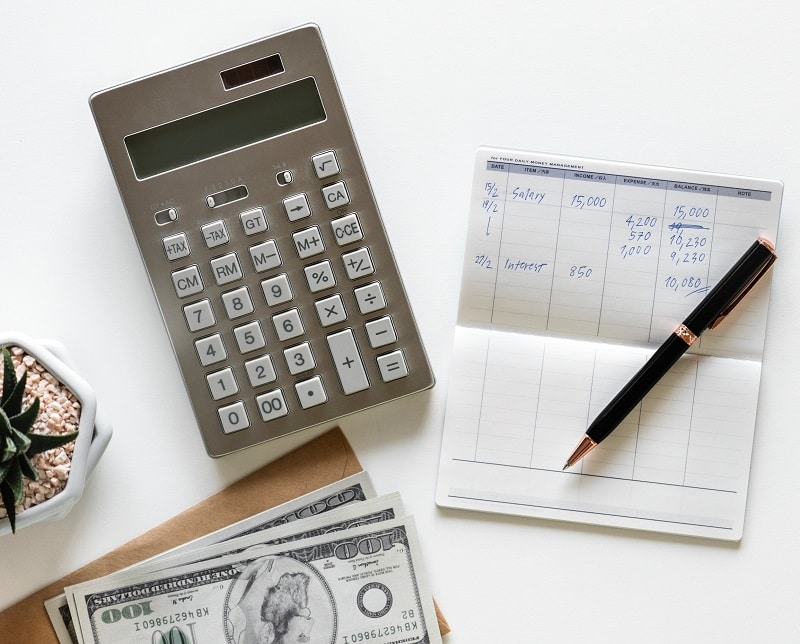

Most of the time, when we’re considering spending a fair chunk of money on an item or an experience, we look to our bank account or an expert for the answer to the question, “Can we afford it?”

Can we afford a newer, bigger home? We reach out to a mortgage broker or banker to determine affordability.

Can we afford a new car? Look to the bank account to see if we have enough cash to buy one outright or make the monthly payments.

How about the kitchen renovation or the trip to Europe? More staring at our cash situation.

The thing about our usual approach to assessing affordability is that it provides a limited view of the impact on our finances. Whether or not you have enough cash for the expenditure is only part of the story. What about the impact of the reduced cash flow or discretionary income on your life? What impact will years of payments have on your goals?

The trick to being financially solid is to use cash in your highest, best interests. That involves having a sense of the big picture.

Here, then, are some ideas and a hack to ensure that your spending serves you well.

## Know your top 3-5 values

Money is your servant, not your master. It’s a tool to help you meet your fundamental needs and achieve your goals. In order to get money working for you, though, you need to know what you value most.

What are your non negotiables? The things that matter most to you? Once you figure these out, redirect your spending to be congruent with your list.

Maybe you’re driving an older car that looks pretty lame compared to the newer, fabulous models and you are sorely tempted to upgrade. OK, great. First question: Does a new car fit into your top values? Are there other areas of your life that would be better served with that money? Is it imperative that you change vehicles because your current beast is costing you a fortune to repair? If so, is a new car the best fit for you?

Maybe it is, but first ensure that the move lines up with your values. Make the purchase pass what I call the **Values Sniff Test**.

## Live “as if” for three to six months

You’ve decided that you’d really like a larger home, one with an ensuite bathroom. Your guests have seen more than enough of the real you as you shuffle to the bathroom first thing in the morning. You talk to a broker about what you can afford and she tells you that your income is solid, your ratios are in line with banking requirements, plus you have a sufficient down payment; you’re good to go for a mortgage up to X dollars.

The thing about the banking industry is that it does not look at the intimate details of your big picture needs and desires. They’re simply answering a local question: Can you afford to buy a bigger home?

What about the fact that your oldest is only a couple years away from starting university and will need some financial help, with a second child not far behind? Or what about the fact that your parents aren’t doing so well, which means you’ll need to spend money flying out to be with them and possibly pitch in financially? Or what about the fact that you also promised your kids that they could both play hockey (not a cheap sport) and oh yes, for sure you’ll take them to Disneyland?

### Can I afford it?

If you want to test affordability for pretty much anything, start by putting the spend through the Values Sniff Test and then spend six months acting as if you had bought the item. For a potential house purchase, calculate the total amount of the new mortgage, taxes, insurance, and [planned spending](https://yflmainprod.wpengine.com/2018/07/rethinking-emergency-funds/) (i.e. repairs and maintenance buffer). Use the highest interest rate you can find to calculate the mortgage payment – be uber conservative. Figure out what the difference is between what you’re spending now and what you would spend in the new place, then sock away the difference in cash into a high interest savings account that you cannot see.

**In other words, pull the money out of your cash flow every month for six months.** Assume that all annual costs – i.e. hydro, gas, insurance, taxes, and repairs – will go up every year. If the costs were 30% higher, could you still afford it?

How do you feel about the impact on your cash flow? Has your [corrosive debt](https://yflmainprod.wpengine.com/2017/02/are-you-really-living-within-your-means/) (i.e. credit card and LOC debt) gone up as a result or have you managed to absorb the increase without much impact on your life? Has your stress gone up?

The bonus of using this hack is that if you decide not to go through with a purchase, you’ve just grown your savings!

## Opportunity cost

Every time we spend a dollar in one area, that dollar is not available for something else. A quick way to determine if a spend is a good choice for us is by asking a simple question: “What else could I do with this money?” The answer is your opportunity cost. If your initial expenditure is of higher value to you than anything else you could be doing with that money, relative to your top values and goals, then it’s a win.

## Impact on debt levels

Do you need to go into debt for the purchase? What impact will that have on your cash flow? [How long will it take you to pay it off](https://yflmainprod.wpengine.com/2018/03/tackling-debt-the-step-many-people-omit/)? Is that in your highest, best interests?

Here’s the kicker: **Figure out the TOTAL cost of the purchase once you’ve factored in interest costs**. If, for example, you borrow $30,000 on a line of credit to redo your kitchen, how long will it take you to pay it off? Let’s say you decide to wipe out the debt in four years; you’ll be paying $625 per month just to pay down the principle (i.e. the amount borrowed) NOT including the monthly interest costs.

All banks have online calculators to help you figure out the monthly interest costs, but beware of using Line of Credit calculators as they’ll spit out the interest-only amount due each month. If that’s all you pay, you’ll never pay down the loan. You need to factor in how much of the principle (i.e. the amount borrowed) you can pay off every month over and above the interest payment.

The point of this exercise is to get you to **think about the final cost of the item you’re financing**. Interest costs could amount to several thousand dollars over and above the original purchase price. Is that worth it to you? Is it congruent with your values and goals? Just to be sure that you understand the impact, live “as if” the loan were in place and sock away the repayments into a savings account.

## Bottom line

In all cases, ask yourself, “If I do this, will it affect my ability to save and grow my money? Will I still have an [emergency fund](https://yflmainprod.wpengine.com/2018/07/rethinking-emergency-funds/) in place or does this purchase jeopardize that? Will I still be on track to meet my financial goals?”

Finally, to avoid the shiny object syndrome, ask yourself this: One year later, will I still think this is an awesome purchase?”

If so, have at it and enjoy!

#### If You Enjoyed This Post, You’ll Also Like:

[Rethinking Emergency Funds](https://yflmainprod.wpengine.com/2018/07/rethinking-emergency-funds/)

[Are You Really Living Within your Means? Four Areas to Consider](https://yflmainprod.wpengine.com/2017/02/are-you-really-living-within-your-means/)

[Tackling Debt: The Step Many People Omit](https://yflmainprod.wpengine.com/2018/03/tackling-debt-the-step-many-people-omit/)

Photo by raxpixel – Unsplash

#### Share this post

## Your Foundation to Financial Freedom is coming soon.

Please complete the form to add your name to the wait list. We’ll let you know as soon as the course is released!

## No spam, ever. Unsubscribe any time.

## IMS ESSENTIAL

Please select a payment type: