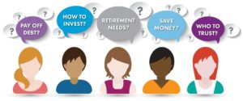

Last fall, I talked to a heap of women from coast to coast about their challenges with money: What questions did they have? Where did they feel they need support or answers? What’s working financially and what isn’t?

It turns out that one of the most common issues for women is the fact that they have questions, lots of them, but they don’t know where to turn for unbiased answers. The biggest thing, though? They feel their questions are stupid (their word, not mine), so they hesitate to say them out loud. One woman even went so far as to say that she’d need a place where she can ask her questions twice since she might not understand the answer the first time around!

I get it. Maybe you wonder how on earth investing works since everybody else is doing it, but you’ve only dipped your toe and it wasn’t all that comfy or encouraging. The more you read, the more confused you are about where to start or how to do it. Who do you turn to? Your brother-in-law, who talks incessantly about dividends and re-balancing his portfolio? Or the guy in the office who’s constantly talking about the latest hot stock? Not gonna happen.

Or maybe you’re trying to figure out how to get out of debt and save money, but any tips or tricks you pick up in magazine articles never amount to real, lasting change in your life. What’s going on? Why isn’t it working? Why can’t you seem to tackle your debt without living like a hermit when the young and gorgeous magazine model appears to have pulled it off with ease? Do you bring it up when you’re hanging out with friends or walking the dog with a neighbour? Not a chance. Too private. Or too embarrassing.

## Light bulb moment

After hearing this same message over and over again, I finally stopped focusing on the workshop material that I was developing and turned my attention to what the women were asking for: We want you to give us a safe place to ask stupid questions, they said. Somewhere where no one will judge us. Somewhere where we can get answers in a language we can understand. We’re not daft, we don’t need dumbed-down material, but we do want plain, nuts and bolts, easy-to-understand language. And we want to ask questions about a whole lot of topics related to money, not just investing or budgeting.

That’s when it hit me: We need to talk and learn on a regular, ongoing basis. We need our own group, a [Women’s Money Group](https://yflmainprod.wpengine.com/membership/). And that’s what I’ve created.

## Elvis was wrong

“A little less conversation, a little more action” might be what Elvis was after, but only half of that is on the money, so to speak. More action? Yes, for sure, but we want conversation too, and a lot more of it.

SO, I am happy to announce the formation of **YFL’s [Women’s Money Group](https://yflmainprod.wpengine.com/membership/)**! The first monthly meeting will take place in Ottawa on Tuesday, February 27th, 2018 from 7 – 9 pm. The good news? You can check it out for free. Why free? So that you can participate and determine if it’s a fit for you. The idea is to meet once a month, except in August, to tackle a range of topics having to do with money and financial skills. There will be guest speakers, monthly follow up webinars, hands-on learning, a chance to ask *all* of your money-related questions, concrete action steps, and support. In July, there will be wine.

Your hubbies/partners will be invited to participate at the December meeting so that we can tackle finance and relationship-related issues, but really, this is a group by, for, and about women.

At the February meeting, we’ll address the following topic: *Overcoming Money Patterns, Beliefs, and Blocks*. The best tips and strategies in the world won’t do much for you unless you understand your money patterns and establish habits that serve you. Through our interactive, case-based approach, you’ll identify areas that may be holding you back and receive guidance on how to get past behaviours that are hindering your financial progress. As part of the February 27th event, you will also have complimentary access to a webinar in mid-March to follow up on your progress and ask questions.

For those of you who live outside the greater Ottawa area, hold tight: I’m going to offer online meetings starting this fall. You’ll have access to the community of like-minded women who are looking to grow their financial confidence and create better options – soon.

## Mom was right

Many moons ago, when my girls were much smaller, they spent an afternoon peppering my mom with questions about me. When did I walk? What was I like as a child? What were my favorite foods? When did I start talking? To the latter question, my mom answered, “Very early, and she hasn’t stopped.” My mom once joked that I would eventually find a way to make a living by talking. Very funny, mom. Oh, wait….

Every last Tuesday of the month, I will be talking to women about money: how it works, where the system often falls apart, how to protect yourself, how to use it to your greatest advantage, and how to build better options for your family. It’s an interactive affair, so be prepared to roll up your sleeves, laugh a lot, and share your thoughts.

I look forward to having you join the conversation. Click [here](https://yflmainprod.wpengine.com/membership/) for more details.

#### Share this post

## Your Foundation to Financial Freedom is coming soon.

Please complete the form to add your name to the wait list. We’ll let you know as soon as the course is released!

## No spam, ever. Unsubscribe any time.

## IMS ESSENTIAL

Please select a payment type: