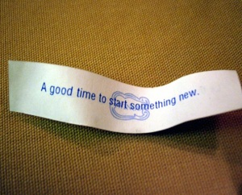

# are-you-too-old-to-succeed

Apparently I’m really old. At least that’s what John\* the taxi driver implied by association when I rode in his car. When one reaches this delicate age, I gather it’s all downhill from here where success is concerned.

Two weeks ago, I attended a workshop at a hotel near our local airport. It’s a good thirty-five minutes away from our house, and since my husband was busy shuttling our girls to their various Saturday activities, I got a ride there but had to find my way back. After four hours of learning and networking, my brain was full-to-exploding. Thank heavens I would have thirty-five minutes or so to sit in peace in the back of a cab. I’d catch up on a few emails, stare out the window, and process some of the great stuff I had just learned.

John had other ideas. From the moment I stepped in he began to chat. Where are you visiting from? Oh, you’re from here, so why are you at a hotel near the airport? We talked about a wide variety of subjects until he landed on work.

– So what do you do?

I told him.

– Why just for women? Do you do consulting?

I work with both men and women in my life as a real estate investor, but my work on women’s financial literacy is geared to women. And no, I don’t do consulting.

– That’s too bad. I need to talk to you. I’m in a terrible financial situation.

## John’s problem

We were ten minutes into the cab ride when this came out. While I’m not a consultant I figured I may as well see if I could help him out in any way. I asked about his situation and the flood gates opened.

John’s taxi plate was about to expire and he didn’t know what to do. Over the last few years he had amassed $350,000 of debt in the form a first mortgage, second mortgage, multiple lines of credit and credit cards. The first mortgage probably had a reasonable interest rate but the rest were bleeding him dry. With all of the competition coming into the marketplace, his income had slipped to the point where he was unable to make ends meet. He has a large family (who apparently love to spend money) and his spouse only works part-time for low wages.

– What can I do? It’s hopeless.

– Why is it hopeless? I agree that you’re in a tough situation but it’s not hopeless.

– It’s easy for you to say. You were born here. It’s harder for me.

– I’m sorry, but that’s an excuse. It’s no easier for me than it is for you. I have had other challenges. We all have difficulties to deal with.

– What do you know about big debt?

– Sixteen years ago I faced a similar amount of debt.

– Oh? You probably had a husband who was earning well and who helped you to pay off those debts.

– Not quite. He had just died. I had to dig my way out of it alone.

– You? Alone? How did you do it?

I shared the Reader’s Digest version of my story, outlining the steps I took to pay off all the debt.

– Yes but you’re young. It’s different for me. I’m old.

– You don’t look old.

– I am, I’m 48.

– I’m 48 too. That’s not old!

This is the point where he looked in the rear view mirror, saw that I was smiling, so he challenged me.

– What year were you born?

I guess he figured I must be lying about my age. When I told him my year and month of birth, he looked puzzled.

– You’re older than me by a few months.

– Look, age, nationality, whatever – these are all excuses. We can either be defeated by the circumstances in our lives or we can find solutions. For every excuse you give me I can point to someone who has overcome the very same situation. Old? Mary Kay Ash started what became a multimillion dollar business when she was in her mid-40s. Colonel Sanders was even older when he figured out the winning fried chicken formula that made him famous.

Not from this country? Read my post on [Tahani’s story](https://yflmainprod.wpengine.com/2013/05/youre-15-youre-getting-married-youre-moving-tahanis-story/ "Tahani's story"), a woman who had nothing when she left her husband to build a life of her own in a new country. Or read [the story of Rita](https://yflmainprod.wpengine.com/2012/05/from-the-kgb-to-canada-ritas-story/ "Rita's story") who escaped the local KGB only to be abused by her husband in Canada. See how she made it past that experience to become a thriving business woman. **You are not too old or too anything (insert your favorite excuse) to succeed**. You have what it takes right here, right now. Look around for examples of people who have done what you want to do then follow their lead.

– You’re right, I just need a push, someone to motivate me.

– No, that’s not it. **Motivation never works from the outside; it’s an inside job**. *You* need to be motivated to change; *you* need to be motivated to do the work. By all means surround yourself with positive people and distance yourself from negative influences, but you need to recognize that the only person who can succeed for you is you. Others may act as inspiration for change, but the motivation for sustained effort and resilience in the face of obstacles must come from inside. Inspiration and motivation are two different things.

I can’t tell you exactly what steps to take because I don’t know your situation well enough, nor do I know what you enjoy doing. But I do know that if you surround yourself with people and activities that bring you joy, hold your goals front of mind and give your creativity room to work, you will find a way out of your financial difficulties.

This went on for a few minutes more as John started to brainstorm how he could make positive changes in his life. By the end of the ride his mood had changed considerably.

– Thank you for this. You’ve made my day, both with the fare and your suggestions. May I have your card?

As I handed him my card, I said that I looked forward to receiving an email from him in a couple of years’ time telling me how well he’s doing.

He made my day too. I didn’t get to my emails that afternoon but I met an engaging fellow who reminded me that there are no excuses in life. Even for old ladies.

\*Not his real name

#### Share this post

## Your Foundation to Financial Freedom is coming soon.

Please complete the form to add your name to the wait list. We’ll let you know as soon as the course is released!

## No spam, ever. Unsubscribe any time.

## IMS ESSENTIAL

Please select a payment type: