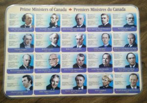

# dear-former-prime-minister-heres-what-i-do-for-women-and-why-i-do-it-2

A long time ago, I bought a laminated place mat of the Prime Ministers of Canada, figuring that it might be more fun for my kids to pick up bits of Canadian history over breakfast than learning them by rote at school. My oldest daughter, nearly 13 now, ignored it until Justin Trudeau made it cool to be a Prime Minister. Then she noted that the place mat isn’t up to date – it ends at Jean Chretien – and she ignored it once again. My 9-year-old daughter Clarice, however, started to study the thing and quiz my husband, Mark, and me to see what we know.

“When was Alexander Mackenzie born?” No clue.

“Do you know that there has only been one girl Prime Minister? Do you know her name?” Yes Clarice, we know her name. It’s Kim Campbell.

Mark is a political junkie who collects encounters with politicians courtesy of his business-travel habit. When Justin Trudeau was trotting across the country looking to become Prime Minister in the last federal election, Mark crossed paths with him while waiting to check into his hotel. They chatted for a couple of minutes. “Very personable and warm,” said Mark. Some time later, he bumped into Bob Rae at the airport. More chit chat. “Great guy,” said Mark once again.

This morning, while getting the kids ready for school, the phone rang. It was Mark. “Did you see my email? I met Kim Campbell at the airport. Very interesting lady.” Clarice was beside herself with excitement. “That’s awesome Papa! Kim Campbell!” (Insert squeals of delight here.) After relaying a few details to Clarice, he asked to speak with me again.

“I spoke with Kim about your work with women. She wants to know more. She gave me her business card and asked that you send her a link to something that describes your work.”

I have been writing and speaking about women’s financial literacy for years, yet there isn’t a single article that gives an overview of what I do and why I do it. If my upcoming book – ***[Protect Your Purse, Shared Lessons for Women: Avoid Financial Messes, Stop Emotional Bankruptcies, and Take Charge of Your Money](https://yflmainprod.wpengine.com/book/)*** – were printed, I’d happily send her a copy, but it’s on my editor’s desk at the moment (Update: The book was published in May of 2017. Follow the link.)

So, instead of making Ms. Campbell dig through years’ worth of blog posts, I decided to distill my work and my mission here, in the form of a letter.

*Dear Kim Campbell (aka the only female Prime Minister of Canada to date),*

*I’m a former academic who, in 1992, was on track to become a Professor of Neurolinguistics. I never made it. Part way through my studies, the bottom fell out of my world.*

*My first husband, Malcolm, spent most of his life battling cancer. When cancer threatened his ability to work, I stepped away “temporarily” from my fully-funded doctoral studies to care for Malcolm and to run his business. I never went back to my PhD, as Malcolm’s health continued to deteriorate. When Malcolm died six years later, I was left with a dying business and nearly $400,000 of debt. I couldn’t afford to go back to school, so I did the only thing I could think of: I reinvented myself.*

*Imagine: you’re 26, you’re goal-oriented and driven, you’ve racked up a number of successes in life and you’re on a promising trajectory. The next thing you know, six years have gone by and you’re left with nothing: no future, no money and no clue where to start.*

*It took more than a decade to rebuild my life. In the process, I learned a great deal about survival, financial protection, money and succeeding when all doors appear to be closed. I’ve also had a lot of time to think about how it was possible for someone, who had so many things going for her, to end up bereft at a time when she should have been soaring.*

*I began looking into other women’s experiences – was I alone in facing this sort of situation or had other women gone through similar challenges? Were there any common points in our stories? After interviewing dozens of widows and divorcees, I discovered that most of the women faced financial difficulties because of their situations.*

*When I turned to the literature to see what I could find, I came across an important book by Mariko Lin Chang entitled **Shortchanged: Why Women Have Less Wealth and What Can Be Done About It**. That’s when I learned about the Wealth Gap. According to Ms. Chang, women own only 36% as much wealth as men. That’s 64% less wealth than men! We all know that there is an income gap, but this was the first time that I saw statistics on the wealth gap. I had naively assumed that if there is a roughly 20% income gap, the wealth gap would show a similar spread. Sure, we might have a bit less because we spend more time focused on our kids, but I did not expect to see a 64% spread.*

*This is a big problem for women and one that few people are talking about.*

*If I had had some wealth to rely on during the trauma of Malcolm’s death, I would have had more options and certainly more security at a very difficult time. It would have changed the course of my life. It’s easy enough to write off my experience as that of an unfortunate widow, but **Chang’s research shows very clearly that most women are financially vulnerable to some extent.** This finding is certainly consistent with what I’ve seen in my work in real estate, particularly within my Rent to Own company, over the last decade.*

*So what’s going on? Why are women more financially vulnerable than men, on average? As you might expect, it’s complicated, but a couple of clear indicators stand out. One of them is the fact that women invest less than men, and when they do invest, they are much more conservative, which in turn leads to lower returns. Less money invested + lower returns = bigger wealth gap.*

*My own work in this area over the last two years shows very clearly that women lack the financial knowledge and the confidence to invest. I did a survey of several hundred women and the #1 area in which women feel the least confident with respect to money is investing. Since they are concerned about the volatility of the stock market, they turn to “safer” investments like GICs. When GICs don’t even cover the cost of inflation, that safety is an illusion as the value of their principal is eroded over time.*

*This is where my work, and my passion, comes in. I am on a mission to help women grow their financial literacy and their confidence in order to create better options for themselves and their families, especially when life happens, as it inevitably does. My soon-to-be-published book is the first step, followed shortly thereafter by workshops and courses through my newly-launched Women’s Money Day business. I have given speeches to multiple organizations and women’s groups, and I continue to write on topics that will help women to survive, thrive and grow.*

*Within the next month I will launch a YouTube channel featuring interviews that I’ve conducted with a host of experts and women who have important information to share. I’ll cover everything from how to get out of debt, managing credit, improving your credit score, legal instruments to protect yourself financially, how to invest, understanding various investing options, how to grow your business income and so on. If it can help women, I’ll cover it.*

*My big-picture goal is to create a world-wide organization that will support women’s financial education and make a substantive difference in their lives. As part of that, I also want to educate our teenagers so that they don’t follow in the footsteps of adults because, frankly, adults have shown that by and large, they aren’t exactly brilliant with money. When they are good with money, they tend not to talk about it, therefore their knowledge doesn’t get passed on to their children. As for our schools, they are silent on the subject of financial literacy.*

*In a nutshell, I intend to help change the financial game for women. It’s time.*

*Some day, I’d love to meet you in person and ask you the questions that I posed to the women I interviewed: If you had known what was coming in your life, what would you have done differently? What advice do you have for women based on your experiences?*

*By the way, Clarice thinks you’re awesome.*

*Warm regards,*

*Doris Belland*

#### Share this post

## Your Foundation to Financial Freedom is coming soon.

Please complete the form to add your name to the wait list. We’ll let you know as soon as the course is released!

## No spam, ever. Unsubscribe any time.

## IMS ESSENTIAL

Please select a payment type: