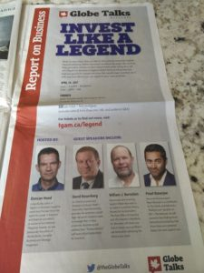

Twenty minutes into the weekend edition of The Globe and Mail, I was seriously pissed off.

As I made my way through the A-section, I came across an ad for a Globe Talks event that, at first blush, looked promising: Invest Like a Legend. Well, who wouldn’t want to do that? As an advocate of women’s financial literacy, I was pumped – sign me up and let’s get at it. Even though I read, write and speak about this stuff most days, I am always eager to learn more from experienced people. I was even prepared to make the five-hour trek from Ottawa to the centre of the universe to attend.

Then I spotted the pics of the people involved. Take a look at the photo of the ad on my post. Do you see anything interesting about the participants? Does anything jump out at you?

*They’re all guys*.

OK, they’re smart, capable, experienced guys, but bloody hell, there’s not one woman among them. I can’t even invoke Sesame Street here with “one of these things is not like the others”, because they are *all* men. We are encouraged when there’s at least one woman in the bunch – which is still pathetic, by the way – but no-can-do regarding women experts for this event. The female voice is entirely absent.

I have a question for The Globe and Mail: Do you mean to tell me that you could not think of one woman who would fit the bill as an investing expert? Because if this is an issue of creativity or a lack of contacts, I’m happy to supply at least a dozen names for you. In fact, Kerry Taylor (@squawkfox) has already done that in [her brilliant blog post](http://www.squawkfox.com/women-panel/) about your gaffe. It sounds like you got under her skin too, and Gail Vaz-Oxlade’s, and the many other women who chimed in on GVO’s and KT’s Twitter exchange (see Kerry’s post; really, go read it).

Someone from The Globe apparently called Kerry to apologize for “not finding” a woman for the panel after she went public with her objections. Two things strike me about that. First, an apology to one woman is inadequate. How about apologizing to the more than 50% of the Canadian population who are women because you, as a national paper, failed to represent us in any way? But I don’t really want that, because my second point is that apologies of this kind are useless. Words are easy; action, not so much. Don’t *tell us* you’re sorry, *do something* about it.

### Isn’t it ironic, don’t you think?

The irony is that The Globe and Mail has, for years, carried articles about how the financial industry is failing women. Rob Carrick wrote a [terrific piece](http://www.theglobeandmail.com/globe-investor/investment-ideas/financial-advisers-have-trouble-talking-to-women/article22726458/) entitled just that, in which he interviews Judy Paradi and Paulette Filion, consultants with Strategy Marketing, about how and why the industry isn’t connecting with, and serving, women. Their advice doesn’t get more blunt than this: “Memo to women who don’t like the relationship they have with their adviser: It’s not you, it’s your adviser.”

It’s not surprising that women don’t feel heard, given that the investment industry grew up catering to men, and 85% of the [financial advice industry is dominated by men](http://www.theglobeandmail.com/globe-investor/investment-ideas/financial-advisers-have-trouble-talking-to-women/article22726458/).

I have [firsthand experience](https://yflmainprod.wpengine.com/2015/11/how-not-to-be-dismal-at-sales-and-why-it-matters-to-you/) with being talked at by a male financial adviser. The latter incident is about something that happened a couple of years ago. More recently, my husband, Mark, and I had an advisor, with 30+ years of experience, spend the first fifteen minutes of a thirty-minute telephone meet-and-greet talking to us about himself and his firm. I gave my husband “the look” as he sat next to me, listening to the endless “let me tell you more about me and how fabulous I am” spiel. Mark knew exactly what I was thinking, and it wasn’t complimentary.

### You oughta know

In [another Globe article](http://www.theglobeandmail.com/report-on-business/women-and-wealth-the-investment-sectors-new-and-crucial-frontier/article19979192/?page=all), Jacqueline Nelson notes the following:

- Women already control about one-third of all financial assets in North America.
- More wealth will soon be in older hands.
- For many retired couples, it will be women who manage family finances.
- 90% of Canadian women will have total control over their finances at some point in their lives.

More tellingly, there’s this story by Sandy Cimoroni, chief operating officer at TD Wealth (female expert alert!): “In a recent research session made up of men and women, Ms. Cimoroni said participants were asked to create a collage of their investment goals using images. “The women came out with pictures of family, beaches, life experiences and aspirational views. The men had things like the hot car, graphs and dollar signs, the phrase ‘show me the money.’””

In a nutshell, women have different goals and a different approach to investing than men have.

### Tackling the wealth gap

Investing is a big deal for women. In her post, Kerry Taylor talks about the impact of the pay gap. Of even greater significance to women is the less-discussed wealth gap. [Tony Robbins](https://www.tonyrobbins.com/money-master-game/), [Mariko Lin Chang](http://www.mariko-chang.com/shortchanged.html), and countless other authors show that a high income doesn’t necessarily translate to a high net worth. When I worked with Rent to Own clients, the ones with the highest incomes were invariably the ones with the biggest cash flow problems. They made a ton of money and had little to show for it. According to Mariko Lin Chang, income isn’t the most important measure of how resilient a woman is financially, wealth is. It’s about what we keep and grow, not necessarily how much we make.

So how are women doing when it comes to wealth? Terribly: we have [a fraction of the wealth](http://www.mariko-chang.com/wealthdata.html) that men have. Learning to invest well, and to manage risk, are important aspects of helping women grow their wealth, and by extension, their options. We need to hear about this from women. We need to see women rocking investing. We need to understand that there absolutely are female experts in this world – I love Kerry’s “binders full of women”! – and that we can gain the knowledge and confidence to tackle it ourselves, or at the very least understand what our advisers are doing.

I have a suggestion for The Globe: make it right. You have an all-male event lined up and by the look of it, it will be terrific. Now create an all-female panel with the very same topic and approach. I know, William Bernstein really is a legend, and he may be hard to replace because of his unique work, so invite him and surround him with female experts as well as a female host.

And one more thing: don’t just offer it in Toronto; hit several of our major cities (Ottawa, please). But whatever you do, *do something* to correct your mistake. When you do, I will be there.

#### Share this post

## Your Foundation to Financial Freedom is coming soon.

Please complete the form to add your name to the wait list. We’ll let you know as soon as the course is released!

## No spam, ever. Unsubscribe any time.

## IMS ESSENTIAL

Please select a payment type: