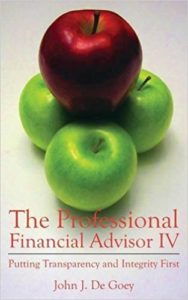

# does-your-financial-advisor-really-deserve-to-be-paid

Over the last year, I have been on a mission to interview as many financial advisors as possible, to get a sense of the range of approaches available. I know what the literature tells me is out there, but I wanted to experience it myself. My aim is to help break down the barriers to investing for women and grow their confidence, while also growing their money in a way that best serves their goals. Hence the many cups of coffee with advisors.

One sentence that keeps coming up with unnerving frequency is this one: “I deserve to be paid for my services.”

This, or a variation thereof, comes out when we discuss remuneration. I ask something like, “So how do you get paid? What do you charge?” And a discussion of fees ensues. When I start asking for clarification about total fees, or delving into potential challenges with recommending products that pay them a commission, some people react by declaring that they deserve to be paid. It’s only fair, they say. (Implicit in what they’re saying is that they deserve to be paid “those fees”. We’ll get back to this in a minute.)

It seems like a reasonable statement: I deserve to be paid. Don’t we all deserve to be paid?

Not necessarily.

### Desire vs Entitlement

At the risk of poking a hornet’s nest, here’s my argument: The true purpose of being in business is to solve a problem and delight your customers, not to make sales. Your customers determine how successful you are at solving *their (not your)* problems by paying for your services or buying your products. If you continue to delight them, and therefore fulfill your role, then they will continue to buy from you.

When you hang up a shingle that says “Mr. or Ms. So-and-so’s Excellent Business”, you do not automatically inherit the right to be paid. You have to earn the payment. To suggest otherwise smacks of entitlement.

I get it. It would be awesome to deserve payment regardless of the offering, but it doesn’t work that way. This kind of thinking confounds desire and entitlement.

Hold on a minute, you might object, if the customer engages an advisor to do X at a cost of Y, then doesn’t the advisor deserve to be paid if they’ve done X? If there is an agreement in place and all fees have been disclosed, and the customer further agrees to all of that, then sure, the advisor deserves the amount in the agreement.

The real issue that came up in my conversations, though, is *how much* does the advisor deserve to be paid? Do they deserve to be paid “those fees”? The next question then revolves around what’s in the best interests of the client?

There’s the rub.

### What bias?

It used to be that advisors would offer clients their recommendations for investments and, more often than not, they would receive a commission and trailer fees from those funds. Much of the industry still works that way. There’s obviously a huge potential for bias in a system where advisors have a vested interest in the investments they recommend. Even if you’re the most morally upstanding individual around – and I believe that the majority of advisors are good people who genuinely care about their clients – you cannot avoid psychological bias. Not convinced? Check out these books:

- [*Thinking, Fast and Slow*](https://amzn.to/2taT5c0), by Daniel Kahneman
- [*Nudge: Improving Decisions about Health, Wealth, and Happiness*,](https://amzn.to/2tbit17) by Richard H. Thaler and Cass R. Sunstein
- [*Predictably Irrational: The Hidden Forces That Shape our Decisions*](https://amzn.to/2MrOTgF), by Dan Ariely

Carl Richards summed it up well in his book *[The Behavior Gap](https://amzn.to/2JVtE8t):* Overconfidence is a big problem. If you don’t think you suffer from this problem, then you’re probably overconfident! In other words, sometimes (OK, often) we’re not aware of our biases.

### About those fees

The financial advice industry is undergoing a profound shift in which some quarters – economists, some of the worlds’ most successful investors, and Nobel Laureates – argue persuasively that the higher fees associated with traditional investment products have a negative effect on investors’ results. [Tony Robbins](https://amzn.to/2t6yaGW) shows how just a 1% difference in fees can reduce a portfolio by hundreds of thousands of dollars. [Preet Banerjee](http://wheredoesallmymoneygo.com/detailed-breakdown-of-the-real-impact-of-mers-on-an-investment-portfolio-over-time/) also tackled the issue of the negative impact of high fees related to some mutual funds.

People like [John J. De Goey](https://amzn.to/2JR1Wqn) (whose book, pictured above, should be required reading), [Daniel Solin](https://amzn.to/2JQqfEX) and Larry Swedroe argue that a passive management approach outweighs the performance of an active management approach, all of which goes to the core of how many of today’s advisors are paid, and how they approach financial advice.

If the words “passive management” and “active management” make your eyes gloss over or sound like a foreign language, don’t worry. I’ll tackle this in upcoming blog posts. I’ll unpack how it works and what it means.

From my many conversations with financial advisors, my dive into the investing literature, and my own experience, I have the following take-aways:

1. Good advisors help you to create a financial plan based on your goals and values.
2. They put together a low-cost, passively-managed portfolio using conservative estimates (Tony Robbins suggests keeping the *total fees, including the advisor’s and the funds’ fees* to a maximum of 1.5%).
3. They choose products that are in your best interests, and from which they do not benefit, thereby eliminating the concern about a conflict of interest. If they do pick an occasional product from which they benefit, they disclose their conflict, clearly show you why the product is in your best interests and how it is superior to other competing products.
4. They use an evidence-based approach to investing.

In my opinion, these types of advisors provide an important service. Interestingly, the people who use this approach were not the ones who told me that they deserve to be paid.

For me it boils down to this: If the question “How do you get paid?” provokes a defensive reaction, it may be time to reevaluate your assumptions.

(Quick note: Links to books in this post are affiliate links, which means I am paid a small commission if you buy using that link. There’s no extra cost to you and it helps to fund my work. I only recommend books I personally own, use, and love.)

#### Share this post

## Your Foundation to Financial Freedom is coming soon.

Please complete the form to add your name to the wait list. We’ll let you know as soon as the course is released!

## No spam, ever. Unsubscribe any time.

## IMS ESSENTIAL

Please select a payment type: