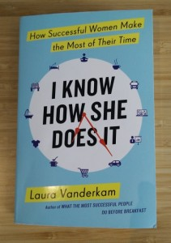
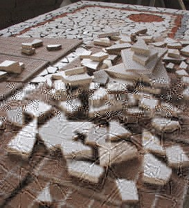

“When are you going to write another blog post? I enjoy reading them. Have I missed your latest one?” My girlfriend hadn’t missed a thing. It’s been a couple of months since my last post.

My challenge hasn’t been finding something to write about, it’s finding the time.

When I published my last post in November, I actually started to write the next one that very day but as often happens, the phone rang bringing business to be done, and that was the end of my flow. My to-do list each and every week since then has had “write blog post” as the number one item. So why did it take so long? I don’t lack motivation or discipline – what happened?

Can you relate? **Is there a goal, project or task that keeps showing up on your to-do list** and yet never seems to make it to the light of day? For some reason there is *always* a series of pressing matters that take up the space and before you know it the day is gone and that item is *still* on your to-do list.

We’ve all got good reasons. For me it boiled down to a vortex of business and birthdays. November through to January is birthday season for us, a fact for which our oldest has not yet forgiven us. “Why couldn’t my birthday be in the spring or the summer? November is awful.” One day she’ll understand that she was born in November *despite* our best efforts; but that’s a conversation for another day.

So birthdays hit and I, being the female part of the equation, am the planner and Chief Executor of all things birthday related. Then there was what we call Christmukah, kids’ recitals, and for good measure the production of year end statements for three corporations, one of which required additional attention because we were in the process of dissolving it.

In all of this writing went out the window.

I know that pretty much every woman reading this is nodding along thinking I have just described the madness that is her schedule too. So what do you do?

I could see it happening and it was bugging me. Surely to God it must be possible for a professional woman to lean in to her work, to borrow Sheryl Sandberg’s phrase, spend quality time with her family, keep up with the (gender-unbalanced) demands of the household and still find time to do what she truly values. But how? I wasn’t succeeding at it and while I knew that time management was at the root of it I couldn’t wrap my brain around fitting it all into a 24-hour period.

My husband’s approach is to be more regimented about work time: family and household responsibilities must wait until after the work day. That’s awesome and in an ideal world it works beautifully, but in real life what I’ve seen is that women end up picking up the slack when the fridge is empty, the kids need a dish for the bake sale and oh by the way, their gym shoes don’t fit anymore and they need them tomorrow by 8 am. Something has to give and for me, that something was time to write.

The Universe must have been listening to my repeated questions about how the hell to create more time because I came across a game-changer of a book: Laura Vanderkam’s ***[I Know How She Does It: How Successful Women Make the Most of Their Time](http://lauravanderkam.com/).*** Cue the Hallelujah chorus.

My problem is that I was envisioning my time in 24-hour periods. What if, instead, I thought about time in a week-long mosaic comprised of a series of half-hour tiles? If your current mosaic isn’t working for you, rearrange the tiles and begin to think more flexibly about your use of the various tiles. This is the key insight from Laura Vanderkam’s excellent book.

I kept thinking about the business day in terms of 9-5, Monday through Friday but who says that work need only get done in those segments? Similarly, I kept religiously blocking off weekends as sacred family time without taking into consideration all of the hours spent on precisely that during the week. My daughter’s concert at 10 am on Tuesday? That’s family time. My other daughter’s school ski trip which I attended mid-week? More kid time. It’s OK for me to grab some week-end time to do a bit of work guilt-free because I counter-balance it with other family activities during the week. My personal goals can be met by viewing the make-up of my week more flexibly.

One of Vanderkam’s main points is that it’s useful to track your time for one week. Once you do so, a few things will begin to stand out. Here are just a few points from the many Executive women’s time logs that she studied as part of the research for her book:

- many women sleep more than they think
- many women spend more time with their children and families than they realize
- many women work less than they perceive

Lo and behold, when I began to look at my use of time, that’s precisely what I found. What I’m doing as a result is starting to **think more flexibly about the possible use of all of the time segments in one week** so that I can book in and balance out time for me, my professional pursuits and my family.

Maybe it isn’t so crazy to consider working a couple of hours on the weekend, or a couple of nights per week after the kids have gone to bed given how much time I already dedicate to them and our family. Perhaps I can use a half hour here and there to get small business tasks checked off the list when those openings happen. When you know which tasks really matter and you have them lined up, you can tackle them in bits and pieces. I can’t write blog posts that way but I can knock off the million and one smaller business tasks that suck up time at key, brain-is-fully-engaged moments.

When you start to look at your time in week-long segments, it’s easier to cut yourself some slack if some days you work more while other days you work less. In this way you can get to the split of hours that you desire over the week-long period. You don’t have to do it all in a day.

**What Vanderkam also learned through her research is that there is flexibility in even the busiest of schedules.** “The time is there to have what matters. We have to choose to see this and many people choose not to. In the discussion of women’s life choices we often focus on the crazy moments, or the difficult moments….” Isn’t that the truth. When we get together, the first thing we tell each other is how busy we are. I already tackled that in my post on [The Importance of Girl Time](https://yflmainprod.wpengine.com/2013/04/the-importance-of-girl-time/). It’s time to start noticing the not-so-crazy moments. They’re there.

Vanderkam’s book offers many insights and suggestions, but here are a couple that I found most useful:

1. **Keep asking the question “Am I making progress toward things that are important to me? Am I solving the problems I want to solve?”** If not, make a change on your choice of tasks and rearrange your time tiles so that the most important tasks for you are tackled during your best thinking times. You may find that some tasks can be ignored altogether.
2. **Plan your *week* on Friday**. “… ideally, you plan the week before you’re in it. I used to do my planning on Sunday nights, but after interviewing productivity expert David Allen, and hearing his offhand remark that many clients do this planning on Friday, I decided to switch. …Friday planning turns unproductive Friday afternoons into useful planning and thinking time. I think through my professional and personal priorities, and block these into my days.”
3. **Plan your personal time on a weekly basis too**. It’s all too easy to fritter away the free bits when there are no plans in place (e.g. the black hole of Facebook – enough said).

Vanderkam goes on to say, “Saying yes to big things like a new job is something wise. It’s saying yes to too many little things that forces one’s hand. You get overwhelmed, so you don’t take on the big stuff, because when you’re overwhelmed, it’s hard to see that the little stuff just doesn’t matter.”

So the next time you feel that you just don’t have time for the things that matter to you, or you keep staring at the same item showing up on your to-do list over and over again, maybe it’s time to rearrange the tiles in your mosaic. “You don’t build the life you want by saving time. You build the life you want and then time saves itself.”\*

Until next time, Survive, Thrive and Grow.

\*Taken from Laura Vanderkam’s Twitter feed

#### Share this post

## Your Foundation to Financial Freedom is coming soon.

Please complete the form to add your name to the wait list. We’ll let you know as soon as the course is released!

## No spam, ever. Unsubscribe any time.

## IMS ESSENTIAL

Please select a payment type: