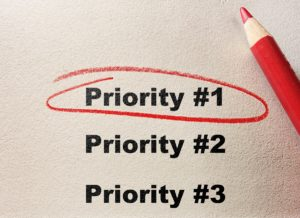

# financial-goals-whats-job-1-for-your-money-in-the-next-three-months

In early August, I asked a question of my mailing list, and on **[my Facebook page:](https://www.facebook.com/YourFinancialLaunchpad/)** What are you up to this summer? I received entertaining emails about hiking trips, travel to Europe, sailing lessons, cups of tea consumed on the deck at the cottage, and other special moments.

In those same emails, some felt compelled to say that they hadn’t thought about their financial goals all summer. One reader, who’d had a glorious summer from the sound of it, summed it up this way: “I admit I haven’t focused too much on my finances, but will need to refocus shortly.”

I hear you. Who wants to think about anything other than disconnecting and recharging when the sky is blue, the sun is hot, and the days are long? Not me!

## A disappearing act

At the time of the exchange above, September was just around the corner. The summer had flown by and now, I suggested, was time to plan for the last few months of the year.

And then September disappeared. Did you see it passing or did it speed by in a whirlwind of back-to-school and back-to-the-routine activities?

Here’s the good news: There is still a full quarter remaining in this year. **This is the perfect time to take a deep breath and think about what we want to accomplish with the remaining three months of the year.**

Actually, we’re going to get more specific than that. Here are the questions I’d like you to toss into the deep processor that is your brain: **“What, specifically, do I want my money to do for me in the next three months? What are my financial goals?”**

That’s right, we’re talking about the work you want your money to do *for you, not the other way around*.

If your first thought is that you’re far too busy to take some time right now, you’ll do it just as soon as life slows down, think again. You’re not going to have more time in next month to create a plan for your money. It’s a plausible-sounding lie we tell ourselves every year, even though we know it’s not true.

You’ll be busier than ever in November, just like you are every year.

**And your money? If you don’t give it a specific job, it will behave like fine particles of sand and disappear into cracks you didn’t even know existed.**

You’ll wake up on December 31st and wonder, “Where did all my money go?”

Same old, same old.

## Are you a good boss or a lousy one?

Let’s imagine that you are a business owner – not a stretch for the many entrepreneurs in my community – and you have just hired an employee. Let’s call the employee Bob.

Bob comes to work on the first day and asks you what to do, but you’re too busy to answer him fully. You don’t give him any specific instructions. Instead, all you say is, “Do your job.”

No training or guidance.

No goals or metrics.

Just silent expectations.

Poor Bob. He doesn’t stand a chance. It won’t be long before you’re pissed off that he’s not doing his job.

It sounds absurd, doesn’t it? There’s no way you’d set an employee loose without any guidance, and yet we do that all the time with our money.

How?

By mindlessly going through our days without conscious decision-making about the best use for our money.

By not taking the time to formulate a strategy for our money.

We don’t stop to sort out our biggest financial pain points and how to address them.

We move forward on automatic, using money in a haphazard way.

Then we get frustrated by our lack of progress.

## What’s Job #1?

If you’re happy with the approach you’ve used since time immemorial, then carry on.

However, for those of you who want better results, this year will be different. We’re going to plan for success.

Let’s commit to getting a running start on September. The first task is to answer the following question:

**What do I want my money to do for me?**

What’s your biggest priority?

Is it paying off a credit card?

Increasing your savings by X dollars?

Buying a more reliable car?

Starting a tax-sheltered investing account?

It may take you a while to figure this out, especially if you’re not accustomed to thinking strategically about your money. That’s OK. I can guarantee that this investment of your time will pay big dividends.

You don’t need to block off two hours to start this process. Take 20 minutes today, over a cup of coffee, and start thinking about the most important job for your money at the moment.

Keep a money journal and write down all of your thoughts, worries, ideas, and experiences. You’ll be amazed at how much you learn as you flip through past entries.

You don’t need a fancy, leather-bound book. I typically use swag I’ve been given at conferences or school notebooks my kids haven’t used. I won my current money log book at a marketing event:

It accompanies me everywhere. In fact, the photo you’re looking at was taken in Kelowna during a family holiday. You never know where inspiration and insight will strike.

Do I think about money all the time? Hell no. But I do write down every great idea, tip, and strategy that I come across, even on holiday. When I sit down to do my planning, I use the book as a resource.

## Deliberate, conscious choices

Those of you who have read my book, **[*Protect Your Purse*](https://yflmainprod.wpengine.com/store/book/)**, know that this is one of the biggest lessons I learned after becoming a thirty-two-year-old widow many years ago: Make deliberate, conscious decisions about your money and your life.

**When I let my finances proceed on automatic as I dealt with other issues, the Universe taught me a serious lesson. It’s one I’ll never forget.**

Today, I regularly set aside time to think about my finances, my business, and my life. This practice is responsible for helping me to pay off significant debt and to create a life that inspires me.

As bizarre as it may sound, I suggest that you think of your money as an employee; it needs a goal, direction, and regular review to ensure that it’s on track.

If thinking about money as an employee doesn’t resonate for you, then view it as one of the most important tools you have at your disposal.

Use it deliberately; use it well.

Your life is far too precious for autopilot. Don’t believe me? Just ask the Universe. It’s perfectly capable of sending you a reminder.

Set your goals. Give money a task. Make it happen.

## Clarify your financial goals

Send me an email with the #1 priority for your money over the next three months. Writing it out will help to make it more concrete.

If you change your mind part-way through the fall, that’s cool. Circumstances change. In fact, you might change your mind because you realize you picked the wrong priority. That’s cool, too.

Just start.

I look forward to hearing from you.

#### Share this post

## Your Foundation to Financial Freedom is coming soon.

Please complete the form to add your name to the wait list. We’ll let you know as soon as the course is released!

## No spam, ever. Unsubscribe any time.

## IMS ESSENTIAL

Please select a payment type: