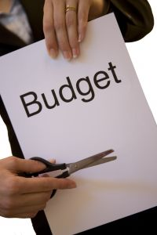

# forget-about-budgeting-and-do-this-instead

I’ve just finished reading two books by people who are considered to be experts in the field of personal finance. They’re both big on budgets. In fact, according to them, having a budget is key to developing financial strength. You’ve got to know your numbers and stick to them. Plot them all out and check in regularly. Track your expenditures. One even goes so far as to suggest that you list every dime you spend as you spend it. Whatever you do don’t stray from the budget.

Does that sound inspiring or even sustainable? Does it make you want to rush to your computer and get it done asap? As I said to a colleague, in my entire life I have only met a handful of people who enjoy budgeting. One friend recently told me that budgets excite her. Let’s just say that’s an uncommon response. Most people would rather watch paint dry than create a budget or better yet stick to a budget. Why is that? Is that really a recipe for success?

**Talk to wealthy people and ask them what they recommend you do to grow your finances. I have.**

When I was broke, massively in debt and [rebuilding my life](https://yflmainprod.wpengine.com/book/) I turned to people who were in a great financial position to see what they would recommend. Not one of them said a thing about budgeting but they did talk a lot about growing money, allocation of funds, smart debt and developing multiple sources of revenue.

Since then I have come to know a number of wealthy people and I can tell you that I have never even heard the word budget mentioned. But the word invariably comes up with people who are in financial trouble. “I should budget.” “We need a budget.” “Time to make a budget.”

Don’t get me wrong: wealthy people have a good idea where their money is going and they certainly have a plan in place to grow their assets. But do you really think that they track the money they spend on a pack of gum? Even when they were broke, and many started off that way, tracking pennies and dimes didn’t factor into it.

Let me clarify so that I don’t get a thousand emails in protest. *Having a budget is a good thing*; it’s essentially a plan for the distribution of a fixed amount of income. **My issue is with the way that people go about the whole topic of budgeting**. **The entire process is set up to focus on a scarcity mentality**: I have a limited amount of money available to me on a monthly basis and now I have to work backwards to see what I have left when all the bills are paid. With this approach you’re working your way towards zero with the emphasis placed squarely on what you can’t do and what you can’t afford.

### One of the biggest lessons that I have learned is that your thoughts, feelings and approach to money have the single greatest impact on your results.

If you think that money is very limited and hard to come by, you’ll be right. Anything that influences your thoughts and feelings about money will affect your financial outcome. Hence my issue in many instances with the process of budgeting.

What if instead you started with a different approach? What if you changed the way that you look at your current situation? You still put a plan in place, which is fundamentally what a budget represents, and you definitely *do* some projections to evaluate various scenarios. However, **instead of working backwards to zero you work your way up** by asking some key questions:

- What are my top five values in life?
- What do I want to accomplish financially?
- What are my goals?
- Are my goals in line with my values?
- Where do I want to be?
- Where am I at currently?
- What’s the best possible way to move from today’s current situation to the desired values-based goals?
- What are my priorities?

### If you use this “plan for the values-based goals” approach, you shift the focus from a diminishing pile of cash to an end result that gets you closer to abundance.

This works even if you’re knee-deep in debt and stuck in a job that pays you too little. Instead of focusing on the fact that you can’t afford to buy yourself the thing you really want, you’ll focus your attention on debt reduction, savings and investments because you have your eyes firmly planted on the end goal and those are the first steps to getting there. The emphasis is now on the desired outcome rather than the restrictions you have to live with on a monthly basis. We can deal with an awful lot if we know that the place to which we’re headed is a huge improvement on our current situation.

My concern isn’t a mere linguistic quibble; it’s rooted in the impact of the words we choose to use and the effect that our approach to money has on our confidence and results. Change the language + change the approach = change the results.

### Here’s the money plan that I recommend and that I teach my clients. It revolves around four key areas of financial knowledge and expertise: Know, Make, Manage, Grow.

1. Start with the end in mind: Determine your values and goals. It can be as simple as saying “One of my top values is to be financially secure, and to that end, I want to be debt-free” or “I want to have extra money every year to take my kids on a great holiday without incurring debt because travel is one of my top values.”
2. [Know your Beacon score](https://yflmainprod.wpengine.com/2014/05/the-first-step-to-financial-security-for-women/) and check it annually.
3. Know and grow your income.
4. Plan to pay for the essentials: a roof over your head, good food on the table (no restaurant or take-out meals in this category) and health care. These inevitably show up in everyone’s top values (i.e. being healthy and safe).
5. Plan to pay off corrosive debt, usually credit card debt, and ensure that you do not incur another dime of debt during the month.
6. Add to your savings with the goal being *at least 3 months* of expenditures in available cash stashed away in an account that you never touch unless there is a true emergency.
7. Add to your investments. If you’ve reached your savings goal then all savings for the period go into investments.
8. Spend the rest on the other stuff based on your values: Kids’ activities, holidays, dinners out and other discretionary spending.

I challenge you to rethink the whole idea of budgeting and see if you can turn if from an exercise of reduction to one of growth.

Let’s see if we can change not only the language around your use of money but also the intent and the goals. I’m willing to bet that this alone could dramatically change your outcomes.

#### Share this post

## Your Foundation to Financial Freedom is coming soon.

Please complete the form to add your name to the wait list. We’ll let you know as soon as the course is released!

## No spam, ever. Unsubscribe any time.

## IMS ESSENTIAL

Please select a payment type: