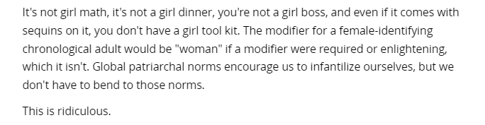

# girl-math-hurts-all-women

**Have you heard about** ***Girl Math?***

I hadn’t until one of my Foundation to Financial Freedomcourse students sent me this email (thanks **B.**!):

> Hello Doris,
> 
> ​
> 
> I am not sure what to think of [https://www.cbc.ca/news/business/tiktok-girl-math-1.6965446](https://www.cbc.ca/news/business/tiktok-girl-math-1.6965446). What is your take on this?

I’ll spare you the time you won’t get back and summarize this for you.

It’s supposedly a “fun” Gen Z trend on TikTok where women use so-called *Girl Math* to “show” that they “made” money by spending on purchases.

Examples given in the CBC article:

1. Found a MacBook regularly priced at $1,450 for $1,300. Claim: Made $150.
2. Bought a $50 item, returned it, then bought a $100 item. Claim: The $100 item therefore only cost $50.

You can go down the TikTok rabbit hole as I did looking into this if you like. 🐰

But if your eyebrows are already racing toward your hairline, I’m with you.

Probably the most eye-popping bit was this *from a financial blogger*, referenced in the article:

> \[Blogger\] calls it “**gen Z slang**” and says the trend is worthwhile because **it helps put women at the centre of financial conversations** that might not happen otherwise.
> 
> ​
> 
> Though she acknowledges that negative stereotypes exist around women and money, \[blogger\] doubts the girl math trend is responsible for them.
> 
> ​
> 
> “This is a **trend created by women for women**. And that’s what makes it feel a little bit less icky for me…. You have to know how much money is coming in every single month and how much money is going out. If you’re aware of that and you’re spending money and you’re doing the girl math, it’s OK.”

Bottom line: the blogger thinks this is all in good fun. No harm done. In fact, there’s some good coming of this because it gives women an opportunity to talk about money.

🤦🏻‍♀️

Hold my tea for a bit while I take this on, will you?

This is so daft.

Let’s talk for a sec about **why you should care about this topic and what to do instead (i.e. NOT “girl math”).**

​

**Why this matters:**

- This puts women at the center of financial conversations all right, but this is NOT the center we want to inhabit.
- The **narrative** around women and money has a huge impact on the way society as a whole treats us and sets implicit expectations.
- This is all about the **struggle for equality** that women have been waging FOREVER.
- Language matters. The words you choose matter. Adding “Girl” in front of “Math” as a qualifier diminishes women, as though somehow math is different for us – especially since this involves faulty math.
- Saying “it’s just fun” about something sexist is the moral equivalent of saying “Can’t you take a joke?” after saying something insulting.
- The fact that this is something created by women doesn’t make it better or good.
- Your finances will thank you if you adopt a radically different narrative.

But first, a personal story.

## Meet my guidance counselor

In Grade 12, I was required to sit down with the sole guidance counselor in our school, Mr. G., to talk about my future.

{I grew up in northern Alberta. Think small community with few options at that time.}

I knew the guy was sexist. Every girl in the school knew it.

But still, the meeting was a school requirement so I found myself in his office talking about my future.

He had my academic records in front of him and the results of my IQ test (that was still a thing all those years ago).

My average was in the 90s. All major subjects fell within 1 or 2 percent of each other in the 90s.

The IQ test indicated possible careers in professional spheres including law and medicine.

Out of all that, here’s what Mr. G. told me:

“You’re good at languages. You should become a teacher.”

He wasn’t saying that because he had a deep respect for the profession or because he felt I had a particular aptitude for teaching.

That would have been terrific if it had been true.

**He suggested I become a teacher because in his mind, girls become teachers; boys become doctors, lawyers, and engineers.**

{I guess he missed the irony that he was a teacher. Never mind. 👀}

I knew his advice was rubbish, but you know what it did for this then-seventeen-year-old?

It made me doubt myself.

**That’s what sexism does – it makes otherwise strong, capable women doubt their abilities. It keeps women playing small.**

And by small I mean playing roles that are not in their highest, best interests.

Roles that do not make full use of a woman’s strengths.

My parents couldn’t provide guidance because neither of them had finished high school. I was breaking ground as the first person in our immediate family to graduate.

Their daughter become a teacher? Sure! Why not?

So I started my university career in the Education department of the closest university (two hours away).

That felt like **what was possible** for me.

A career in the sciences didn’t feel possible despite my marks and all those tests saying otherwise.

The underlying sexist narrative won.

I eventually found my true calling – but that sexist advice influenced me at a critical time.

{For the record, there is nothing wrong with a woman becoming a teacher! If teaching is her dream and her magic sauce, then it is an awesome path for her and she should absolutely pursue it. I STILL talk about amazing teachers I had back in high school and university.

But let’s not funnel girls onto that path out of a sexist belief that teaching is THE path for girls.}

Which brings me to Girl Math.

## The harm in “Girl Math”

**1\. It’s faulty math.**

Nothing about it adds up.

When you spend money, you’re SPENDING money. You are not *saving* money.

That laptop example? You’ve just spent $1,300.

You may have spent less if you got the thing on sale, but this is a spending activity, not a saving activity.

**Saving is what happens when you pull money out of circulation and set it aside in an account for use down the road.**

I wrote about the illusion of saving money when buying things on sale in [this blog post](https://yourfinanciallaunchpad.com/do-you-really-save-money-when-you-buy-items-on-sale/).

As for the example of returning an item you had already purchased, then doing a mental trick to somehow reduce the amount of the new purchase by the amount returned – that’s just baffling.

It makes me want to sit that girl down and say, “You do know that you still paid out $100 in total for the item, right? Not $50?”

**​**

**2\. Labelling bad math as girl math is insulting to women.**

Women have been battling bias about math skills forever.

Remember the Barbie fiasco from 1991 where she said “[Math class is tough!](https://www.google.com/search?q=gee+math+is+hard+barbie+timing&rlz=1C1CHBF_enCA905CA905&oq=gee+math+is+hard+barbie+timing&gs_lcrp=EgZjaHJvbWUyBggAEEUYOTIHCAEQIRigATIHCAIQIRigATIHCAMQIRigAdIBCTEyMTE4ajFqN6gCALACAA&sourceid=chrome&ie=UTF-8#fpstate=ive&vld=cid:90ccc457,vid:DE5p9m5MOKY,st:0)” in an endless loop after declaring that “Party dresses are fun!”?

We don’t need any more of this garbage, thank you very much.

Thankfully, [Greta Gerwig](https://www.imdb.com/name/nm1950086/) got her hands on the Barbie narrative and put out a thought-provoking movie this year.

It’s clear that our work isn’t done.

​

**3\. It’s not fun if it’s derogatory.**

I’m sure the women shooting the TikTok videos are having fun, but there is no possible world in which this isn’t harmful for women.

Because it adds to the narrative that somehow, math is *different* for us.

That we’re not up to the task of having **razor-sharp financial literacy skills**, so we have to create a special kind of math to help us deal with all of this.

And justify purchases.

It’s ridiculous.

Even if it’s done in jest, it’s harmful.

​

**4\. It definitely does NOT provide an opportunity for women to talk about money.**

How is this helpful?

How is this even a conversation?

This is not what an empowering, helpful money conversation looks or sounds like.

This is all about justifying and demeaning women’s financial skills.

Here are a couple of comments in response to the CBC article that sum it up nicely for me.

This from a man:

|  |
| --- |

This from a woman:

|  |
| --- |

## Stop justifying

In my values-based money system, you don’t have to justify a thing to anyone.

You love what you love *unapologetically*.

And you fund the things that matter most to you.

Do you want those $1,350 Cartier earrings (referencing one of the TikTok videos here)?

Go right ahead **as long as that purchase makes sense within your values-based money system.**

If…

- your Essentials are taken care of
- you’re on track to hit your money goals
- and that purchase is in line with your Priorities (based on your core values)

… then buy the earrings.

No justification or gawdawful faulty math required. 🚫  
​

## Build your skills 💪

**One of the best things you can do for yourself and your future is to build your financial literacy skills.**

✨ Then put them into practice.

Here’s the interesting thing about having rock-solid financial skills:

- You have **enough money** to buy what you want. 💰
- You also have the **confidence** to make your purchases without second-guessing yourself because you know you’re good to go.
- You’re already making **great use** of your money.
- Your dollars are already serving your highest, best interests.
- And you’re **on track** to hit your financial goals. 🎯

Because you have skills, a system, and bada$$ confidence. 😎

## Here’s a trick to grow your savings

**Want a strategy to grow your savings account balance that actually works? Try this:**

Every time you say “I saved money”, I invite you to do the following:

1. Specify how much money you’ve saved.
2. Then move that amount of money from your checking account into a high interest savings account.

Now, my friend, you are truly saving money!

Your savings account will grow and you will feel like a rock star. 🔥

But if you DON’T move the money over into the account, you don’t get to say you’ve saved money.

Deal?

Believe it or not, that’s **one of the most important financial literacy lessons** you can learn.

Money isn’t saved until it’s moved out of circulation and set aside for future use.

​

## Your story and comments

What are *your* thoughts on girl math?

Let’s get a real conversation going about women and money.

If you disagree with me, that’s cool! I welcome an exchange about this because I think it’s important.

**Hop into the comments below** and let me know what you think.

If you have a story about sexism you experienced, I want to hear that too. It’s important to share our stories so that we can all learn and grow from them.

I’ve got my cup of tea back in my hand, ready to read your response, so fire away!

Much love, ❤️

Doris

PS **Know a woman** who could use a dose of financial inspiration and support? Forward this email to her and let’s help her get a lot more joy from her money without shame, blame, and judgment. She can hop onto my newsletter list [**here**](https://pages.yourfinanciallaunchpad.com/moneytips) if she wants to get these messages in her inbox so that she doesn’t miss a thing. I also share a lot of exclusive material with my mailing list community.

​

#### Share this post

## Your Foundation to Financial Freedom is coming soon.

Please complete the form to add your name to the wait list. We’ll let you know as soon as the course is released!

## No spam, ever. Unsubscribe any time.

## IMS ESSENTIAL

Please select a payment type: