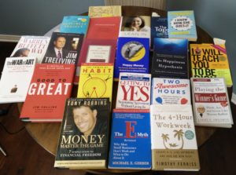

Are you a fan of self-help books? Do you have stacks of them to help improve every aspect of your business, financial, personal or physical life? Take your business to the next level, use your time more efficiently, learn how to relax and de-stress, do these ten exercises to be fit and flexible? Is there more than one in each category?

Mea culpa. Mea maxima culpa.

Now here’s a question: Have you implemented *even 10%* of what you’ve learned in those books? 5%? Anything? I mean actual change in your life, not just a week-long stab at trying something out and abandoning it before the next full moon. Have you managed that?

Hold on a second: What does this have to do with beer, you ask?

This past week, my husband and I tried a couple of tasty micro-brews while enjoying some time with friends. A short while later, I made the usual trip to the washroom. Afterwards, when I was offered a second beer, I joked that I’d love one since the first rental was already gone. Consume it and then it vanishes.

Fast-forward to the next morning: I’m at my desk taking notes on another book about money and it dawns on me that when I consume books this way – that is, read them, take notes and implement what I’ve learned – they actually have an impact on my life. They’re not just short-term experiences like the beer from the night before.

I LOVE books and I’m a sucker for better, faster, more effective, clever ways of being and doing. Promise to teach me something cool that will help me to achieve those results, and I’m in. But after years of reading some seriously good books, the only aspects of my life that have improved are the ones where I have taken the time to learn from people who have achieved the results that I want, and to apply what I’ve learned. I’m willing to bet it’s the same for you.

**Results happen when we switch from mere consumption, to study and application.**

At the risk of sharing too much information, here are a couple great books that I’ve read and a breakdown of the impact on my life when I put their lessons into practice:

### The 4-Hour Body, by Tim Ferriss

This puppy is a door-stopper, coming in at more than 500 pages. I picked it up roughly eight months before my 50th birthday when a store clerk, having just learned my age, told me, “Wow, you look great for someone who’s nearly 50 years old!” Her comment really bugged me. I know she meant it kindly, but when you add the bit “for someone who’s…” it takes some of the shine off the compliment. It made me ask a single question: What *would* it take for me to look great, period, without my age coming into it?

I turned to Ferriss because a) he uses himself as a guinea pig and reports all the results very honestly; b) he is obsessed with outcomes and efficiency; and c) he is a science hound. His desire to ensure that everything he does is backed by science was attractive to me. So I read, digested and implemented 85% of his eating and workout suggestions. It took a long time and was a real pain since it required overhauling my breakfasts and other eating habits.

The results? I was recently measured by Phil, a personal trainer at Movati gym, and it turns out that I have 18% body fat. Phil’s eyes widened when he saw the printout. “Most women have a body fat reading in the high twenties to the high forties. This result is unusual.”

I also recently had to go through an invasive series of tests for my life insurance policy renewal. They measured pretty much everything. The result? I ended up in the top 2% of the population, which means that I pay the lowest possible premiums for insurance. Good health = a lot of money saved.

Lesson for me: The effort was worth it.

### The War of Art: Break Through the Blocks and Win Your Inner Creative Battles, by Steven Pressfield

I have been working on my book, *Protect Your Purse*, for nearly four years now. For the first two years, I was in research mode. I would interview women, dig for statistics and write blog posts to share my findings. Eventually, though, friends and acquaintances wanted to know when the book was going to be finished. The problem was that my schedule was getting busier, not lighter, and there never seemed to be enough time to dedicate to finishing the manuscript. I couldn’t figure out how I was going to get the thing done.

Then I read Pressfield’s small but effective book. He called my BS. The problem wasn’t my schedule, it was me. I wasn’t making the time to complete the book for a variety of valid reasons, but they all amounted to excuses. Pressfield helped me realize what I was doing and showed me a way to get past the blocks. I started to make finishing my book the #1 priority in my life. I stopped coaching girls’ basketball, stopped looking at real estate deals and started to turn off my phone and all social media for several hours every day while I wrote.

The result: I finished my manuscript, hired editors and designers to create the final product, and will have a book in my hands in the next few weeks.

Lesson for me: What you prioritize gets done.

There are too many good books on my shelves whose lessons have been lost to me. I remember reading Jim Collins’ *Good to Great*, and thinking at the time that it was one of the best business books I’d ever read. I dog-eared multiple pages and wrote notes in the margins. And yet, once the book was done, I put it back on my shelf and didn’t do a single thing with it. If you gave me a pop quiz today on its content, I would fail.

Then there’s Laura Vanderkam’s *I Know How She Does It*. I would fare a bit better on a quiz about that one because I can tell you that two of her key messages are 1) track your time; and 2) plan your week on Fridays. I intended to do both; in fact, I started to do that and it was an effective approach for me, but I haven’t kept it up. Fail. Why? Because I didn’t prioritize implementing what I had learned.

What are the last two self-help books that you’ve read? Have you retained anything from them? What have you actually used in your life? Are you happy with those results?

Look, if you’re the kind of person who reads books purely for entertainment and you’re not interested in changing or improving anything, then fine. Keep consuming. But if you bought, or borrowed, those books for a reason, then it’s time for a change in strategy unless you’re already getting results.

Read.

Review.

Apply.

You’ll get a much bigger bang for your money, and your life.

#### Share this post

## Your Foundation to Financial Freedom is coming soon.

Please complete the form to add your name to the wait list. We’ll let you know as soon as the course is released!

## No spam, ever. Unsubscribe any time.

## IMS ESSENTIAL

Please select a payment type: