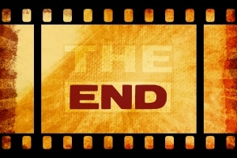

When I asked my readers if there is anything in particular they want me to address, a friend replied, “How do you get your life back on track when you’ve been depressed for a couple of years?” 

That’s a big one.

While I can’t comment on depression specifically, there is some common ground for people who have been through a very rough time, whether because of illness, divorce, death, financial challenges or some combination of these. They all find themselves at a low point and they’re searching for a path to a better place.

The following is what worked for me. If some of these ideas resonate with you then by all means use them and adapt them to your own situation. If something else has worked for you, please share in the comments below.

After [Malcolm’s death in 1998](https://yflmainprod.wpengine.com/2012/05/my-story-part-i/), I went through a period of debilitating grief. I think I spent more than three weeks crying on the floor of my office, unable to think straight and certainly unable to function professionally. I didn’t leave the house, I barely ate and I refused to answer the phone. I’m pretty sure I survived that first stretch simply because Malcolm’s father, Ron, checked in on me daily and badgered me until I started eating again.

Then I went through an angry period. I was seriously pissed off at the Universe. It was not cool that Malcolm died so young; it was not cool that I lost the most important person in my life and it bloody well wasn’t OK that my future had just been ripped out from under me.

I spent months wallowing in self-pity. Then panic set in when I realized the severity of [my financial situation](https://yflmainprod.wpengine.com/2012/05/my-story-part-ii/). I couldn’t afford to feel sorry for myself any longer; there were too many bills to pay.

The next year was a difficult one but through it all I discovered some things that helped me climb out of the mess.

## Start with the end in mind

One day in January, after the first dismal Christmas without Malcolm, I found myself walking through the forest behind my back yard. After a period of wandering aimlessly, it occurred to me that I didn’t know where I was going. In one big “aha” moment, I realized that this was the problem with my life too.

Throughout my teenage years and in my twenties I always had goals and a plan. Sort out the destination, work backwards to figure out the steps and execute.

Suddenly I was spinning. An academic career was no longer an option, the business had no future and I had no marketable skills that were easily definable. Smart? So are tons of other people. Capable? That too. Clever, creative? Yeah, yeah, get in line. My Bachelor of Arts hardly set me apart, cum laude or not.

I stopped walking and asked myself a simple question: What do you want? Never mind where you’re at now or what’s realistic, what do you really want?

- I wanted to be free from the pain of loss. I wanted to feel genuine joy. It didn’t feel possible at that time but I wanted it anyway.
- I definitely wanted money. People with money have options. Facing disaster with money is a whole lot easier than facing disaster without it. Money was a must. I swore to myself that I would never again be financially vulnerable.
- I wanted a whole new career, work that resonated with my goals and desires. The business had been Malcolm’s; it was not my chosen path.
- The house had to go. Even though it was only twenty minutes outside of a large city, I felt completely isolated. Plus it was full of terrible memories.
- I wanted a vibrant social life. Malcolm’s illness had reduced us to virtual hermits for the last couple years of his life. I desperately wanted the company of friends.
- I longed to travel and I needed to escape, if only for a bit. Malcolm’s cancer and on-going treatments meant that we never ventured too far from home. Australia, New Zealand, Asia – all were on my list.
- Have I mentioned money? I was swimming in debt at the time. I wanted to be free from the stress and pressure of debt.

And so it went. I worked out a mental list of where I wanted to be. When I got home I put it in writing and I re-read that list on a regular basis to remind myself of the big picture.

Then I worked backwards to try to figure out what I needed to do. Sometimes I drew a big blank; I honestly had no idea how to get from point A to point B. When that happened I focused on lots of little things that helped me move in the right direction. Things like sorting out paperwork, selling unnecessary business assets, repairing items in my house so that I could eventually sell it, giving away anything I hadn’t used in years, getting outside every single day to breathe fresh air and get some exercise. Slowly, very slowly, my life started to shift.

Whenever I felt rotten, I would re-read my list and ask myself one simple question: What would make me feel better right now and at the same time help me get closer to my goals? Sometimes that meant going to bed at 6 pm because I was exhausted and couldn’t process a single other thought. Other times it meant making an effort to reach out to a friend and to be social. Did I feel like it? No. Did I need to do it in order to feel better? Yes.

I did it because the alternative was to continue to feel rotten, and I knew that I definitely didn’t want that. If you keep doing the same things, you’ll get the same results. I needed to change to get to a good place.

The small, positive decisions eventually led to bigger, positive decisions which all played a role in helping me to move forward to a meaningful place for me.

If you always choose in favour of your goals, your priorities and your passions, you will move forward.

## Ask the Universe for help

I’m the kind of person who doesn’t want to impose on others or be a burden. Rather than turn to someone for help, I tried to slog through on my own. I failed.

When Malcolm died we owned a house just north of Kingston. It was out in the country on a couple of acres surrounded by fields and cows. One night my situation really got to me. I felt that I would boil over with anger and simply had to blow off some steam. So when night came I strapped on my running shoes and went for a pounding walk that turned into a chat with the Universe.

I let it all out: the anger, the frustration and the tears. Several cows turned to watch the crazy, ranting woman storming her way down the road. There was no solution, no big “aha” moment, but I did feel a whole lot better by the time I got home.

I did it the next night, and the next. Eventually it became a routine. I treated it like a regular conversation: “Hello, it’s me again.” Always at night when I had little to stare at other than stars and the outline of cows in the fields. Somehow it seemed more private.

Something interesting began to happen: I would pose questions at the start of the walk and work through all of the challenges I was facing.

– So how am I supposed to do X? I have no idea where I’m supposed to start or how I can possibly make it happen. Throw me a bone here; what now?

I’d talk until the stress receded and then I’d shut up. Walk in silence.

I started to get a few ideas.

Some ideas would come to me right away, others would occur to me back at home: in the shower, in the middle of the night, as I cooked dinner.

In the nearly sixteen years since that time my chats with the Universe have become my way of reconnecting with my core, defining the challenges and allowing the solutions to come to me. I have come to trust the process and it has never failed me. It has sometimes been frustratingly slow, but it has always worked.

There is a solution for every challenge if you will only allow it to break through. Meditate, walk, run, pray, hike, dance – whatever works for you. Connect with your inner wisdom, allow the answers to come and trust that they will.

## Fire the bully in your brain

Can you imagine what you’d say if someone constantly put down your child? If every second word to your kid were discouraging? I’m guessing you’d be pretty upset! We go out of our way to protect our kids to ensure that they have the most encouraging environment possible because we know that you can’t learn, thrive and grow on put-downs and discouragement.

And yet, all too often that’s precisely how we talk to ourselves.

Have you ever chided yourself for “being dumb/a fool/stupid/insert your own put-down”? Ever thought of a hundred reasons why you can’t succeed at something? Ever doubted your ability to accomplish a goal?

Few people are meaner to us than we are to ourselves. One of my business colleagues has a brilliant way of describing the negative voices in her head. She calls them the “Itty Bitty Shitty Committee.”

When I first wrote down my goals on that January day long ago I vividly remember my reaction when I re-read them: There’s no way. I thought of every single reason why I could not and would not accomplish those goals. I was deluded to even think they were possible. Clearly grief and stress had addled my brain.

What the hell?! Who needs that kind of talk?

Why do we do that to ourselves? Do we have such a shortage of critics in our lives that we need to add to the punishment?

Here’s what I’ve learned: You are the boss of you. You control what you do and don’t say to yourself. Fire the bully in your brain! Tell her to get lost. Position terminated immediately.

You have a life to lead and goals to accomplish. Any language that is detrimental to your progress is henceforth banned.

We all have negative voices in our head and it’s important to realize that those criticisms are baseless. Founded on nothing. Who knows where they come from – fears, upbringing, blah blah blah – it doesn’t matter. It’s all part of the negative script that drains our energy.

If you screwed up or failed in the past, so what. That’s the past, it’s not your future. Let go of the baggage and leave it behind you where it belongs.

Here’s a rebuttal whenever the Itty Bitty Shitty Committee pipes up:

YES I CAN!!

Yes I can accomplish my goals.

Yes I can get to a good place.

Yes I am smart enough, good enough, strong enough, worthy.

Yes. I. Can.

Those three words have become my motto. They guide me whenever I have doubts. I’m now teaching them to my daughters.

I have even passed them on to the girls’ basketball team that I coached this past year. That team of 10- and 11-year-old girls, who had few developed skills and no prior competitive experience, won a gold medal in a division that no one thought was even remotely possible at the start of the season. I taught them one cheer: Yes We Can! We never once used the team name for a cheer. The only thing we said to ourselves at every single practice and before every game is “Yes We Can!”. And they did.

Of course that’s not the whole story; other elements are needed to succeed – work, determination, perseverance. But it all starts with belief.

Frame those words and put them in front of you so that every single day you remind yourself that you can achieve whatever you want. You can rise out of any awful, dismal, depressing place in which you find yourself. It all starts with belief and faith.

Yes you can.

Until next time, Survive, Thrive and Grow!

#### Share this post

## Your Foundation to Financial Freedom is coming soon.

Please complete the form to add your name to the wait list. We’ll let you know as soon as the course is released!

## No spam, ever. Unsubscribe any time.

## IMS ESSENTIAL

Please select a payment type: