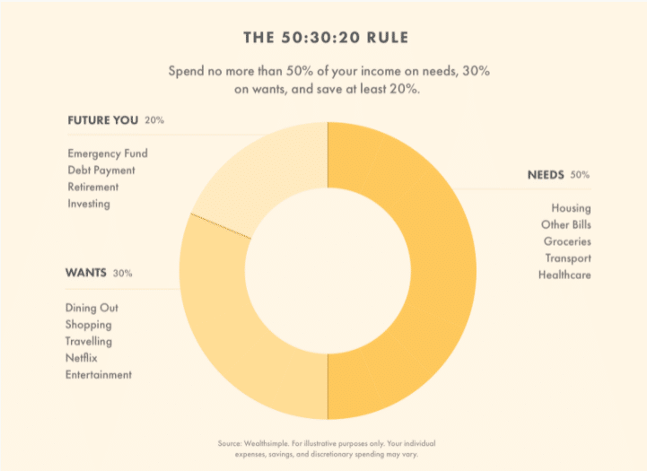

**How much money should you allocate to each category in your personal finances?**

We’re talking about things like housing, food, transportation, savings, going out, and so on. What’s the right amount to spend for each?

I get that question a lot from people who are trying to create a system for their money. There’s a feeling that if they don’t have a specific target, they’ll waste money and miss out on their goals.

I get the desire to have specific, quantified targets. Certainty and simplicity are attractive, comfortable. They’re an easy way to tell if we’re on track.

But this begs the question, “Which track are you on?” If you’re going to follow someone’s prescriptive target, wouldn’t you want to know what that number is based on?

And why it makes sense for you?

**As I’ve discovered over 15 years of working with people on their finances, prescriptive targets probably won’t serve you well because they’re blunt strategies that miss out on the most important questions of all: What do *you* want and need? What’s in *your* highest, best interests?**

Simplicity in your system is definitely valuable and doable, but you can do much better than one-size-fits-all targets.

In this post, I’ll share one of the most common “prescriptions” or rules in the personal finance space. Then I’ll show you why I threw it out the window years ago and developed a values-based approach that cranks up the likelihood you’ll get joy out of your money and actually achieve your goals.

## The 50/30/20 Rule

There’s no shortage of suggestions from personal finance writers when it comes to recommendations on how to divvy up your dollars. Most of them are a variation of the popular 50/30/20 Rule.

In an [article for Wealthsimple](https://www.wealthsimple.com/en-ca/learn/50-30-20-rule?gclid=CjwKCAjwi9-HBhACEiwAPzUhHNJ__lQNKvQEKs_1pl4PKGcDd4xmnmVzmiap9dmTz4cFIHjPvWUhXRoCvXYQAvD_BwE#what_does_the_50_30_20_rule_mean), author Dennis Hammer provides the following illustration of the 50/30/20 Rule:

 

I have no idea who first created this rule and what they based it on, but the rule states that you should target no more than 50% of your after-tax dollars for spending on your needs, 30% for your wants, and 20% for your financial goals.

#### Let’s use round numbers to keep things simple as an illustration:

If you earn $100,000 after tax and you followed this rule, you would spend as follows:

- No more than $50,000 on your rent or mortgage, food, car payments and other forms of transportation, medical costs, and other bills related to essentials.
- No more than $30,000 on fun: going out to restaurants, clothes, trips, weekend outings, online entertainment, concerts, and so on.
- Put $20,000 toward a mix of debt payments, investments, your emergency fund, and savings.

Every writer goes to some pains to explain that these are “general guidelines” because of course the percentages will vary if you live in an expensive location like Vancouver or New York, etc. The percentages are flexible, they say, which is kind of funny if it’s a rule. Maybe they should call it a “Rule-ish”. Imagine saying to your kid, “You need to be kind-ish to your sister.” See how that works.

Here’s my question though: **Why use those percentages? Why 50% for needs? Who picked this number and what’s it based on?**

Did they look at a broad range of people, triage the data to include only those households whose finances were healthy (which also begs the question as to how they determined financial health), and note the trends, which led to the 50/30/20 split?

Gotta tell you, the researcher in me wants to know where on earth these numbers come from. It makes me crazy when people toss out numbers that seem plausible but are based on M.U.S. (Made Up Stuff).

And here’s an equally important question: Will those percentages serve you well?

Let’s look at that.

## Unintended consequences

Let’s go back to our example. You currently earn $100K after tax. But since you’re a motivated woman and you’re knocking it out of the park at work, the boss agrees when you ask for a $10,000 after-tax raise (because you’ve learned that negotiating is a key life skill and you strategically advocate for yourself every chance you get).

Now you earn $110,000 – yay you.

According to the rule, $5,000(ish) of the raise would go to your needs, $3,000 to your wants, and $2,000 to your savings/investments/retirement.

##### That right there my friends is called Lifestyle Creep – or as it’s aptly called elsewhere, Lifestyle Bloat.

The tendency to spend more when you earn more.

That’s precisely what got so many of my clients into trouble during my Financial Repair days.

I know, I know, these are just “guidelines” and they do say that “no more than” x% should go to needs or wants. But the problem with rules is that they make it easy to justify behaviours that are definitely not in your best interests.

Want to spend another $3,000 to $8,000 on trips from the money you earned from your raise? No problem! You’ll just attribute the extra dollars allotted for needs and wants to this and hey, it’s cool because you’re still putting an extra $2,000 toward your financial goals.

**You start thinking about staying within the generic rules rather than asking the much more helpful question: What’s in my highest, best interests?**

Never mind that you have corrosive debt and the bulk of your increased income would be best utilized by reducing that as quickly as possible.

Or that putting 5% to 10% toward your retirement won’t get you to your goals, because your needs at retirement will outstrip the amounts you’re setting aside today. More of the raise would be best utilized by being invested for your future in this scenario.

Or that you earn a lower income which means that your essential costs are necessarily higher than 50%. If you keep staring at a rule that says that you “shouldn’t” spend that much on your needs, now the Shame Train starts up and you’re beating yourself up over perceived inadequacies. Your mindset takes a pounding.

None of this will serve you well.

## A more effective approach

**Instead of comparing yourself to the choices of the Average Jane or Joe, how about if you ask what *you* want?**

**How about establishing what *your* core values are and fund those first?**

No prescriptions. No should.

Just values-based goals that tell your money how to serve you well.

Every step of the way, you ask two simple questions to determine how best to apportion incoming funds:

1. What’s in my highest, best interests?
2. Is this choice congruent with my core values?

If yes, spend with pleasure. No stress, no angst, and no regret.

If no, make another choice.

Every step of the way, you’re checking in with what matters most to you and you’re making decisions with an eye on the outcome you desire.

It’s simple to share this approach with your children, too, and it keeps you out of the scarcity game of “We can’t afford that.”

Nope. None of that. From now on, you’re making choices. You’re in control.

It’s not about not being able to afford something, it’s about choosing how best to use your dollars to get maximum value from them. And that’s precisely how you frame it to your kids. “Which would you prefer?” you ask them when faced with a choice.

If they ask why they can’t have both, you say that spending on those two items isn’t in the money plan and you’re choosing to make wise choices. If they keep saying they want both, then you ask, “Great! What’s your plan to be able to pay for the second item? Let’s figure out how you (or we, depending on the situation) can make that happen.”

You model agency and choice. You demonstrate that you’re in the driver’s seat of your finances.

## The Spending Order I teach

In my ***Take Charge of Your Money*** course, I walk my students through the creation of their Money Map, showing the flow of cash in and out of their lives.

Part of that process demonstrates the order in which to spend money to ensure that their goals are met:

1. **Fund Essentials.** These are the things you need to survive: a roof over your head, good food on the table, medical care, transportation, and so on.
2. **Savings/Investments & Debt Repayment.** Fund your future and eliminate corrosive debt. Most people only think of their savings after they’ve done all their spending for the month. That pretty much ensures they’ll never save much. Your future and your goals are worth more than mere table scraps.
3. **Fund Priorities.** These are the things you identify from your list of core values. There is no judgment about what shows up on your list. If you value going out to restaurants with friends, it goes on your list of priorities instead of being presumed to be an extra. Do you have a thing for shoes? Fine. Travel (my personal fave)? It goes on your list. **You get to choose what to fund – without guilt or explanations.**
4. **Everything Else**. After you’ve taken care of the important bits, do whatever you want with the rest. I personally don’t track this money very carefully. I don’t need to because my future is taken care of and so are my values-based priorities.

**This approach has transformed the finances and the financial experience of hundreds of people who have learned this method from me.**

I developed it after 15 years of working directly with families, with course students, and with private coaching clients to help them create rock-solid finances. It’s a simple system that works for everyone.

And not a percentage-based rule in sight.

#### How do you know if you’re off track?

You create your values-based plan and as you track your spending, you realize that you don’t have enough money to fund the first three. That’s when you make adjustments, using my approach of focusing on the big wins first, then making incremental changes one step at a time.

In my system, the only percentage you track is your savings rate, as part of my [Four Key Numbers to Financial Freedom](https://yourfinanciallaunchpad.com/four-numbers-to-financial-freedom-in-order/).

Your life isn’t one-size-fits-all. Why take that approach with your finances?

Keep it simple and make sure your system serves you well.

I can tell you this: If you use my values-based approach, it will.

Photo by **[Karolina Grabowska](https://www.pexels.com/@karolina-grabowska?utm_content=attributionCopyText&utm_medium=referral&utm_source=pexels)** from **[Pexels](https://www.pexels.com/photo/two-red-balloons-with-percentage-symbols-on-white-background-5625108/?utm_content=attributionCopyText&utm_medium=referral&utm_source=pexels)**

#### In a few weeks, I’ll be opening the doors to my Take Charge of Your Money course.

#### Be the first to hear about it by getting on my mailing list here.

Get my weekly posts with money tips, strategies, and insights. No spam – ever.

#### Share this post

## Your Foundation to Financial Freedom is coming soon.

Please complete the form to add your name to the wait list. We’ll let you know as soon as the course is released!

## No spam, ever. Unsubscribe any time.

## IMS ESSENTIAL

Please select a payment type: