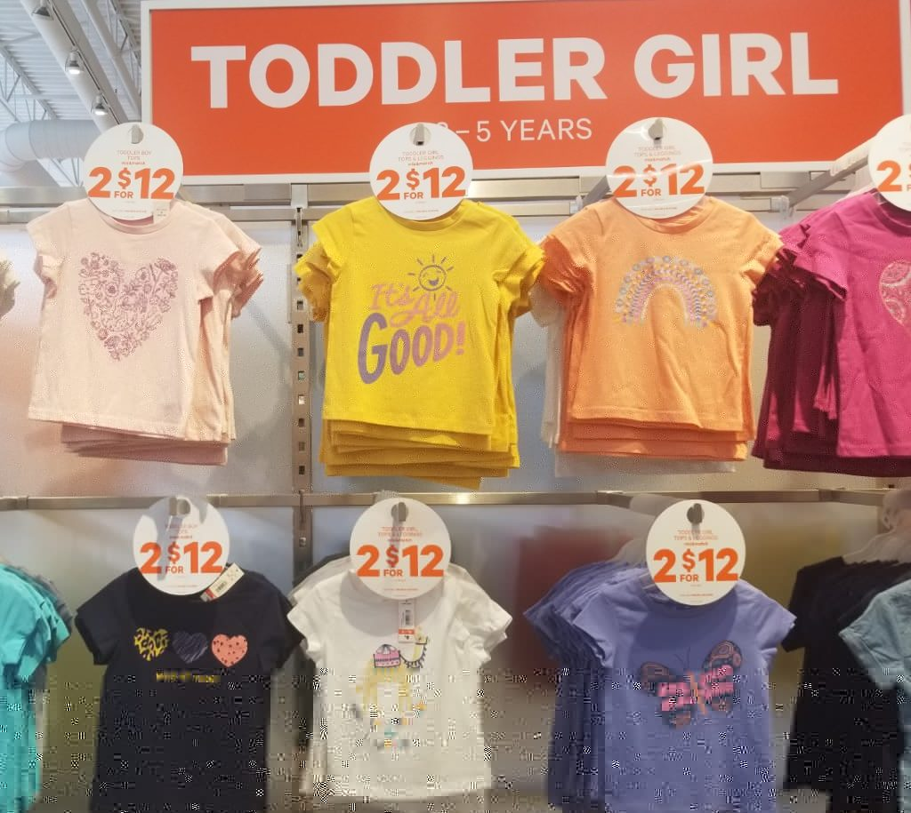
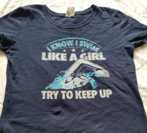

My 14-year-old daughter and I were recently in a long line-up at the grocery store, waiting for our turn to check out.

As we made our way past a clothing display, my daughter commented on the cool shirts available for toddler boys. Here’s what she saw:

 

As we moved farther along, she saw the other side for girls:

 

She was not impressed and neither was I.

What strikes you about these two sets of shirts?

What I see? Part of the reason that so many women I work with have a fractured relationship with money and rely on men to make choices that are definitely not in their highest, best interests.

It’s part of the reason that women as a whole have trouble finding, recognizing, and honouring their voice.

## “I don’t wanna sit still, look pretty”

My teenager spotted the issue right away. “Why do the boys get the cool shirts where they’re being active and doing fun stuff?”

Why indeed.

Because the world is *still* different for girls despite the fact that it’s 2021.

Because the message we give our girls with an endless array of cute shirts like those above is that their job in life is to be pretty. Not capable, not accomplished, not ambitious, not active, not vocal; pretty.

“Sweetheart,” the message goes, “you’re all about butterflies, hearts, and rainbows. Your brothers are all about doing cool things and soaring.”

I love butterflies, and hearts, and rainbows, but effing hell, couldn’t they have had a SINGLE shirt that showed them reaching for the stars?

Apparently girls don’t need to soar or get big air.

And when they do get out to “Explore the world” they do it on a camel’s back. Wouldn’t want to tire the poor girl out by making her walk, run, jump, or climb anything.

Maybe it would mess up her hair and her nails.

I repeat myself: Effing Hell!

##### The story continues:

Girls need to “See good in all things”. Heaven forbid they should rock the boat. Better to say, “It’s all good.”

Look, “See good in all things” is an admirable life philosophy. It’s one that would serve everyone well, but when it becomes the dominant message we give girls, we’re implicitly telling them to stop whining about, well, anything – injustice, sexism, whatever – and go with the flow. It’s all good right?

Be good. Be pretty. And above all, be agreeable.

## What this has to do with their finances

Before you throw the old argument of “What’s wrong with a cute shirt for my young daughter, Doris?” I will be the first to tell you that I bought heaps of colourful shirts for my girls when they were young. There’s nothing wrong with cute, colourful shirts.

But I also gave my daughters shirts that had aspirational and inspirational messages on them reminding them of their power, of their capabilities, of their voice.

Girls need to hear and to see these messages daily to overcome the barrage of subtle social messages reinforcing the “be pretty and nice; don’t worry about money” narrative.

**This matters because those toddlers grow up to be 30-something to 70-something women in my safe, all-female community where women can finally speak freely about their past and their present experiences with money.**

**And that’s when I hear and see the impact of years of subtle (and not-so-subtle) sexism:**

- Lack of self worth.
- Lack of belief in their ability to be smart and savvy with money, unlike the men in their world.
- Financial power imbalances out the yin-yang, where women feel they have less of a voice than the men in their life.
- Years of underearning.
- Anger and resentment at having been told for decades what they can and can’t buy.
- Feeling powerless and stuck.
- Worrying that they’re behind because they didn’t earn as much as their brothers or partners.
- Feeling unworthy because while they stayed home to take care of the kids, they “didn’t contribute as much”.
- Feeling they don’t get a say because they earn less than their partner.
- Dealing with significant debt because they were never taught to manage money; that was their father’s job growing up.
- A belief that men earn money, women spend it.

The impact of messages from seemingly harmless drawings is real. The problem isn’t a single drawing, it’s the sheer volume of them.

Ask yourself this: If we really did have identical beliefs about boys and girls, wouldn’t we see a fairly even mix of “pretty” and “aspirational” messages on clothing for each?

## It’s not fair for boys either

I love that my daughter worried about the impact of these biases on boys, too.

“What if a boy likes rainbows and hearts? What if he wants a pink shirt with a butterfly on it? What’s he supposed to do? It’s not fair.”

That’s right – it’s not fair for boys either. Nobody wins in this rigidly segmented world.

## What we can do

##### Here are some concrete steps you can take to mitigate the impact of societal biases on your girls:

1. First and foremost, **talk to them about money**. Tell them what you’re working on, how you manage your money, some of the lessons you’ve learned (without going into [scarcity mentality mode](https://yourfinanciallaunchpad.com/is-one-of-your-money-tracks-broken/)), and how you’re working on building your skills. Seeing Mom or Aunty building her financial literacy is one of the most powerful gifts you can give them.
2. **Make talking about money normal,** not a big deal. The terms aren’t scary, they’re simply part of a language that you’re working on. Learning a new language takes practice. They’re up for the job. And it definitely isn’t vulgar or gauche to talk about money; it’s wise.
3. Make it clear that **managing money** – which includes earning well, making wise (i.e. [values-based](https://yourfinanciallaunchpad.com/a-primer-on-values-based-money-management/)) decisions about its use, and growing it through investing – **is part of the** **necessary skills for adulthood**. These aren’t optional; they’re required.
4. Every step of the way, **emphasize how strong and capable they are**. They can absolutely learn everything they need to know to live a happy, empowered, wealthy life. Yes, wealthy. (Be careful not to perpetuate your money stories. It’s time to break the pattern if this is an issue for you.)
5. Encourage them to go out into the world and try different things. If they fail at something, good! They’ve just acquired valuable information on what not to do next time. **Failure is essential to success.**
6. Let them know that they can look good all they like – and that’s cool – but **being financially strong isn’t about your looks or your genetics**. It’s about learning and implementing. This is all about doing – and they’re up to the task.
7. **Encourage them to develop and use their voice**, even if it makes you crazy at moments. I’m mom to two strong-willed teenage girls. They drive me up the wall with their voices at moments, but that’s part of the deal of growing strong women. I wouldn’t want it any other way.
8. For every cute shirt you buy them, buy them one that reinforces their empowerment!

##### Anything you can do to counteract the effects of the “sit still, look pretty” story line will pay huge dividends in your daughter’s future financial life (pun absolutely intended).

For the record, here’s the shirt my daughter was wearing when we spotted the toddler display in the grocery store:

You go girls!

PS. I’d love for you to share images of shirts or prints that inspire you. Please share them in the comments below. Let’s get some better messages flowing here!

PSS. This is the shirt my older daughter wore the next day. It’s one of her faves:  
 

When we talked about this post, she said, “I think it’s stupid that there are still “girls” and “boys” sections for young kids. Why not just have a t-shirt section for all kids? If boys want to choose a shirt with a heart on it, they can. Same for girls who love the dinosaur shirts.”

#### In a few weeks, I’ll be opening the doors to my Take Charge of Your Money course.

#### Be the first to hear about it by getting on my mailing list here.

Get my weekly posts with money tips, strategies, and insights. No spam – ever.

#### Share this post

## Your Foundation to Financial Freedom is coming soon.

Please complete the form to add your name to the wait list. We’ll let you know as soon as the course is released!

## No spam, ever. Unsubscribe any time.

## IMS ESSENTIAL

Please select a payment type: