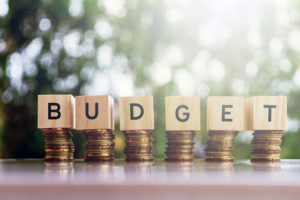

# how-to-budget-effectively-to-achieve-your-goals

Let’s have some fun with a quiz. What’s the secret to achieving your financial goals this year? Is it:

a) Luck – Some people get all the breaks.

b) Education – It helps to have a degree in finance.

c) A good budget – It keeps your money organized and on track.

d) All of the above.

e) None of the above.

What do you think?

### Luck

No one will argue with the advantages of having a bit of luck in life, but none of the dozens of millionaires I’ve encountered achieved financial success through luck. They may have benefited from it on occasion, but it wasn’t the primary factor. They certainly didn’t depend on it.

We can safely say that it’s not part of a goal achievement plan.

### Education

It definitely helps, but again, it’s not a guarantee of success with your goals.

In **[my book](https://yflmainprod.wpengine.com/store/book/),** I tell the story of a woman whose husband, a financial planner, left her saddled with thousands of dollars of debt after his sudden death. So much for the benefit of education.

The field of behavioral economics shows us very clearly that we are all too human when it comes to money and decision-making, even when we know better.

### A good budget

Everyone talks about budgets as though they’re the cornerstone of smart financial planning.

Here’s the thing about them: When they work, they’re great. Unfortunately, they don’t work for most people, most of the time.

In part, it’s because they force a reductive approach to your finances. In other words, you start with your monthly income and you apportion all the dollars into categories, or boxes, until you get to zero.

And that’s exactly how much fun the process is – 0. It’s a great way to develop a scarcity mentality as you watch your budget balance diminish with every dollar you spend.

Even when the process works, it’s rarely sustained.

Years ago, my business partners and I worked with dozens of families to help them rebuild their finances. We’d create a budget that would yield good results. Our clients paid off thousands of dollars of debt, built up their savings, and significantly improved their credit score.

All good, right?

Wrong. The minute we stopped working with them, many slid back into their old habits despite the fact that the budget they had worked with, for years in some cases, helped them accomplish their goals. When they got to the finish line, bye-bye budget.

**The upshot: Budgeting didn’t resonate with them. They viewed it as a temporary pain to be endured.**

### What works

If you guessed that my answer to the initial question is e) none of the above, you’re right.

**The most effective way to achieve your financial goals, that I have found through research and experience, is to create a Money Roadmap** **underpinned by winning behaviors (remember our conversation over the past week about the importance of vital behaviors?).**

Here is the process to create your own Money Roadmap, for the DIY-ers in my community. (Not a DIY-er? Skip to Get Guidance below.)

1. Identify your values. What matters most to you? These should be the guideposts to ensure that your money serves you well.
2. Establish your goals. What do you want to accomplish with your money this year? Make a list.
3. Price out each item (e.g. Reduce debt by $2,000; Family trip – $3,000; new fridge – $800, invest $4,000; braces for daughter – $3,000, etc).
4. Which will you pay for with cash and which will require taking on more debt? Create a column, with the total, for cash purchases, then do the same for items requiring new debt.
5. Run your goals through the Values Test. Are you funding the right things? If you say you value financial security, but your goals are all about spending versus debt-reduction, you might not be funding the right things for you. The items left on the list are your priorities for the year.
6. Write down your after-tax income for the year. This is the amount of money you have to work with. For the moment, ignore any additional side-hustle income you intend to make.
7. Get totals for your current monthly spending. (You need to track your spending for a couple of months so that you know your numbers.) Identify total spending on essentials (i.e. the things you \*need\* to survive, like a roof over your head, good food on the table, and so on). Then, get totals for other spending.
8. Subtract the cost of essential expenses from your after-tax income.
9. Next, subtract the cost of your priorities. How much is left?
10. The amount left over is what you have left to spend on everything else throughout the year. Divide this number by twelve to get your monthly allowance for “other” expenses.
11. Pay for items in order of importance. Whatever is left over is your free money to do with as you please, guilt-free.
12. Track your growth and goal achievement through a success checklist. I guarantee that once you start this, you’ll be hooked!

### Questions to ask

Does the monthly allowance in #9 cover your current spending patterns for everything except essentials and your priorities, which are already addressed? If so, you’re good to go. Carry out the plan and you will achieve your financial goals for the year, in order of priority for you. It’s a custom-made solution that meets your needs.

If there is a shortfall – not enough money for everything – it’s time to take a close look at how you’re currently spending money.

–> Is your spending in line with your values?

–> Are you funding the most important things?

–> Are your choices moving you forward or keeping you stuck (i.e. always in debt, no savings, or no investments)?

–> What can you eliminate or reduce without much impact on your level of joy?

If you’ve realigned your current spending with your values and you still don’t have enough money for your priorities, start by funding the most important items and scaling back or eliminating others.

### I want it all!

You might decide that *all* of your goals are important to you. If so, rather than dropping some of your planned expenditures or investments, explore ways to increase your income through a side hustle, over-time, asking for a raise and so on. I know many people who have used this strategy to speed up debt elimination, grow their savings, and pay for cherished activities.

Finally, open up your calendar, electronic or paper, and input key dates:

- When to set up automatic transfers for savings and investments.
- When to set up automatic bill payments.
- Time to review credit card bills and bank statements to assess your spending.
- Review your goals to ensure you’re on track. Make changes if necessary.
- Date to research upcoming purchases.
- When to update your success checklist.

All that’s left for you to do is to celebrate when December 31st rolls around and you’ve crushed your financial goals!

### Get guidance

This is 100% doable by everyone! If you’re a DIY type, you can accomplish this yourself by following the steps above.

**If, however, you’d like me to guide you through the process, [click here](https://yflmainprod.wpengine.com/events/january-28th-2020-womens-money-group-workshop/) to register for my online workshop on How to Budget Effectively, complete with my step-by-step process, tools, visuals, coaching, and accountability. It starts at 6:45 pm EST on Tuesday, February 28th, and goes to 9 pm. The only thing you need to participate is a computer, an internet connection, and earbuds or headphones.**

I’ll show you how I’ve helped hundreds of people take charge of their finances and go from frustration to celebration as they reached their money goals. You’ll learn this in our no shame, no blame, no judgment environment. Join me to help you achieve your most important financial goals in 2020!

**[How to Budget Effectively: Live online workshop with Doris Belland](https://yflmainprod.wpengine.com/events/january-28th-2020-womens-money-group-workshop/)**

Reach out if you have any questions.

#### Share this post

## Your Foundation to Financial Freedom is coming soon.

Please complete the form to add your name to the wait list. We’ll let you know as soon as the course is released!

## No spam, ever. Unsubscribe any time.

## IMS ESSENTIAL

Please select a payment type: