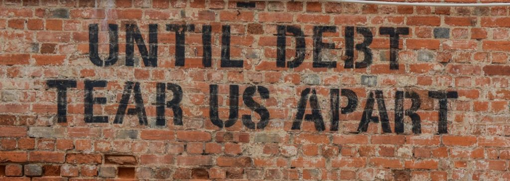

Why is it that some people are able to get out of debt – even when they owe a heap of cash – while others struggle in a perpetual loop of growing credit card, line of credit, student loan and mortgage balances?

It’s complicated. That said, in my experience, the answer often has little to do with money.

In the last two months, I have had several people pull me aside after presentations and email me after reading my posts on debt, with essentially the same question: Can you help us? We’re spending more than we earn and our debt is growing. It’s not sustainable. We’re going to be in trouble soon.

In two of the cases, marriages are at risk and homes are on the line.

Every one of those conversations started with a measured tone, but it didn’t take long before a note of panic rang through.

I get it; I’ve been there. Not the bit about spending more than you earn – that’s never been my issue thanks to a father who insisted that you only buy what you can pay for in cash – but I certainly know the feeling of overwhelm that comes with persistent, significant debt. It’s awful.

(If you don’t know my story of being widowed at thirty-two and inheriting nearly $400,000 of debt, you can read about it in my book, [***Protect Your Purse***,](https://yflmainprod.wpengine.com/store/book/) or **[on my blog here](https://yflmainprod.wpengine.com/2012/05/my-story-part-ii/)**.)

I started our discussions the same way I always do – with questions.

– Tell me about your situation. How much do you owe and to whom?  
– How did you get into debt? What did you buy?  
– When did the debt problems begin?  
– What do you feel are the main issues?  
– Tell me what you value. What’s important to you?  
– What’s preventing you from taking control of your debt?

## I can’t because

So many of the people I spoke with had nearly identical responses to my questions that I’ve decided to amalgamate their stories into one persona, whom I’ll call Debra, and one overarching story, as follows:

Debra and I chat about her situation. As I walk through my questions with Debra, she tells me that her family’s problems started when they moved to a house they can’t really afford. The monthly payments to maintain the house are killing them.

“Have you considered selling the house?” I ask.

“We can’t because….” she replies.

I question her about this and try to come at the problem from several angles. The resistance persists, even though Debra acknowledges that buying the house was a mistake from a financial perspective.

Then, she identifies another problem: they’re driving two vehicles whose bi-weekly payments are adding further strain on their finances.

“Have you thought about selling the more expensive vehicle and downsizing to a small, inexpensive, fuel-efficient car, or even selling it outright and using public transit?” I ask.

Again, she replies, “Well, there’s a problem with that. We can’t because….”

“Why did you buy such a large vehicle?” I query. “What purpose does it serve?”

Essentially, it was bought for a variety of reasons: to please other people; to serve other people’s needs; to maintain appearances around work colleagues.

I push back. “Do you acknowledge that the vehicle isn’t serving you well and that it doesn’t fit your values?”

“Yes,” she replies.

“Do you also see that you could sell it?”

“Yes, but it’s not that easy. I can’t because….”

This exchange goes on for several minutes about a range of problem areas with her finances.

**I can’t because.**

**That, right there, is the problem. It’s the real reason so many people cannot get out of debt. It’s all about the “because” and the “but”.**

## The truth comes out

Suze Orman, a well-known American author, once noted, “Check out what comes after the “but”. That’s where the truth resides.”

I couldn’t agree more, except that I would add the word “because” in addition to “but”.

### Here’s something I’ve noticed about every person who has successfully dragged themselves out of debt: They made a decision that debt was no longer acceptable and then they made the hard choices required to get the job done, without resorting to excuses.

Let’s cut to the chase here with a few simple truths:

Getting out of debt sucks.

Learning to live on less than you earn is difficult when you’ve become accustomed to living on credit and treating credit cards like a bank account.

Breaking old, comfortable spending habits is hard work.

Coming to terms with the extent of your debt is stressful.

Undoing unhelpful choices from the past is 0% fun.

You sometimes have to give up possessions and activities that you love in order to regain financial balance.

You may disappoint some people when you stop going out for drinks or when you sell something they gave you.

**That’s the price of getting out of debt to achieve financial stability and gain peace of mind.**

There is a price for everything.

One of the lessons I try to impart to my daughters is this: You can pay a price today to accomplish your goals, or you can pay a much larger price in the future. Either way, you will pay, whether it’s in the form of effort to develop skills today that will reward you handsomely moving forward, or in effort to create a strong, financial foundation.

The thing is that putting off the hard work until “later” will invariably come with a larger, more onerous price tag.

Do it today and benefit for a lifetime. The good news is that it *is* doable by anyone determined to make it happen.

## Money problems are seldom only about money

In all but one of the conversations I mentioned above, the people I was speaking with spent most of their energy telling me why they could not do something.

I would cut back on my spending, but….

We would sell our house and move to one that’s more affordable, but….

I can’t reduce the amount I spend on groceries because….

Back to my conversation with Debra. When we talked about her monthly deficit, I suggested she start with that number and I broke down the amount she’d need to save on a daily basis. Let’s say she was short $500 per month. That would mean saving roughly $16 per day.

Debra’s response? “That’s impossible!”

I ended the conversation by suggesting that she has a choice to make: Either she continues to choose to live with increasing debt – and we all know where that ends – or she chooses to own the solution.

That’s the thing. **Owning the problem isn’t enough**.

Every one of the people I spoke with wants to get out of debt. **Now they need to own the solution**. Once they accept that they have the power to right their ship, regardless how painful it may be, they will be on their way to a better place financially.

It’s worth noting that the people who approached me all have good to excellent family incomes. To my knowledge, no one is earning even remotely close to the poverty line. If they were, that would trigger a very different conversation.

The amount of cash coming into the household isn’t the problem; it’s the use of the cash once it lands in their accounts that is the source of the mounting debt.

## The Solution: Fix your Mindset, Determine your Values, Do the Math, Make the Choices

If you find yourself stuck in a world of debt and/or overspending, here is the four-step process I’ve used with clients to get great results.

##### #1 – Start with your mindset

If you want to finally kick debt to the curb, you can’t start by asserting that it’s impossible.

> Argue for your limitations and sure enough, they’re yours. – Richard Bach

If your mindset is working against you at the outset, then you’re right – it will be impossible.

The most important real estate in your world exists in the six inches, give or take, between your ears. That’s where the magic begins. Start by tackling your unconscious biases, beliefs and blocks when it comes to money.

Here are a few questions to ask yourself. **Remember, though, as you work through this material, the idea is to take a no blame, no shame, no judgment approach. You simply seek understanding and clarity for better results.**

– When do the words “but” and “because” creep in as you’re considering possible solutions to tackling your debt? Spend some time here figuring out why you feel that way or believe that it’s impossible.

– Did you rack up the debt to avoid disappointing someone?

– Are you embarrassed by your situation?

– Do you overspend to compensate for another area of your life?

– Did your family deal with ongoing money challenges as well? Are you reproducing a pattern from your past?

– Are you afraid of the consequences if you make significant cut-backs?

– Will you feel guilty if you stop spending so much on the kids or make them responsible for more of their expenditures?

– Are you comparing yourself to someone else and trying to live up to their lifestyle? (Bear in mind that what we see of someone’s lifestyle doesn’t tell the whole story. Until you see their financial books, you have no idea if they’re doing super well or living on credit as well.)

Take some time to understand the patterns at play as well as your motivations. Once you’ve identified them, you can begin to formulate an approach that will serve you much better. For example, I’ve had clients realize that they grew up in families where financial struggles were the norm; debt was ever-present. They made a conscious choice to choose a different path for themselves.

If this is your reality, try writing something like this in your journal: “In the past, I would spend without thinking in much the same way that my parents did. I thought that was normal, but I see now that this behaviour is harming me. I don’t want to live this way anymore. Starting today, I choose a different, financially healthy future for myself, and that means living well within my means. I choose to make conscious choices about how I spend my money. I’m letting go of the part of myself who was always in debt to become a saver and an investor.”

I’m not suggesting you use the above verbatim. Formulate a statement in your own words, reflecting your reality and your choices. It should resonate with you when you read it. If you get a “hell yes!” when you read your statement, then you’re on the right track.

If you need some inspiration, read Marie Forleo’s new book, *Everything is Figureoutable*. When I first heard her say that word -figureoutable – I thought, “Yes, that’s it. Everything is figureoutable.”

I’ve seen people dig themselves out of mighty holes. It is 100% doable. You can do it, too.

##### #2 – Determine your values

One of the biggest problems underlying debt is mindless (vs mindful) spending. With a wallet full of plastic, it’s so easy to part with cash without feeling a thing. Next thing you know, your debt has piled up and you’re in a world of stress.

See something cute as you walk by a store window? Out comes the Mastercard. Order another round of drinks when you’re out with friends? No problem – have Visa, can do. Renovate the bathroom because, hell, you deserve a decent shower and vanity? That’s what the line of credit is for. When the kids are five seconds away from a full-blown meltdown in a store and they’re demanding that you buy them a toy, you cave because you don’t want to deal publicly with the hysterics. Out comes the Amex.

Boom – money in, money out. Didn’t feel a thing until the bill showed up.

That’s the danger of plastic and it’s why making spending part of a conscious process is critical to success.

**For years, I taught people to fix their finances by following carefully planned budgets, until I realized that budgets alone don’t work. For lasting results, we need to link spending to our values.**

Why is that? Because money needs to serve us – our needs, our wishes, our goals. When you tie spending to the things that really matter to you, and cut back mercilessly on the things that don’t, you start to experience more joy and satisfaction from your money, rather than the momentary high of purchasing another doodad, to quote a word popularized by Robert Kiyosaki, author of *Rich Dad, Poor Dad*.

I’ve written about identifying your values [in this blog post](https://yflmainprod.wpengine.com/2018/04/paying-off-debt-an-effective-budgeting-approach/), but in a nutshell, it boils down to writing out the top three to five things that matter most to you.

Is it spending time with people you love? (One of my friends lists “Quality time with quality people” as one of her top values).

Is it maintaining your family’s health? (This is my #1, after being widowed at the age of thirty-two.)

Travel?

Achieving professional success?

Earning a certain amount?

Charitable work?

Spending time outside?

Playing sports?

Once you sort out your top, non-negotiable values, you can shift your spending to be more in line with the things that really matter. When you’re facing a cash shortfall or debt, start by eliminating the items that don’t line up with your values. You may even have to eliminate some of the ones that do in order to back into the black. That’s OK, for now. Remind yourself that you’re on a mission and once you get to your goal, you can reevaluate and realign your spending choices.

If you’re in a relationship, both partners need to establish their own list of values. Then, sit down together to figure out how you can create a list for the family that honours both of you, while allowing you to achieve financial stability.

##### #3 – Work out the numbers

You can’t tackle a debt problem until you know exactly what you owe and where your money is going. This step involves a two-pronged approach.

First, go back through your records for the past three months and figure out where the money went. Print up your bank and credit card statements, then use a spreadsheet to create totals for every category.

A quick word about categories: Create groupings that makes sense for your family. The idea here is to drill down beyond meaningless categories such as “fun and entertainment”. The latter doesn’t really tell you anything. Did you spend on restaurants? Movies? Concerts?

Break it down to gain a better understanding. This will become essential when you start tying your spending to your values. You may decide that going to the movies as a family once a month is very important to you, but eating out at meh restaurants, simply for the sake of convenience, is not.

Second, list out your debts in order of cost. In other words, start with the debt that is costing you the most in terms of interest rate and end with the lowest-cost debt. Credit cards are almost always at the top of the list, since they typically charge anywhere from 18% to 30% interest on balances.

Did a relative give you an interest-free loan? Add that to the list too. The list of debts should include everything you owe including the monthly payments to keep them up-to-date.

Once you have all of the numbers in front of you, in black and white, proceed to the next step, but keep tracking your spending. Here’s [a list of budgeting and tracking apps](https://www.greedyrates.ca/blog/best-budget-apps-canada/) to help you do just that.

##### #4 – Make decisions about what to eliminate and GO

This is where the rubber meets the road. It’s time to pay the piper now, so you can ditch financial stress and experience the joy that comes from nailing your finances. Here are just a few more benefits that come with doing the work now:

- Improved relationships
- More satisfaction
- Growing net worth as you start to save and invest
- More options for your life
- Increased confidence
- More joy
- Ability to retire at a reasonable age, in comfort

**To get to the lovely state of financial peace, you need to make some hard choices about what to eliminate. Use your values to guide you and go for the big wins.** Cutting cable will net you a lot more money than cutting back on the Friday afternoon latte. No one will ever make a dent in their finances by chopping out a coffee, unless it’s a daily habit for a frothy thing that sets you back $5 every day.

When I was paying off $400,000, I chopped out every little thing for nearly two years to pay off the debt. It worked, and it was awful. I don’t recommend that approach. Retain an occasional indulgence that lines up with your values and brings you joy, but mercilessly chop out everything else.

It may mean unhappy choices for the kids, too. That’s part of life. Get them in on the project. It’s important for kids to understand how to manage money well and to make touch choices when necessary. Even if you don’t talk to them about your challenges, you can bet they’re watching and absorbing your lessons.

You get to pick the lessons they’ll retain.

Once you start to free up cash by a) cutting back on your spending; b) selling any items you don’t need or don’t use; c) downsizing; and/or d) by starting a side hustle, you put all the “found” cash toward your debt. Here’s **[a cool app](https://debt-payoff-planner.com/)** to help you stay on track with your debt reduction plan. It has great charts and options to compare strategies and celebrate debt reduction milestones.

As soon as you know how much money you can divert to debt, calculate your debt-free date and put it up in front of your desk. Look at that date every day. It will inspire you to get the job done, and even get it done more quickly, as you find ways to make or free up more money.

## Snowball or Avalanche?

There are two typical approaches to paying off debt. **You can attack the debts with the lowest balances first (the Snowball method) or you can start with the most expensive debts, wipe those out first, then work your way down to the least expensive debts (the Avalanche method)**. The former helps some people stay motivated by given the appearance of eliminating debts more rapidly (it’s all about psychology with this approach), while the latter makes more mathematical sense.

If you tackle the debt that costs you more, you’ll save more. It’s as simple as that. Still, if you know that you’re the kind of person who needs the psychological boost that comes with knocking off a card’s balance more rapidly and checking it off your list, then use the snowball method.

Either way, start paying it off and keep at it until it’s done. Use **[one of many online tools](https://debt-payoff-planner.com/)** to help you stay on track.

## Muzzle the cards

One of the lessons from behavioral economics, regarding changing habits, is that we need to make the right choices easier to make, while making the wrong choices harder. We do that by changing our environment.

In the case of debt elimination, I suggest the following steps:

1. Park all but one credit card in your freezer, inside a block of ice. If you don’t have them on you, you won’t use them. And no, I’m not kidding about the freezer. If your cards are in a ziplock bag full of frozen water, you won’t be able to shop impulsively.
2. About that one remaining credit card – it’s for emergencies only. Put a bright post-it note on it that reads “Emergencies only” and wrap the note in several elastic bands. At the very least, it will be a pain in the hind end to use if you’re tempted.
3. Shop with a list and only buy items that are on that list. If you see something tempting, make a note to consider it for your next list, but don’t buy it.
4. Before adding something to your list, run it by your values and goals filter. Is it in line with your goal of financial wellness? Does it fit in your list of values? When in doubt, say no.
5. If you’ve memorized your credit card number, consider taking Jean Chatzky’s advice and have it replaced. Call the credit card company to declare the card lost, then do not memorize the new numbers. If you know the numbers, your job of cutting back on spending is rendered that much harder.
6. Keep your financial goals written on an index card and carry them in your pocket or purse. The more you connect with your goals and your “why”, the greater the likelihood of success.
7. Pay for everything using cash or your debit card. If your first response is that this is impossible, revisit the section on mindset above. If you claim that it will be challenging, you’re right. That’s the idea. As Dan Ariely, noted behavioral economist, points out in his book *Dollars and Sense: How we Misthink Money and How We Can Spend Smarter*, we need to make spending more painful.
8. Check your bank and credit card accounts daily. The goal is to raise awareness; to make money choices consciously.

## Final thoughts

Do yourself a favour – don’t believe your baloney when you say that you’ll tackle it tomorrow. Don’t trust your future self to make better choices than you’re willing to make today. Today is the only day we have to work with.

You can do this.

Send me an email if you need a boost. I’ll be your cheerleader!

Looking for more help? Join the wait list for my upcoming course ***Master Your Money: How to Create a Money System to Live Debt-Free, Save Hundreds per Month, and Afford the Life You Want***. There will be a DIY online version and a live online version, with coaching. Get on the list to be notified when the courses are released.

#### Share this post

## Your Foundation to Financial Freedom is coming soon.

Please complete the form to add your name to the wait list. We’ll let you know as soon as the course is released!

## No spam, ever. Unsubscribe any time.

## IMS ESSENTIAL

Please select a payment type: