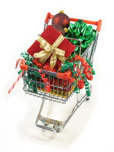

When I opened my front door this morning I was greeted by a mini mountain of flyers for Black Friday. In case you’re wondering, it would appear that all of North America is on sale today. There are so many pretty things to buy and boy-oh-boy is it ever tempting given the low prices. How can you resist? After all, you’ve got all those people to buy for!

Which leads me to write about Christmas spending an entire month before the big event in the hopes that we can start to change the financial process and patterns around the spending frenzy. How can you get past this season without spending more cash than you’d like to? Here are five suggestions.

## 1\. Conscious spending

I first encountered the concept of conscious spending courtesy of [Gail Vaz-Oxlade](http://gailvazoxlade.com/index.html). Brilliant! When I heard that expression, it reminded me of one of my favorite sayings by Wayne Dyer: “When you change the way you look at things, the things you look at change.”

In this case, when you look closely at the way that you’re spending money leading up to Christmas, you start to notice patterns you might not be aware of, like the propensity to buy a ton of super cute stuff that looks good but really isn’t necessary. Or the habit of invariably spending more on people than you had intended with justifications ranging from the predictable to the ludicrous.

Instead of being tempted by lots of baubles that pop up in stores and their incessant flyers, what if you sat down to make a list of the people for whom you want to buy a gift (notice I didn’t use the word “need” here?) and how much you want to pay before you begin shopping?

Santa does it – in fact he checks his list twice I’m told – so why not do it too? If you make a deal with yourself that you can only buy the items that are on your list, nothing more, then you will have controlled the first part of the spending spree.

Vaz-Oxlade has her own amusing rule which probably works like a charm: When you go shopping you are not allowed to buy anything that isn’t on your list. See something terrific and figure you’ll snap it up on your way through? No way. If it’s not on the list you can’t buy it.

Her advice: Go back home, put it on the list and get it the next time you’re out. That way you will not give in to impulse buying. When you get back home and have a chance to give it a sober, second thought, you might decide that you really don’t need that item after all. Problem solved.

The idea here is to make all of your purchases part of a conscious process of choices rather than the result of impulsive, on-the-spot decision-making.

## 2\. Experiences, not stuff

Have you ever looked in your basement or garage and thought, “How on earth did we end up with all this stuff? Then, for fun, you tried to remember the last time you used some of it and couldn’t? Most of us are surrounded by items that seemed like a great idea at the time of purchase but ended up gathering dust somewhere in the house. So why add to it at Christmas?

Do your kids really need another 400 Lego pieces? Or another Barbie? (It could be argued, quite successfully I think, that no one ever, in the history of the world, needed a Barbie. But that’s for another day.)

[Elizabeth Dunn and Michael Norton](http://www.thelavinagency.com/speaker-drelizabeth-dunn.html) wrote a fascinating book called “Happy Money” in which they explore ways that you can derive more happiness from your money. One of the five principles they describe is the following: Buy experiences, not stuff.

> “Indeed, research shows that satisfaction with experiential purchases tends to increase with the passage of time, while satisfaction with material purchases tends to decrease. As a respondent in one study put it, “Material possessions, they sort of become part of the background; experiences just get better with time.”

When our first child was born, friends gave us a coupon for several hours of free babysitting for date nights. Best. Gift. Ever. Recently my girls gave a young friend a hand-made coupon for “dinner and a movie” with them. Tomorrow we’re going to see Penguins of Madagascar with him and then we’re coming back to our house for a menu determined by the girls: chicken fingers, home-made fries, green beans, home-made cake and ice-cream. To quote the kids, “that’s awesome!”

Use your imagination to come up with thoughtful, inexpensive ways to spend time with the ones you love and at the same time create memories rather than adding to the collection of things that will end up in the basement. **Dip into the memory bank, not the piggy bank.**

## 3\. Keep it small

When I was ten, my Grandma gave me a Christmas gift that turned into hours of fun. It was a set of ten jacks and a ball. That’s it, it’s all she could afford given how many grandchildren she had (dozens). At first I wasn’t too sure about the gift, but when I started to play with it I was hooked. I would lose track of time as I kneeled by our front door practicing to get really good. One ball, ten jacks.

Many years later I discovered that a packaging company here in town sells a cardboard box that opens into a house. One set of markers and one box later I had a hit that cost less than $30. Our girls would decorate it for a while and then they’d move on to setting up blankets and pillows inside. At one point I even found a tea set in there. Huge fun.

Remember that the best gifts are often the simplest and the least expensive.

## 4\. Get consensus to downsize

Raise your hand if you enjoy shopping for a ton of people. Are there any hands up? Not mine. Who has time to troll the malls or guess what your brother-in-law really needs for Christmas? Or your parents. Or in-laws.

Several years ago I had a chat with my parents about Christmas and before I could even get through my idea my mom was all in. It turns out that she has no clue what to get us either. We decided to make a donation in each other’s name to a charity of our choice and to restrict gifts to small, whimsical items.

Now, instead of stressing about what to get us, my mom donates to local, needy families and sends us small things to put under the tree. The girls typically get a Christmas ornament from her every year and it’s one of the highlights of their day. The ornaments are beautiful, fun and varied. In the process, the girls are building up a set so that when they leave home they will have a meaningful collection of ornaments to take with them for their own trees. It has become a tradition that we all cherish and the cost is insignificant for my parents. Win-win.

Pick names, buy only small things for the kids or better yet, work out a fun experience in which everyone can share to mark the occasion. Find a tradition of your own that costs little in terms of cash but that will have a big impact on your memory bank.

## 5\. No more debt

When I hear people tell me that they need to buy certain toys or gadgets for their kids, I shake my head. No they don’t.

If there’s a gun to your head and the person will pull the trigger if you don’t make the purchase, then OK you need to do it. Otherwise it’s not a need, it’s a choice.

When I’m advising my clients I have a simple rule: No more debt unless it’s an emergency. Christmas does not count as an emergency. If you have an unpaid credit card balance, then you have corrosive debt in your life and it will erode your buying power as well as your financial strength in a hurry. **Do yourself a favour and adopt this rule: no more debt for consumer goods**. Find a way to ensure that whatever your do, you do not add to your debt load at Christmas for any reason other than a true emergency – as in, you need to heat your house, feed your family or deal with a medical issue.

There are many clever ways to make your family feel like the luckiest people on the planet without having to spend a fortune. In any case, they will remember the time you spent playing board games with them, having a snow ball fight over the fort you just built together and drinking hot chocolate together afterwards more than they will remember the gadget you bought. And your basement will thank you.

#### Share this post

## Your Foundation to Financial Freedom is coming soon.

Please complete the form to add your name to the wait list. We’ll let you know as soon as the course is released!

## No spam, ever. Unsubscribe any time.

## IMS ESSENTIAL

Please select a payment type: