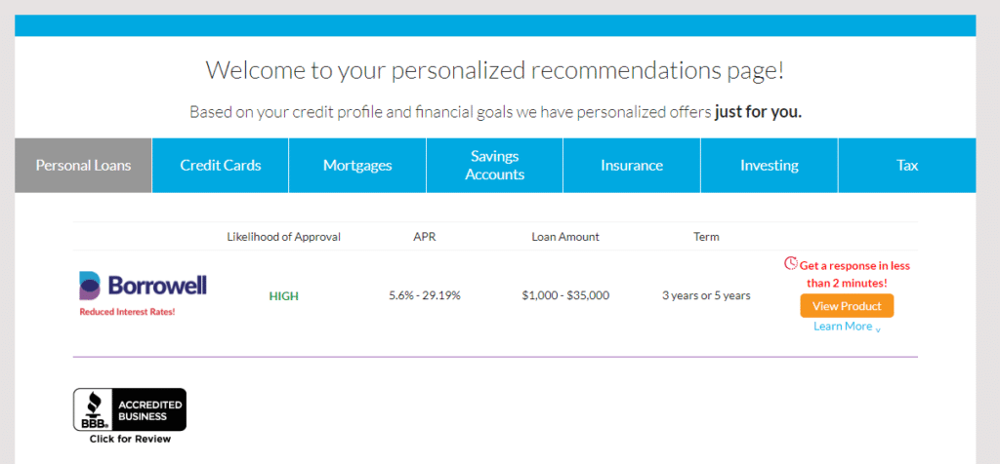

# how-to-get-your-credit-score-for-free-and-what-the-catch-is

A venture capitalist, doubling as a professor during a week of mini university for high school students, told my daughter the following: When you get something for free, *you* are the product. They were looking into free apps and how companies make money when they give their products away for free. There’s always a catch.

In the last few years, several companies have come into the market to offer consumers free access to their credit scores instead of paying the credit reporting agencies for them. It may be worth it for you to consider one of the free options available in Canada at the moment, provided you understand the trade-offs.

Here, then, is the scoop on three options in Canada, at the moment, with some pros and cons for each.

## CreditKarma.ca

This is an American company that has moved into the Canadian market to offer free credit scores once you sign up for an account. The following are the key details about them:

- In Canada, they only provide access to information from TransUnion, not Equifax.
- Signing up is a breeze; it literally takes three minutes. The bonus is that you do not have to provide your SIN or credit card information.
- You do need to verify some credit details to ensure they are accessing the correct file.
- You can check your score every seven days, though why on earth you’d want to is a mystery to me. If you’re working on repairing your credit, check every four months or so. If there’s nothing pressing, then checking annually is just fine.
- The report shows hard and soft inquiries.
- They list who’s responsible for each debt. That is, is the debt an individual debt or joint?
- When I pulled my report, it showed mortgage details for all my rental properties (i.e. lender, initial mortgage amount, mortgage outstanding, etc).
- Deactivating the account was simple. I quickly found the link and got the job done with one click.
- Once you deactivate your account, you can’t sign up again for six months.

How do they make their money if they offer freebie scores? They show you targeted ads from financial companies, on their website, based on the information you provided as well as your score. It’s a huge win for the financial companies because they get to niche their offerings by selecting the specific demographic they’re after. The consumers win by getting access to the information on their credit reports without having to pay a fee to Transunion; and Credit Karma gets paid for being the middle man.

If you’re OK with this exchange of information for a freebie plus targeted ads, then it’s a win.

## Borrowell.com

This company takes a different approach to Credit Karma. For starters, it’s a Canadian company and it offers information from Equifax instead of Transunion. And now the details:

- Signing up is just as easy as with CK. It took me a handful of minutes to plunk in some personal information, confirm a few credit details and set up an account. No SIN or credit card required.
- You can track your information on a monthly basis. Once again, that’s overkill for 99.9% of the population. I worked with people rebuilding their profile after a bankruptcy and even they didn’t need to track their info on a monthly basis. If you suspect some kind of fraud is taking place, then track it monthly for a bit. Otherwise, relax and check in once or twice a year.
- They don’t show who is responsible for the debt – that is, if it’s an individual or joint debt.
- They gave me a lot less information than Credit Karma. For example, instead of listing the banks that hold the mortgages for my investment properties, the Borrowell report simply read, “Undisclosed mortgage provider”.
- The list of credit inquiries was incomplete, showing only hard inquiries and not soft.
- Like CK, they also show you personalized product offers from third-party vendors, though they make it clear that “we share partner information with you, not the other way around.”
- Given their name, it shouldn’t come as a surprise that they offer loans.
- Closing my account wasn’t a snap. I had to do a search of their site, eventually finding one sentence buried in the Privacy Policy, asking me to email them. I’ll get back to you on how long it takes them a) to respond, and b) to get the job done.

One of the things that struck me about Borrowell was their seemingly helpful offer to make recommendations based on my profile. According to them, my score is 849. Given that the highest score possible is 900, that’s a really good score. I never run a balance on my credit cards and I’ve been paying down my investment property mortgages ahead of schedule. If you were a financial company, what kind of product or ads would you show me? Maybe something about investments? High interest savings accounts? Instead, this is what I got from Borrowell:

Based on no evidence of need, I’m told I have a high likelihood of being approved for a loan of $1,000 to $35,000 (!!) in less than two minutes.

And this is where you find out that where possible, they will push their loans. Just a wild guess here, but where do you think they make the most money?

Buyer beware. Don’t get sucked into loans you don’t need or shouldn’t have. And if they say yes based on a two-minute approval process, shop around; you can probably get a better rate than 5.6%.

## Mogo.ca

This is a loan company. They’re pretty much the same deal as Borrowell in that they offer you information on your credit report from Equifax and they provide it for free with a three-minute sign-up. Here’s the difference: When my “congratulations for signing up with us” message popped into my inbox, it came with an offer of a $5,000 loan. “Congratulations, you qualify for a loan!” the email boasted.

I had not asked for a loan; I had asked for a free credit report. They offered it anyway. Unlike Borrowell, where I clicked on the tab promising recommendations, this offer came at me, as did two others within the next couple of days.

If aggressive marketing and attempts to get you to borrow money is what you’re after, then this is your company.

They’re targeting the millennial set who may have more trouble accessing loans, as well as those who may be looking to refinance debt. In all cases, shop around and read the fine print. The fabulous-sounding offers may not be so great when you do a bit of digging.

If all you’re looking for is a free credit report and score from Equifax, I’d stick with Borrowell.

## One last thing

It’s still worthwhile to pull your free report, once a year, from both Equifax and Transunion to ensure that everything is accurate. Here are the links to your free reports:

[Free Equifax report.](https://help-en.equifax.ca/s/article/How-do-I-get-a-free-copy-of-my-Equifax-Canada-credit-file) If you also want your score, you’ll need to pay $11.95 to get it.

[Free Transunion report.](https://www.transunion.ca/product/consumer-disclosure) I didn’t find an option to tag on your score. To get the latter, you’d need to set up an account and pay $19.95. My suggestion: Just get the free report and check your score through Credit Karma.

Bear in mind that the score you get through any of the three providers mentioned above will not be the same as the score lenders see when they pull your bureaus. That’s because each lender negotiates their own proprietary report with the credit reporting agencies. Don’t worry about that. Just focus on the [basics of maintaining a good score](https://yflmainprod.wpengine.com/2017/03/ladies-whats-your-score/) and you’ll be fine.

#### If You Enjoyed This Post, You’ll Also Like:

[Ladies: What’s Your Score](https://yflmainprod.wpengine.com/2017/03/ladies-whats-your-score/)  
[How to Wreck Your Credit in One Step: A Cautionary Tale](https://yflmainprod.wpengine.com/2016/11/how-to-wreck-your-credit-in-one-step-a-cautionary-tale/)

#### Share this post

## Your Foundation to Financial Freedom is coming soon.

Please complete the form to add your name to the wait list. We’ll let you know as soon as the course is released!

## No spam, ever. Unsubscribe any time.

## IMS ESSENTIAL

Please select a payment type: