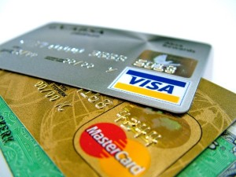

Normally I pay my credit card bills in full like clockwork. The bill comes in, I reconcile all of the expenses to ensure that they are legitimate and I set up the payment online. All bills are paid one week before the due date every single time to ensure that the online payment goes through in time, except this past January.

One of the things that I teach is to automate as many bill payments as possible. Set it up so that it’s once and done, ensuring that you never miss a payment. If you’re like me – and I really hope you are – and you pay off the bills in full every time, then the amount that you owe varies so you can’t set up full, automated payments. To by-pass this potential hiccup, I set up recurring reminders on my computer to ensure that the moment the credit statement is issued on the 20th of every month, I get a reminder telling me to pay the thing on the first of the following month. It has been a simple and effective system for me up until January of this year.

In January, having decided that we wanted to escape the cold, we boarded a plane and headed off to the Dominican Republic for one week. As usual my to-do list the week before our departure was a million items long and on that list was, you guessed it, a reminder to pay the credit card bill. For some reason that still mystifies me, I missed that line item and flew away leaving the thing unpaid.

The credit card company was probably delighted. Finally, they must have thought, we can wring some interest charges out of this cheap lady, and they would have succeeded had I not read Ramit Sethi’s book *I Will Teach You To Be Rich*. Ramit’s writing can come off as terribly frat-boy-like at moments (though less so these days in his blog) but I love the way he approaches the whole business of personal finance. He’s all about understanding and working with the psychology behind money and success. And he’s all about asking for what you want *in the right way.*

In the chapter on credit cards he gives a script to use with the credit card company when you want to ask them to reverse charges. A few years ago I had tried this on my own and been successful, but this time I applied Ramit’s script. Here’s what it sounded like when I called the credit card company to discuss the interest charge.

– Hi, I’m calling about my February statement in which there is an interest charge of $73.50.

– Let me just look up your bill. Yes, I see the charge.

– I’d like to ask you to reverse that charge please. I was away at the time that the bill came due and I fully acknowledge that I should have made arrangements to have it paid on time. That said, I’ve been a customer of yours for many years now and I spend many thousands of dollars on your card for my purchases every year. I pretty much always pay my bills in full before the due date with this exception, so as a very good customer of yours I’d like to ask that you reverse the interest charge.

The line went silent for a couple of seconds after I made my ask and I did what Ramit recommends: I shut up and left it to the representative to make the next move.

– Can I put you on hold for two or three minutes while I look over your account information?

– Absolutely.

She disappeared for a minute or two and then came back with the news that I fully expected.

– Well Ms. Belland, I’ve reviewed your account and can confirm that it is in good standing and that you have been a valued client for many years now. Have you made this month’s payment?

– Yes, I paid the balance in full two days ago, twelve days before the due date, and I have the confirmation number.

– That won’t be necessary, thank you. I am able to make an exception for this time only and waive the interest charges on your bill. The credit will appear on your next statement.

Done. Five minutes in total with the outcome that I wanted: the fees were waived. And it’s baloney that it was “for this time only”. As I mentioned, I asked them to do this a few years back and was granted the same one-time exception back then too.

There are two parts to this effective formula:

1. You have to be nice. Remain courteous at all times. If you have someone who is giving you some push back you may need to be firm but keep things pleasant at all times.
2. Don’t be afraid to ask. The fastest way to get a financial break is to ask for it. (Note that this does *not* mean asking for a break from friends and family. You can read what I have to say about that [here](https://yflmainprod.wpengine.com/2016/02/should-we-lend-money-to-friends-and-family/).)

If you have not been a great customer then you have a lot less leverage to work with. Still, it’s worth a shot. Just don’t go on about how great you are if you frequently pay late or go over your spending limit.

If you carry a balance on your credit card then give the company a call and ask them to reduce the interest that they charge. Yes, you can do that. If they balk then mention something that they really care about, like the fact that it costs them a lot more money to acquire new customers than to retain existing customers. You can say something like, “Listen, I’ve been with you for a while and I really don’t want to leave but this interest charge is killing me and Card X is offering a much better rate of Y than yours. I know that you care about customer retention because it’s a lot less expensive than customer acquisition so what can you offer me to keep me as your customer?”

Then be quiet. Let them do the talking. Be sure to do some research before the call so that you have your facts lined up. Find the best rate that a competitor is offering and then use that as your desired goal.

Now back to my credit card bill. Here’s an excerpt of the text that showed up on the credit card statement:

“**If you do not make the minimum payment showing on this statement by the payment due date, the annual default interest rate of 25.97% on purchases and 27.97% on cash advances will apply to any interest bearing balances on your account as of the day following this statement date.”**

Did you catch that – 25.97%?! That’s bloody robbery. Now, to ensure that I don’t fall prey to those insane rates, I have set up automatic payments of $500 that far exceed any minimum payment I’ve ever had. In this way if I forget to pay, at least the minimum payment is taken care of which will have two key consequences. First, it will prevent the beyond-stupid interest rates from kicking in (as opposed to the just-stupid regular rates of 18%). Second, it will ensure that I don’t get a late payment recorded to the credit reporting agencies, which may affect my credit score.

If nothing else, automate the minimum payments! And be sure to pay several business days *before* the due date because it can take a couple of days for the payment to show up on your credit card. I recently had a client complain to me that she had late payments show up on her credit bureau because it was the credit card company’s fault; the payment had come out of her bank account on time. Well too bad. You can whine and complain but that just gets annoying for everyone around you. The fact is that it takes a couple of days. Build it into your system or be prepared for the consequences.

By the way, according to my statement, if I only made minimum payments on my outstanding balance, it would take ***approximately*** **47 years and 5 months to repay** the total balance. I LOVE how they use the word “approximately” about a length of time that is more than half the lifetime of an average mortal.

God I hate credit card interest charges.

The bottom line: automate, automate, automate and when need be, ask for a reduction.

Until next time, Survive, Thrive and Grow.

#### Share this post

## Your Foundation to Financial Freedom is coming soon.

Please complete the form to add your name to the wait list. We’ll let you know as soon as the course is released!

## No spam, ever. Unsubscribe any time.

## IMS ESSENTIAL

Please select a payment type: