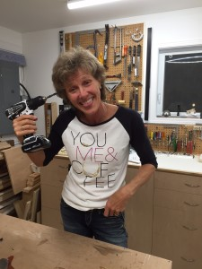
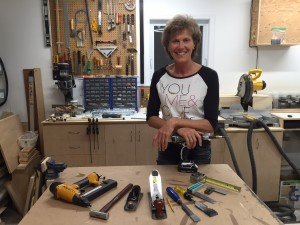

Roughly one year ago my friend Sandra and I had a bright idea: Let’s create a private forum where women can talk about money. Lord knows we all need to learn more about how it works and since we sometimes feel like morons discussing it around men, why not create a space for women only? It would be a safe, supportive environment where women can ask questions, share concerns and help each other out on any topic related to money and financial literacy.

There was just one problem – it turns out that women don’t want to talk about money. At all. It’s not that they don’t think about it and it certainly isn’t that they don’t worry about it, they just don’t want to discuss anything out in the open. The only people we heard from were women who were already involved in the financial industry. Everyone else? Radio silence, even though heaps of women asked us to sign them up immediately.

After a bit of digging some women fessed up about being far too embarrassed to talk publicly about the topic of money. First and foremost they feel stupid admitting that they are not good at some aspects of money management, particularly investing, and they certainly don’t want to let everyone know that they don’t have enough of it. Then there’s the perennial issue of feeling vulgar for admitting that they want more, the very act of which appears to cross both cultural and societal norms of propriety for women.

So what is really going on here? Why do we get all plugged up when it comes to talking about money? It’s not like money is an ex-boyfriend who cheated on us or a close friend who let us down or even a colleague who embarrassed us publicly. Money is a thing, an object; it’s not even sentient for Pete’s sake, so why all the emotion and the hang-ups around it?

If these hang-ups had no effect on the results in our lives I’d shrug my shoulders, note them with curiosity and move on. But the problem is that they do affect us by keeping us from becoming fully, financially aware. How can we possibly master the language of money and get the results we want if there is so much negative emotion wrapped around the very topic?

## Changing the way we think and talk about money

When I was growing up I heard all the usual rants about money: it’s evil, it corrupts. Rich, greedy people would be held up as a prime example of the fact that a) wealth and greed appear to go hand-in-hand; and b) see what having a lot of money does to people? The implication was that having money magically transformed otherwise kind, generous people into self-absorbed, money-grubbing characters.

There’s only one problem with this kind of popular narrative: it’s rubbish.

Money is an object just like a hammer is an object. Money is a tool just like a hammer is a tool. You can learn how to use it well and get good results or you can do some damage with it if you’re not careful. Either way the choice is yours.

It’s not the hammer’s fault when you whack your thumb or dent the wall with it just as it’s not money’s fault if you feel that it is remarkably hard to earn and grow. It mostly boils down to knowledge, practice and execution.

## Marilynn The Tool Lady

Meet my lovely friend Marilynn. She’s the one to whom I refer in my blog post [The importance of girl time](https://yflmainprod.wpengine.com/2013/04/the-importance-of-girl-time/) where I talk about laughing so hard that we made the artwork fall off the wall. I have known her for more than twenty years and in that time I’ve always thought of her as The Tool Lady. Check out a small smattering of her tools. Trust me, there are many, many more in the bits of her shop that you don’t see.

If you heard Marilynn at a party waxing poetic about the new table saw she just got her hands on (and trust me, she LOVES that thing), you wouldn’t think “How vulgar.” It’s a table saw, she’s passionate about it, good for her. It’s not your thing but she’s clearly very pleased about it so you would doubtless feel happy for her.

If she told you that she has an extensive collection of chisels (which she does) and that she hopes to obtain more (don’t know, need to check with her), you wouldn’t raise your eyebrows and think, “Wow, she’s really greedy.” You’d probably be inclined to think, “Hey lady, if you want a couple dozen chisels, knock yourself out. Whatever floats your boat.”

Marilynn loves tools and that’s great for her because she uses them to great effect making gorgeous furniture for herself and others. If her love of those tools started to impact her friendships – e.g. she isolated herself in her shop to the exclusion of her friends and family or she focused so entirely on obtaining more tools that she failed to care about other important aspects of her life – then we’d have reason to question her love of tools. But Marilynn has a balanced approach to the use of her tools and we don’t judge her for it (except maybe to think that she is awesome for her ability to create amazing things with them).

And so it goes with money. Money is neither good nor bad. It is just another tool that some people use very well while others struggle with it.

- Money does not corrupt; people do a perfectly good job of corrupting themselves. If you’re a good person and you earn more money, you will probably continue to be a good person and do good things with your money.
- Money is not inherently hard to earn nor, by the same token, is it inherently easy to earn. Learning how to earn money or grow money does take education and effort but it is not the end of the world.
- There is no such thing as someone who is “just not good with money” in the sense that they were born that way. We all have money habits, and they are either good money habits or unhelpful money habits. Change the habits and you change the results.

**Ladies, it is high time that we strip away all of the emotion that surrounds the very topic of money and get down to the task of learning how to use that tool for our highest, greatest good.** **In order to do that though we have to talk, learn, share and ask questions. We also need to stop judging people who want to grow their wealth.**

“Wealth” is not a swear word; it’s a state that provides you with options to run your life the way you choose to.

It’s a state that helps you to survive the crap that the world throws at you.

And it’s also a state that allows you to make a significant difference in the lives of the people, agencies and charities that matter to you.

What do I mean by wealth? That’s for you to define, and whatever you choose is perfect for you.

So the next time that you find yourself in the grip of emotion involving the topic of money, take a step back and visualize yourself with one of Marilynn’s tools in your hand. If you can muster up the same emotion about Marilynn’s tool that you feel about money – for example, “I feel really stupid that I don’t know how to use this table saw. Marilynn knows how to do it, why don’t I? I must be stupid.” – then go ahead and allow yourself to feel the same emotion about money. But chances are you won’t give a damn about the table saw, so ditch the emotion around money and stop beating yourself up.

And if you do feel stupid about not being able to use a table saw, call a good contractor and let it go. That’s what contractors are for.

The next time you find yourself caught up in negativity regarding money, remember this: Money is just a tool which you can learn to use well if you choose to. And good on you if you do.

Until next time, Survive, Thrive and Grow.

#### Share this post

## Your Foundation to Financial Freedom is coming soon.

Please complete the form to add your name to the wait list. We’ll let you know as soon as the course is released!

## No spam, ever. Unsubscribe any time.

## IMS ESSENTIAL

Please select a payment type: