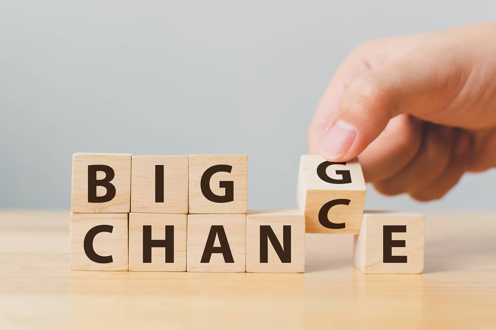

How about a dose of inspiration to energize your day, followed by a tip to thrive in these difficult times?

Let’s do it!

On March 17th, I announced a 30-Day Positive Action Challenge to shift our focus from inertia to accomplishment. I encouraged you to commit to one daily action, big or small, that would move the needle forward for your finances and your life.

The reaction was fantastic.

Yesterday, I shared a few of the responses I got and, judging from your emails to me, you loved them and want to see more.

### Here you go – some good stuff from Day 2 of the Challenge:

**Gal #1** –

1\. Today I made a list of finance-related tasks and projects to complete this month.  
2\. Made an appointment with my insurance broker to review an existing policy and better understand the coverage and potential gaps.  
3\. Made an appointment with a different insurance salesperson to explore business insurance.  
4\. Called Hydro Ottawa to check the auto-payment I set up last month is working properly and confirm when the payment is made each month.  
5\. Followed up on a pending health insurance claim.

**RESULT** – DONE

**Gal #2** – Today I will gather all documents required to submit my French tutor claim and take pictures of toys that we will be selling prior to our move this summer.

**RESULT** – French claim done and submitted – another $1000 coming into my pocket!

**Gal #3** – I’m working on my 2019 tax prep for an hour this afternoon. Working much slower than usual. Like everyone else on the planet, I feel affected by current events. Experiencing massive fluctuations in energy. My goal is to remain calm, productive and kind to myself and others. From my journal this AM: “One \*money action\* per day is awesome and enough.”

Let’s do this! ✨

**RESULT** – Finished 1 hour + 20 minutes of tax prep today! I procrastinated until 6pm-ish. Felt better once I got going. I’ll continue tomorrow, earlier in the day. ☀️

**Gal #4** – My friend loaned me ‘Mind Over Money’ by Claudia Hammond. It has 14 chapters. A chapter/day takes me through 2/3 of my WFH period (as it sits now, who knows the future). This will be today’s goal – anything above and beyond is bonus.

**RESULT** – Intro and first chapter read.

**Gal #5** – I’m contacting my mortgage lender to ask about mortgage holidays while this situation passes. And I’ll do a food inventory of the house!

**RESULT** – So I didn’t do the food inventory. BUT I did contact my mortgage lender and filled my E.I. application.

**Gal #6** – I filed my E.I. application on Friday as soon as I found out the schools were closed. But have to wait on Record Of Employment, which work won’t send til the last pay for days worked, which is April 3rd.

**Gal #7** – It is pay day, so I will ensure the money is in the bank to pay the bills and sort a box of stuff in my office.

**RESULT –** I checked the bank accounts – all is good. The box still needs to be sorted.

**Gal #8** – I spent the entire day and part of the evening writing/creating docs. I set aside all non-money-making tasks, like the spreadsheet I wanted to update, and turned on the creative jets today. My original task didn’t get done, but something better did in its place.

**RESULT** – I’m tired, but happy. It’s been a productive day.

**Gal #9** – I have so much going on right now that I never intended to accept your challenge, Doris, BUT I realized I’m doing it anyway. I think you have just helped me create good habits. And now that I realize I’m on track, my personality won’t let me stop (Darn it!!!). So Day 1 was catching up on credit card reconciliation because it has been on my desk staring at me for days!!! Day 2 I finished automating utility bills for the \[house in Canada\].

Are you feeling inspired to tackle one small task in your finances or your home? I hope so! Every little thing you do helps you to keep moving forward.

Send me an email right now and let me know what you choose to do today.

Hopefully, you’re getting some ideas about one thing you can do today to move your finances forward. Jump in on the fun and send me your plan for today. Remember, it doesn’t have to be anything big; just positive.

Stay connected and keep focusing on the things that matter. We will all get through this together.

### Tip to thrive

I know the world feels like a terrible place right now, but the good news is that every hardship brings with it a tremendous opportunity for growth.

I experienced this firsthand when my first husband died and I was left with $400,000 of business debt with no source of reliable income.

Shortly after my husband’s death, someone gave me a book that was called something like *Doors Close; Doors Open*. At the time, I was so bloody angry about the message – when one door closes, there are other doors that open; you just need to open your mind up to the possibilities around you and look for the open doors – that I burned the book.

That’s right. Me, an avowed book lover and voracious reader. I did that. Actually threw the book in the fireplace and watched it burn.

I was emotionally raw after losing the person I loved the most and facing potential bankruptcy. I couldn’t imagine a scenario that could possibly match, let alone surpass, a world I had inhabited with him at my side.

I couldn’t believe the book had the audacity to suggest such a thing was possible.

And that didn’t for one second diminish the truth of the message.

It was only years after the loss and after the repayment of the debt, and after rebuilding my life, that I realized the profound truth of that message.

Every time a door slams in our face – like losing our source of income due to a pandemic – another one opens and offers a brilliant opportunity.

#### Today’s tip to thrive is this: Shift your thinking from what you’ve lost to what you could gain.

Move from reactionary thinking to possibilities thinking.

How can you use your existing skills to make money in a different way?

What other skills could you call on or develop to make money right now?

Not everybody is hurting financially.

Let me repeat that: not everyone is at financial risk.

While we are all hurting psychologically and emotionally because of the pandemic, some people are working more and harder than ever. Their income is secure, or even rising, in the current climate. That’s the good side. The flip side is that they may well need extra help with buying groceries, prepping meals, and so on.

Every crisis affords opportunities to those who look for them.

Choose to be one of those people.

Start your inquiries with open questions like, “How can I do this? How can I make this happen? What are some of my options?”

Whom can you serve with your skills?

**When you stop feeding yourself a narrative of endless constriction and scarcity, you open up creative channels to explore other opportunities.**

I get how scary it is to be facing zero income with bills to pay. I’ve been there! But you can’t give in to the fear.

Your infinitely creative mind can help you through this. Give it the space and the freedom to do its job by believing that it’s possible; that you can do this – find a solution through this.

That you can not only survive the pandemic, but thrive.

Your mindset is the critical starting point for all growth. Shift your thinking to opportunities thinking and watch what happens.

Tomorrow, I’ll talk about how to look at your current situation strategically to prime yourself for growth.

Until then, stay informed, check out my [Facebook page](https://www.facebook.com/YourFinancialLaunchpad/) for links to articles and resources that can help you navigate your financial world.

And send me your one positive action step for today.

Every journey through difficulty starts with a single step. Take yours today.

#### Share this post

## Your Foundation to Financial Freedom is coming soon.

Please complete the form to add your name to the wait list. We’ll let you know as soon as the course is released!

## No spam, ever. Unsubscribe any time.

## IMS ESSENTIAL

Please select a payment type: