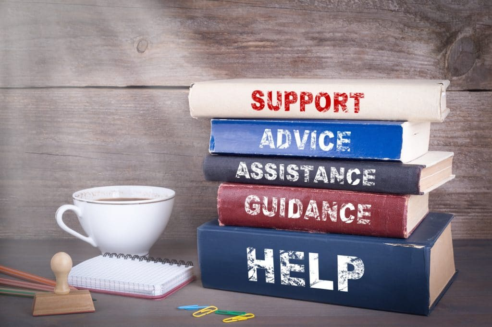

Have you been following my series on my Daily Positive Action Challenge?

If you’re not familiar with my challenge, you’ll want to check out my last post called [Inspiration and a Tip to Thrive in Dark Times](https://yflmainprod.wpengine.com/2020/03/inspiration-and-a-tip-to-thrive-in-dark-times/).

Many of you have emailed me to say how much you appreciate what I’m sharing. It helps to balance out all the fear, frustration, and uncertainty that so many of you are feeling at the moment.

Today, I want to share more good stuff to inspire you to keep moving forward and to help you out if you’re struggling.

In a moment, I’ll share **two free coaching sessions** that I’m offering for women who need financial guidance to get through the economic impact of Covid-19. But first, here are more examples of daily positive action steps that ladies in our community have taken over the last few days.

### These gals are on fire!

**GAL #1:** I’m working on completing my automated payments.

**GAL #2** (a Canadian who is living in the U.S.): I changed our pay allotments so that we don’t exchange too much CDN $$ to US $$ at the current, awful exchange rate!

**GAL #3:** I will get my taxes started today! I’m giving myself 2 days to do this. On an unrelated note, I also plan on making lots of pizza dough today 🙂

**RESULT:** Did most of my taxes. Just waiting on some tax slips for my RRSP. But that’s it! Everything else is ready to go. Pretty proud of myself for that. And the pizza was so good!

**GAL #4:** Call Rogers to drop my personal phone plan to minimum required, now that I have the work phone. Also, read my one chapter.

**RESULT:** I didn’t get my chapter read (by the end of the day, the mental focus isn’t there); however, I went into my account, paid my MC bill (4 days in advance) and I took the 60$ from my phone bill and added it to a monthly savings transfer for ‘Adventures’. 😁

**GAL #5:** I will spend another hour (or more) on my 2019 tax prep. And I vow to start, and get it done, before 6pm this time!

**RESULT:** Spent \*two\* focused hours on my 2019 tax prep! {Before 6pm – yay!} Reward: Popcorn + Netflix cartoons. {Yes, I’m a 6-year-old on the inside.} Progressing slower than expected, however \*any\* forward movement is a good thing these days. \*Deep breath\* The mindful pace provides opportunity to think about how to improve my systems going forward.

**GAL #6:** Are we allowed to challenge others on this, Doris? I just want to mention that I LOVE last pass! If any of you did the training with Mark (Levison) about online security. It is totally worth setting it up. I say a little thank you to Mark almost every time I use it!! If you are looking for something positive to do during this Challenge, I highly recommend going back to your notes and setting this up. TOTALLY worth it!!

**GAL #7:** Read a Chapter in *Financial Freedom*.

**GAL #8:** With long work hours, my goal is to take a few breaks to breathe and do light reading. I’m following along on the challenges though and wanted to cheer everyone on!

**GAL #9:** Today I plan to get my long overdue medical claim ready to submit and maybe even submit it. More money in my pocket!!

**RESULT:** And my claim is done and ready to be mailed! Another $1000 or so in my pocket when it comes back!!

**GAL #10:** Reviewed my disability insurance policy with my broker to understand what I’m covered for and not in case I need to use it one day. **Result**: solid understanding of my risks, and coverage choices to cover off risks. Called my cell provider and cancelled a service I’m not using anymore. **Result:** saving $7.50/month + tax. Spoke with insurance company about obtaining general liability insurance. Reached out to three peers for information about the same to get comparison quotes. **Result:** momentum!

**GAL #11:** I just got off this week’s call with my accountability partner. I’ll count that as another action step for today! We discuss, track, problem-solve and encourage each other with our financial steps + goals. Also, I plan to log another hour on my 2019 tax prep today. If I’m up for more, I’ll do it.

**RESULT:** Just finished today’s hour on my 2019 tax prep. I left it until late in the evening again. But it’s done! And I’ll fall into bed with a clear conscience that I took another step toward completion.

**GAL #12:** I rewrote/fine tuned my 2023 life vision; feels soooo good.

That’s just a smattering of the action ladies have taken. How cool is that?! We’ve got more than three weeks left in my challenge, so stay tuned for more goodness.

Also, did you notice the recurring theme of women feeling good that they took small steps forward? If you haven’t participated yet, it’s not too late. Just plan to do one thing tomorrow and touch base with me to let me know what you accomplished.

It doesn’t have to be anything major. Just one positive action step that will make you feel better about your day and yourself.

### Free Access to My Office Hours to Answer Your Questions

As part of my [**Women’s Money Group**](https://yflmainprod.wpengine.com/womens-money-group/) offerings, I host online Office Hours twice a month to answer any financial questions my members have and to provide them with coaching.

This week, in light of the unprecedented world events and the fact that so many people are hurting financially, I am opening up the lines for free, for the first time ever, to one hundred women – that’s as many spaces as are currently available.

On Wednesday, March 25th, one hundred women will have the opportunity to tap into our powerful Women’s Money Group community to ask financial questions, get guidance and receive coaching. It’s a safe, no shame, no blame, no judgment environment where all questions are welcome.

Helping people repair their finances is what I did for decade. Helping women set up their finances strategically to be able to weather any storm is what I’ve been doing for the last five years.

Tap into my knowledge and experience as a financial coach, for free. All you need is a computer, a headset or earbuds, an internet connection, and a quiet, private space in your home from which to participate. Please note that I require your video to be enabled in order to participate. That’s how my team and I can verify the participants and ensure the safety of our group.

My Office Hours are done through Zoom. Here is **[the link you need to register](https://zoom.us/meeting/register/tJUvfu-tqzMpGesWmXDORK3GbqBZBJPTOA)** for a spot. If you would like to participate, I recommend that you grab a spot right now as the spaces are limited.

One last thing: On Tuesday, March 31st, I will also open up my Monthly Women’s Money Group Workshop to the public FOR FREE. The topic will be **A Guided Coaching Session: How to be Strategic With Your Finances During the Pandemic.**

I’ll share details later this week.

If you have any questions, by all means reach out. We’ll chat again soon.

#### Share this post

## Your Foundation to Financial Freedom is coming soon.

Please complete the form to add your name to the wait list. We’ll let you know as soon as the course is released!

## No spam, ever. Unsubscribe any time.

## IMS ESSENTIAL

Please select a payment type: