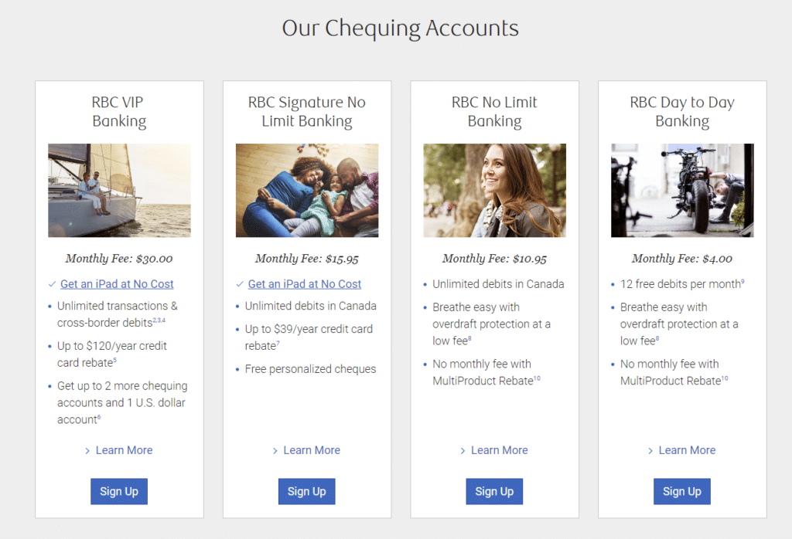
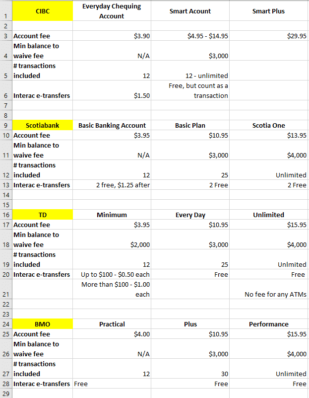
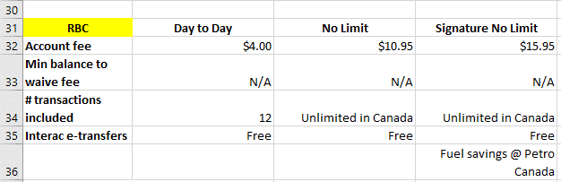

Take a look at the image above, taken from an ad for a chequing account.

I don’t know about you, but I definitely aim to make smart choices with my money. Who doesn’t?

Here we have an offering of a “**Smart Account**” which, according to CIBC, is one in which you get unlimited banking for a fee. The amount you pay is capped, mind you; but still, there’s a fee.

**Let’s boil this down to a fundamental question: Is it worth it, or smart, as the ad implies, to pay fees for personal banking accounts?**

More than ten years ago, I discovered an online bank that offered a **no-fee chequing account**. When I realized that I could get free cheques – which was a big deal back then since e-transfers didn’t exist – and unlimited free transactions, I switched all our banking over to that institution, including chequing accounts for rental properties, and I haven’t paid a penny in bank fees since.

Fast-forward to a recent conversation with a member of my Women’s Money Group, whom I’ll call Mia. While chatting about other banking issues, I learned that she has an RBC chequing account that costs her $17 per month. That doesn’t seem like a lot, does it? Why worry about $17 measly dollars per month?

## The cost of status quo

I asked her how long she’s had the account. She replied, “More than 20 years.” She added that she only uses the account for a handful of monthly transactions.

This prompted me to do a bit of math: $17/month x 12 months x 20 years = $4,080 spent in the time she’s had the account.

Put yourself in Mia’s shoes: What could $4,080 have done for you in that time? A holiday down south in February? Paid off a credit card or line of credit, freeing up more cash for you to use on your priorities every month? Shaved off thousands of dollars of interest charges on your mortgage?

##### It made me wonder why people agree to pay bank fees when there are free options?

##### And second, are banks offering cool perks that I don’t know about, which would justify the fees?

##### Let’s take a look.

## A word about relationships

Mia is the kind of person who tracks her expenses faithfully and makes deliberate choices about how to spend her money. Why, then, would she accept a $17/month fee for an account that is of little value for her?

Very simply, it’s all about convenience and **avoiding the PITA factor** of moving payments over to another institution. She’s also had the account for more than two decades, so she feels a sense of **loyalty** to the bank.

I get that.

In our overly busy lives, it’s a pain to have to make multiple calls, send emails and fill out paperwork to move over pre-authorized payments. It’s simpler to just let things ride when the cost doesn’t take a big bite out of our cash.

Then there’s the relationship angle.

It used to be that you could develop a great working relationship with “your” banker, who would be there for you when times are tough. Relationships are important.

Still, I wondered just how much RBC values her loyalty, which costs her $204 per year for little benefit. I poked around on RBC’s website to see what they offer in terms of chequing accounts and here’s what I found:

Disregard the VIP Banking account because a) it’s expensive at $30/month; and b) one of its main features is tied to a credit card (I talk about this later in the post).

**What do you notice about the three other offerings?** If you said that they all cost less than Mia is paying per month for her account, you’re absolutely right. Every single one of those offerings would represent a better deal for Mia.

Did someone at the bank offer to transition her to a better account to save her money? No.

As loyalties go, this appears to be a bit one-sided. RBC: 1; Mia: 0.

Before I dig into the suitability and/or attractiveness of cheaper options, let’s take a look at the two main, free options in Canada. I’ll follow that up with an overview of chequing account options at all of Canada’s Big 5 Banks: RBC, TD, Scotiabank, BMO, and CIBC.

## Free Option #1 – SIMPLII FINANCIAL

In the mid-1990s, Loblaw Co. Ltd entered a joint venture with CIBC to provide low-cost, online banking under the name President’s Choice Financial, or PC Financial for short.

On November 1st, 2017, **[CIBC and Loblaw parted ways](https://www.theglobeandmail.com/report-on-business/cibc-to-cut-ties-with-presidents-choice-unveils-branchless-banking-brand/article35997321/)**, with the latter focusing its energy on its branded credit cards, while CIBC gained a stronger foothold, and more control, in the world of digital banking. The account numbers remained the same through the transition, however the name changed to Simplii Financial, an online bank offering a no-fee chequing account with the following perks:

- No monthly fees
- No minimum balance requirements
- Unlimited debits, bill payments, and withdrawals
- Free Interac e-transfers
- Access to CIBC ATMs for free
- Free cheques
- Mobile banking
- The option to set up overdraft protection at no monthly fee. You’re only charged when you use the service.

I’ve used Simplii since the early 2000’s, when it was called PC Financial, and **I have not paid a dime in bank fees** since then.

Before CIBC took over, they used to charge for e-transfers, something that nearly made me switch to Tangerine. However, in November of 2017, they wisely emulated their main competitor and included these in their offering.

With Simplii, everything is done online. They recently added an app that provides the benefit of mobile banking, so you can deposit your cheques by taking a photo of the front and back using their app.

**Mia’s savings if she’d used Simplii for the last twenty years? $4,080.**

**The difference between Simplii and her bank regarding useful features and offerings for her? None.**

## Free Option #2 – TANGERINE

This online bank started off as INGDirect. Scotiabank bought it from ING in 2012 and re-branded to Tangerine. Much like Simplii, it offers a range of free services, however there are some significant differences. Here is a list of its perks and limitations:

- No monthly fees
- No minimum balance
- Unlimited debits, payments and withdrawals
- Can deposit cheques through their mobile app, meaning no more visit to the bank because of cheques
- Can add your Tangerine client card to Apply Pay, Google Pay, and Samsung Pay Mobile Wallets
- You only get 50 cheques for free.
- Interac e-transfers cost $1.00. You can send email transfers for free, however it typically takes a couple of days for the money to get to the recipient’s account
- You can set up overdraft protection, but there is a monthly fee

If you’re a frequent user of e-transfers, then Simplii may be a better option for you.

**Mia’s savings if she’d used Tangerine for the last twenty years? $4,080.**

**The difference between Tangerine and her bank regarding useful features and offerings for her? None. Everything she can do within her existing bank account is available through Tangerine.**

A quick perusal of the offerings at Simplii and Tangerine suggests that there isn’t a good argument to be made for Mia (or anyone I can think of, for that matter) keeping her money in the RBC chequing account.

To ensure that I’m not missing anything, let’s take a look at the Big 5’s offerings.

## Show me what you got

I created a spreadsheet to compare and contrast the basic chequing account offerings at Canada’s Big 5 banks. Here’s a quick summary of what I found, by bank (at the time of writing).

What quickly becomes apparent when you see all the information stacked up together is that the offerings across **the banks are all quite similar**.

The bare-bones packages cost roughly $4.00 and include twelve transactions. Some offer free Interac payments, some don’t.

The next level of offering is in the $10 – $15 range. There are various incentives that I didn’t share because they’re time-limited.

Some banks also have much more expensive accounts, in the $30/month range, that are tied to credit card perks. I’ve either left those out or left the column blank because I’m not interested in comparing chequing accounts that charge you $360 per year and then tell you that yay you, you get a rebate on your credit card fee. Next.

I got a kick out of the fact that most banks boasted about “Free paperless record keeping”. What?! Well knock me over with a feather. The banks have decided to give you access to your statements, online, for free. Seriously, who thought this was a marketing feature? 🤦‍♀️

One of the banks, Scotiabank, offers rewards for debit purchases in their Scotia One account. In my opinion, this is dangerous from the consumer’s perspective because it incentivizes spending money. Literally. Just like its cousin, the credit card. **How’s that working out for many consumers?**

As with all such programs, are the rewards worth the cost? Hard pass on this one for me.

## Is this a big deal?

RBC offers fuel savings of 3 cents per litre at Petro Canada with their Signature No Limit account. That could be useful for people who do a lot of driving and who have easy access to a Petro Canada station, but is that perk worth the $15.95 monthly cost? Let’s do a bit of math.

Since I don’t know what car you drive, I’ll use one of mine. My older car is a Hyundai Elantra and it burns roughly 9 litres of gas for every 100 kilometres driven. We drive approximately 25,000 km every year. Therefore, last year we burned through approximately 2,250 litres of gas (25,000 ÷ 100 = 250; 250 x 9 = 2,250). [**According** **to Statistics Canada**](https://www150.statcan.gc.ca/t1/tbl1/en/tv.action?pid=1810000101)**,** the average price of gas in my city, for 2019 to date, is $1.11. In the absence of information for the full twelve months, I’ll use that average as my working number to give you an idea of the savings.

Without a fuel savings perk, we paid $2,497.50 (2,250 x $1.11 = $2,497.50). With the 3 cents/litre savings, we would have paid $2,430 (2,250 x $1.08 = $2,430).

Total savings? $67.50 ($2,497.50 – $2,430 = $67.50)

Total cost of the account for the year? $191.40 ($15.95 x 12 = $191.40).

**Doesn’t even come close to being worth it.**

“Hold on,” you might say. “I have a vehicle that burns through a lot more gas than that.” Even if you have a truck that uses 20 litres per 100 kms, you still wouldn’t make back the cost of the account.

So much for that benefit.

(BTW, stunning and totally unrelated fact: Did you see the **[Stats Can averages](https://www150.statcan.gc.ca/t1/tbl1/en/tv.action?pid=1810000101)** for gas across Canada? People in Vancouver paid more for gas, on average, in the last six months than people in Yellowknife and Whitehorse. WTH?!)

## About those minimum balances

Did you see the bits where some of the banks dangle the option of no fees if you keep a minimum balance in the account for the entire month? The latter point is important because **if you dip below their minimum even once, the deal is off for that month; you’ll get charged the account fee**.

Let’s think about this. Does it make sense to keep $2,000 – $4,000 in your account, depending on the bank and particular account, in order to keep the fees at bay?

To answer that question, **let’s invoke an important concept from Behavioural Economics: opportunity cost. What else could you do with that money?**

It makes sense for the bank to incentivize that behaviour, because it gives them access to super-cheap funds to use for investment elsewhere.

What do you stand to gain from that? You save the fee; that’s it. Here’s the thing: **If you banked at Simplii or Tangerine, you’d save the fee anyway and you could then use the extra money to:**

- **pay off credit card debt; or**
- **pay down your mortgage; or**
- **grow your savings in a high interest savings account; or**
- **use the funds to invest and grow your wealth.**

Sure, we all want a buffer in our chequing account to ensure that we have enough money for bill payments, but parking thousands of dollars there will definitely benefit the bank more than it will help you.

## Where’s the magic?

In looking over the list of purported benefits, none of them makes sense when compared against no-fee, online accounts.

**I honestly cannot think of a single reason why setting up a personal chequing account at a bricks-and-mortar bank, complete with fees, would be advantageous.**

If I’ve missed something, by all means shoot me an email and let me know. I genuinely want to hear about it if you feel that paying your bank monthly fees for a personal account makes sense for you.

As for the cost of switching over, that’s a matter of an hour or two. Even with multiple chequing accounts for properties, it only took me a couple of hours spread out over a few days to get everything lined up. It’s definitely worth a small amount of PITA to save money forever. That is, unless you enjoy adding to the billions in profits that the banks earn every year.

Just to clarify, the above applies solely for personal chequing accounts. If you have a business, you need a business account and you will pay fees for that unless, in some cases, you maintain a minimum balance. That’s a whole other conversation.

Don’t blame the banks for trying to pitch you with clever words like “Smart” and “Richer”, which are pretty much psychological bait. They’re in the business of making money for their shareholders. That’s fine.

**Just don’t get sucked into the hype.**

## My challenge to you

Take a look at your accounts and see if you’re paying fees for no real benefit. Share a quick note in the comments below on what you find and what you save if you make the move. Better yet, tell me what you’ll do with the money you’ll save.

As for Mia? She realized that one year of savings pretty much pays for a visit for two, with lunch and wine, to Le Nordik, a fabulous local spa. That alone is worth the hour or two it will take her to move things over!

**Want a proven process to help you make smart financial decisions that are in your highest, best interests *every time*?**

Grab your copy of my [FREE Cheat Sheet](https://yourfinanciallaunchpad.com/4-questions-cheat-sheet/). In it, you’ll discover the four key questions to ask yourself, in order, to gain **total clarity** on the right financial path for you.

This **process works** for all decisions, big and small.

Make indecision, second-guessing, and analysis-paralysis a thing of the past with our Cheat Sheet!

#### Share this post

## Your Foundation to Financial Freedom is coming soon.

Please complete the form to add your name to the wait list. We’ll let you know as soon as the course is released!

## No spam, ever. Unsubscribe any time.

## IMS ESSENTIAL

Please select a payment type: