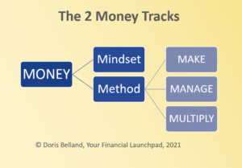

# is-one-of-your-money-tracks-broken

#### Do you keep making the same money “mistakes” over and over again?

You’ve seen the pattern before and you know it’s a thing for you, yet it still happens? What’s going on?

Rest assured, it’s not just you. We *all* have patterns and they show up in every aspect of personal finances. Here are just a few examples:

- **Perpetual underearning**. You’ve read multiple books on how to earn more, follow 7 blogs, and tried every hack known to womankind. And yet, you are still earning *far* less than you want. You’re starting to wonder if this is all you’re capable of.
- Earning plenty of money, but not being able to hold on to it. “**Easy come, easy go**” seems like a disease you can’t shake.
- **Endless cycles of debt**. No sooner do you repay one chunk, another one sprouts up elsewhere, even though you have a plan and a budget and post it reminders plastered everywhere telling you to stop spending.
- **Emotional spending**. You know that when you’re feeling sad, you have a tendency to shop to make yourself feel better. You tell yourself you’re going to cut that out PDQ, then it happens. Again.
- **Every investment** you’ve ever put your money into **goes nowhere**. You’ve spent years saving and investing. You should be a millionaire by now, but you definitely aren’t. What gives?
- **Inability to save**. You’ve read Dave Ramsey’s *Total Money Makeover*, you’ve created a budget, you use a budgeting app, and you’ve put your dog on notice, as Ramsey suggests. You still can’t seem to set money aside because something always comes up. You’re worried you’re going to have to eat dog food in retirement.

This is just the tip of the iceberg of what I’ve seen in my work. Unhelpful financial patterns are everywhere and what’s worse, they’re damn difficult to overcome with a traditional approach to money.

What are you supposed to do? Stock up on dog food for retirement, just in case?

Throw up your hands and accept that this is all that’s possible for you?

Thankfully, no.

You just need to address your money tracks.

## The 2 Money Tracks

One of the biggest aha moments I’ve had in my business happened roughly seven months ago when I read [Christine Kane’s](https://christinekane.com/) book *The Soul-Sourced Entrepreneur.* Christine is a podcast host and business coach who has a unique way of viewing entrepreneurship.

She teaches that there are two tracks to businesses: the strategy track, which is the one that most of us know well. It consists of the usual suspects – marketing, sales, product development, and the like.

The second track – and this is where her take is so original – is the soul track. It’s all the mindset, emotions, and beliefs that run in the background and have a huge impact on our ability to deliver on the strategy track.

While reading that, a lightbulb went off for me: I’ve been saying something similar about the importance of mindset for your money for years. I feel it’s so critical to success that I developed a course called *Master Your Mindset,* which I incorporate in all my private coaching.

In the next package that I’m brewing, I start with mindset before delving into a single concept related to financial literacy. It’s *that* important.

What I love about Christine’s idea is the concept of two tracks. So, as with all great ideas, I’ve borrowed the concept and used it to explain how money works in your life:

#### There are 2 money tracks. The first is the Mindset Track.

This track is responsible for the majority of the patterns at play in your life. It consists of the beliefs and baggage your have from your past that affect how you feel about, approach, and use money.

The Mindset track is all about the “why” we do what we do in our personal finances and why we experience various emotions when dealing with money.

Some of my clients have argued that their inability to get out of debt or to save money is due to a lack of financial literacy.

Partly, maybe; but that’s not the real story. The main issue is their mindset. In a second, I’ll prove it.

#### The second money track is the Method Track.

This is the “how” and the “what” you do with your money. It’s broken down into three components:

1. **Make:** How you make money.
2. **Manage:** How you manage your money and what you do with it.
3. **Multiply:** How you grow your wealth through investments.

Whenever you have a financial challenge, you can bet that it’s attributable to one of these tracks.

Here’s a visual representation of the two tracks:

## Mindset at the root

Let’s go back to my clients who felt that their patterns were due to a lack of knowledge about how to make, manage, or grow their money. In other words, who insisted that their methods were to blame for recurring problems.

Without knowing it, I tested that hypothesis during my decade as a financial repair specialist. During that time, I worked with families who typically had significant debt issues and an inability to save money.

I would sift through all their financial information, figure out what I thought the root of the problem was – e.g. too much spending in a particular category – and I’d work with them to create a new budget.

Every detail was worked out – how much to pay against the debt every month, where to limit spending, what to cut, and so on. It was often a struggle for them, despite the fact that they had a clear, explicit plan. Lack of follow-through was a common problem.

They’d give me reasons, all of them external to themselves, and tell me why it would be better next month. Except it often wasn’t.

We had talked about how to budget.

I had shown them the basics and explained every step of the process.

**They had all the information they needed about the “how” and the “what”. Still, they struggled.**

Eventually, they reached their targets and we would all celebrate. Yay you! You did it – you paid off a heap of debt, saved thousands of dollars, and rebuilt your credit score. Fabulous!

Except that when we parted ways, they often fell right back into their old behaviors.

If simply understanding core financial literacy was all they needed, they would have rocked the process. But they didn’t.

Their patterns popped back up and started to run the show once again, because we hadn’t addressed their mindset.

#### And that’s when I realized that you can have all the best information at hand and use every last hack, but if your mindset isn’t on board, nothing will last.

**The patterns will recur.**

And you will not achieve your goals, regardless of how meaningful they are.

## Only one way to financial strength

There is only one way to ensure that your financial train reaches its destination, and that’s to ensure that both money tracks are healthy.

#### Here’s a challenge for you in the coming week:

1. Pay attention to all those moments when you feel stress or frustration about an area of your finances.
2. Write down the details in your journal. If you don’t have a journal, I encourage you to start one. It’s a simple but effective tool to help you figure out your financial puzzle.
3. To deal with the emotion, ask my favorite questions: “Isn’t that interesting? I wonder why I’m feeling this way?”
4. Sit with the questions and the feelings. Don’t try to beat them down. Just notice and note them down, as though you were a researcher.
5. Don’t judge the feelings. Remember my motto: **No Shame, No Blame, No Judgement.**
6. See what comes up for you and see if you can spot any patterns. Is this something that has been a challenge for you in the past?

**Start by making small steps toward clarity about how you feel, what comes up for you, and what’s showing up in your life.**

**That’s the start of figuring out your Mindset track.** More on this in the coming weeks.

When you’ve started to identify some of your patterns, reach out and let me know what’s coming up for you.

And if you’re beating yourself up about having patterns in the first place? Let go of that judgement. **We *all* have patterns.**

Another thing to remember is that mindset work is a lifelong endeavour. It’s like being healthy: you have to keep eating well and exercising. You don’t get to pack it in at a certain stage, brush your hands off, and call it a day. Not if you want to be healthy into old age, anyway.

Ditto for your finances. The good news is that the mindset work you do now will pay off in spades down the road.

I look forward to hearing your stories and insights.

#### Know someone who would benefit from reading this post? Please share it with her.

### Get my Money Tips sent straight to your inbox. Join my community here.

No spam – ever.

#### Share this post

## Your Foundation to Financial Freedom is coming soon.

Please complete the form to add your name to the wait list. We’ll let you know as soon as the course is released!

## No spam, ever. Unsubscribe any time.

## IMS ESSENTIAL

Please select a payment type: