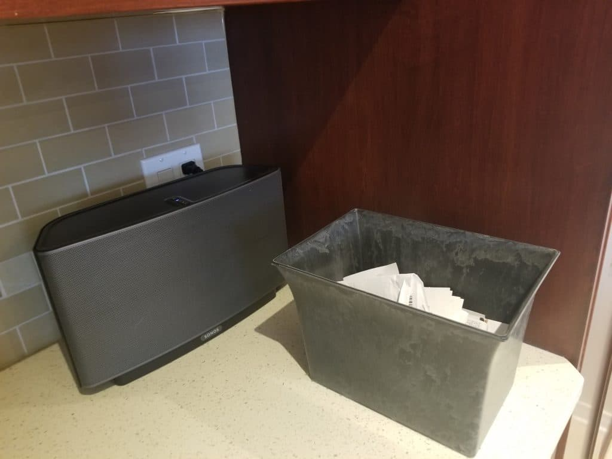

When you make purchases, what do you do with the receipts?

Do you have a system to corral them, or do you end up having to ferret through pant pockets, your purse (how many pockets does that thing have anyway!), your car, and various surfaces in the house to find them all?

Earlier this week, I gave a workshop on systems and tools to help you organize your finances. Judging from the emails I received, it was a hit, so I thought I’d share a few of the tips that resonated with the participants.

## Give them a visible place to land

My husband and I generate a lot of receipts in our personal life, without mentioning the ones generated by our three businesses. Over the years, we’ve tried multiple strategies to keep track of them all.

 

My first go at it was to create a file folder for each month. The idea was that we were supposed to put all receipts into the appropriate file after making purchases. When it was time to reconcile our statements, in theory we would grab the file for that month and have everything we needed at hand.

It never worked. I’m not going to point fingers here, but *somehow* receipts never landed in the right file and some never made it to the file in the first place. (Really? Was it that hard?! Sigh.) So files were out.

Last Christmas, we received a gift basket. When we emptied it, I was loathe to throw out a perfectly good basket. That’s when it hit me: This would make a good landing container for all our receipts. I put it on our coffee counter in the kitchen, where my husband sees it constantly (spot the coffee fanatic), and asked that we dump all receipts in there when we get home from shopping.

Success!

Since the basket is placed in a visible location where ~~my spouse~~ we see it all the time, we are constantly reminded to grab receipts from our wallets, pockets, and shopping bags. (Score a point for implementing lessons learned from behavioral science.)

When we reconcile our statements, we still encounter the odd occasion where we’ve missed a receipt, but it happens far less frequently than it used to.

#### Here’s what one workshop participant had to say about this strategy:

> Thank you for the workshop on Tuesday evening. As usual, it was educational, informative and helpful. You covered items you often refer to, but for some reason I had never gotten the information. Something as simple as creating a receipt basket makes me feel so much lighter and with extra head space to think of other things. I already implemented that.

Who doesn’t want extra head space? That’s exactly what this strategy does – frees your mind from having to make one more decision. You’ve got better things on which to spend your cognitive juice.

## Don’t need them? Do it anyway

While you don’t need to keep receipts for personal purchases, beyond those for items you might return, here are two compelling reasons to get in the habit of obtaining receipts for all purchases.

**#1 – Reconciliation**

Reconciling credit card and bank statements simply refers to the process of checking to ensure that all the charges and/or entries are legitimate. Many people I know take a relaxed approach to this – as in, they glance at the statement and if it looks right, they’re happy.

It is difficult to catch errors if you’re just having a quick glance at the items. Over the years, I’ve caught many errors – over-billing, duplicate charges, etc – by checking statements line by line. You can’t do this unless you have the receipts to verify the purchases.

If you use expense tracking apps like Mint, you might feel comfortable that they’re capturing all the entries; but here’s the thing: **Mint assumes that your statements are correct.** There’s only one person who can prove otherwise – you, by checking entries against receipts.

**#2 – Awareness of spending**

By far and away the more important reason to keep all receipts is to look at them in detail, as a whole, when you’re reconciling your statements.

Most people view receipts simply as a proof of purchase. I view them as a behavioral tool to inform you of your spending habits.

For example, multiple entries for purchases at Costco tell you that you bought X dollars of goods there. It doesn’t tell you what you bought. The receipts will tell you that.

There’s something sobering – and enlightening – about reading over multiple receipts and seeing just how much you spent on clothes and gardening products. (Don’t get me started on red wine.)

If you want to control your spending and grow your savings, bring your spending patterns into your awareness by analyzing receipts.

## Draw a picture

During the workshop, I had participants draw out a Money Map, which is a visual representation of their personal cash flow – where money flows once it enters their life and which systems they use to manage the various components.

There were many “aha” moments when the map was complete, giving attendees a birds-eye view of their finances. That’s when many realized that they have many more expenses and liabilities than they’d like, compared with savings and investments.

I call it the 30,000 foot view, akin to the view you get when you’re in a plane looking down.

This view presents two advantages: You see the big picture and you can easily spot patterns.

Sometime this weekend, I suggest you pull out a blank piece of paper and create a visual track of where money goes when it comes into your life.

What are the sources of that income?

Where does the money go after that?

In what order (i.e. what to you do first with the money when it lands in your account)?

One of the strategies I shared with participants is to fund the asset side of the map first, before spending on expenses and liabilities. That’s how you build wealth.

The only exceptions to this are if you don’t have sufficient income to pay for essentials and if you have **[corrosive debt](https://yflmainprod.wpengine.com/are-you-really-living-within-your-means/)**. In the latter two cases, a different strategy is called for.

Everyone else? Start with the actions that will build wealth and go from there.

I’d love to hear from you. Leave a comment below with your strategy for dealing with receipts and planning your cash flow.

## Want to get money tips and strategies sent straight to your inbox?

## Sign up here to receive our weekly Money Tips. Don’t miss a thing!

#### Share this post

## Your Foundation to Financial Freedom is coming soon.

Please complete the form to add your name to the wait list. We’ll let you know as soon as the course is released!

## No spam, ever. Unsubscribe any time.

## IMS ESSENTIAL

Please select a payment type: