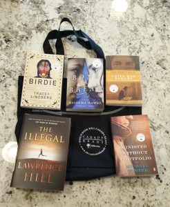
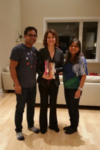

The Canadian Broadcasting Corporation’s afternoon program (in Ottawa) called *All In A Day* hosted a live show last night as part of the lead-up to Canada Reads. The week before, the host of the show, Alan Neal, asked listeners to submit their own stories relating to this year’s theme of starting over. As a thank you, they would reward a few of the participants with book packs of all five of this year’s titles. Since I’ve spent a chunk of the last three years writing blog posts about my story of loss and lessons learned, I decided to submit the Reader’s Digest version of my story. Wouldn’t it be great to win all of this year’s Canada Reads books! It was a long shot but what the hell, nothing ventured, nothing gained.

Several days later I got an email from the program asking me to come read my story in person at their live show! When I got there, I discovered that no, actually, I wouldn’t be reading my story, I’d be interviewed by Alan along with several other people who submitted their stories. No problem, great, except that while I had prepared to read my story I hadn’t prepared for Alan’s mini interview.

His first question referenced my story about awkward dinner invitations after Malcolm’s death. Easy. His next one, though, took me by surprise.

“When did you know that you were ready to start over?”

Blink. On the spot I couldn’t think of a single, specific moment so I said something about not having an aha moment, that it was a slow process, or something like that. But then later on that evening, as I thought about it, I realized that my answer was incorrect. There *was* in fact a defining moment when I knew that I wanted to move forward.

There was a night in September of 2000 when I was miserably lonely. Everywhere I looked I saw happy couples and it made me yearn for someone to talk to again, someone to laugh with. *I* wanted to be the girl strolling down the street holding my guy’s hand, *I* wanted to have a date to the movies or to dinner and *I* wanted to be the girl who puts her freezing toes on her warm guy’s legs at night. Malcolm had been gone for more than two years and while I missed him desperately, I understood that he was gone forever. If I wanted that lovely closeness in my life once again I’d have to open myself up to that possibility.

But where do you find a great guy when you’re 34? Well-intentioned friends had tried to introduce me to single men with disastrous results. Tell me Universe, are all single 30-something men hopeless? The counter to that was that I wasn’t exactly a typical woman. Most 30-something women haven’t spent nine years in and out of cancer wards and then lost their spouse.

After a pavement-pounding chat with the Universe in which I laid out the situation, it occurred to me that I needed to write down what I was looking for. How could I expect to find someone if I didn’t know what I wanted? So on September 22, 2000 I wrote a letter to the Universe in which I spelled out the Top 10 attributes I wanted in a new life partner. Since I was starting over, I would be very particular.

Mark entered my life two months later and the rest is chronicled in the short story below, as submitted to the CBC.

A huge shout-out to *All In A Day* for the bag of goodies that I walked away with from their live event. I’m thrilled to say that I’ve got a lot more reading to do. And my heartfelt thanks to our great friends Meenakshi and Kurien. Meenakshi, your fabulous Indian food beforehand clearly helped! I’m so glad we could celebrate together.

## Starting over

When I was in university my path was clear: complete a doctorate and become a professor of Neurolinguistics. Teach, write, research – those were my chosen pursuits and I was on track to accomplish them. Then, part way through my undergraduate degree, along came a man who changed the course of my life. His name was Malcolm.

On the second day of our courtship Malcolm sat me down and into my hand he placed a Budweiser cap, which he had hammered into a ring.

“I have something to tell you,” he said. Just as I was wondering what on earth was going on and thinking ‘seriously, you drink that garbage?’ he continued.

“I have cancer. I’ve had it since I was five but they only figured it out when I was thirteen. My doctors told me I probably wouldn’t make it to eighteen, yet here I am. While I’m in remission now, they don’t think it will last. I’m telling you this because I think I want to marry you and I want you to know what you’d be getting into. I will understand if you want to leave.”

I’m pretty sure that if you had punched me in the face at that moment I wouldn’t have felt it. What on earth do you say to that?

I stayed, buoyed by youthful optimism and a near-certainty that I could research my way into a solution. Every problem has a cause and a solution, right? I would solve for x. Together we would find a way to keep him healthy.

The cancer returned six months later. It didn’t have too great an impact on our lives until we had married, I had moved to Montreal to begin a doctorate and Malcolm had started his own business. Eventually though, the disease gained ground.

My twenties went by in a blur of medical appointments, cancer treatments and surgeries. The lowest point came when a bone marrow transplant failed.

Shortly after we celebrated our ninth anniversary, Malcolm was rushed to the hospital when one of his lungs began to hemorrhage. Three weeks later he was in the intensive care unit, sedated and intubated. The move to the ICU happened while I was out of town for a few days to deal with business at Malcolm’s urging. “Go, I’ll be fine. You need to do this for our business. I’ll talk to you in a couple of days. I love you.”

When the panicked call came from his father, telling me to come home at once, it was too late. Malcolm was already unconscious. I never did get a chance to say goodbye.

The next two years went by in a fog of grief and panic as I dug my way out of a $400,000 hole left behind by the business, all the while trying to reimagine my life. I had no idea what to do next.

After a year of mourning, some of my friends felt it was time for me to open myself up to the possibility of another relationship. Painful dinner invitations ensued: couple, couple, single guy, me. I would paste a smile on my face and pray for a heart attack.

Just as I was planning to sell the last of the business and head to Australia for a year of stress relief, Mark came into the picture.

Mark was an acquaintance of Malcolm’s. I knew of him, had met him in passing through our business but I really didn’t know anything about him. Then came an invitation to “dinner, drinks, coffee, whatever.”

Mark had just come back from a year of travel in Australia and he was looking to reconnect with friends. “Why me?” I wondered. I really didn’t know this guy and our one interaction a year previously had not gone terribly well. In the end I decided to accept, figuring that it would be nice to spend an evening in a man’s company for a change. If, by chance, the evening didn’t go well, I could beat a hasty retreat from the restaurant.

To my great surprise we hit it off. One week later we found ourselves in a restaurant with a group of my colleagues, head bent in a serious conversation that came out of left field.

“How do you feel about children?” he asked.

“What? Why on earth are you asking me this?”

He was serious and persisted with the question.

“Look, I don’t know. I don’t really think that I want children. Malcolm couldn’t have them and since we were so busy dealing with cancer treatments I never really gave it much thought. Honestly, I think I’d rather not have them. My friends who are parents don’t seem to be having a great time. Their lives revolve entirely around the kids, meals are eaten cold, there’s less travel, less fun, more stress, less sex. It doesn’t sound very appealing.”

“Well that’s a deal breaker for me. I want two kids,” said Mark.

Ten minutes before the guy had never even thought about children and now they were a deal-breaker? What is it with the men in my life?

When it became clear that we were in a serious relationship, I thought, “How bad can it be? Lots of people have kids and since they have more than one, the experience must be worth repeating.” I began to open myself up to that possibility.

Ten days after that deal-breaker conversation, Mark proposed. We were married the following year and I gave birth to the first of two girls the year after that.

I have gone from being a 32 year old widow who couldn’t imagine how on earth to reinvent herself as an old 30-something, to a reluctant mother, and finally to one who can’t imagine her life without two young people who bring her incalculable joy.

#### Share this post

## Your Foundation to Financial Freedom is coming soon.

Please complete the form to add your name to the wait list. We’ll let you know as soon as the course is released!

## No spam, ever. Unsubscribe any time.

## IMS ESSENTIAL

Please select a payment type: