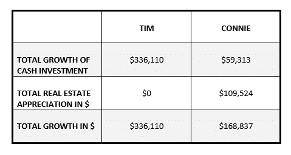

Tim and Connie decided to call it quits after more than a decade of marriage. There wasn’t a big crisis; it’s just that they grew apart. While one of them wasn’t entirely happy with the decision, they both came to accept that separation, and ultimately divorce, was inevitable.

There was just one problem: they both wanted to keep the house. Tim suggested that if they couldn’t agree, they should sell the house and split the proceeds. After much discussion, Connie persuaded Tim to let her keep the house because she has the smaller income and probably couldn’t manage to buy another one on her own. She also pointed out that to sell the house would be disruptive for the children. In return, Connie agreed to compromise in other financial areas.

Here’s how it shook out for them: The house was worth $350,000 and had no mortgage on it, and they had $500,000 in stock market investments. Connie ended up with the house plus $75,000 of cash; Tim kept $425,000 of the investments. Everything was split 50/50, therefore it was perfectly fair according to the letter of the law.

Fair, but not equal.

## When 2+2≠4

The above scenario is a blend of three couples I’ve come across who are going through the process of divorce. In each case, the woman dearly wanted to retain the matrimonial home, thinking that it would be in her best interests. By staying put, she retained some stability and avoided the stress of moving, not to mention the associated costs.

These are all valuable factors, to be sure, but in all three cases, I couldn’t help but wonder if holding on to the house was really the best outcome for the women involved.

Out of curiosity, I did a bit of math.

## Highest, best use

Whenever I’m faced with a tough decision, or when I’m at a crossroads, I have learned to ask the following question: **What is the highest, best use of my time/money/skills?**

This adaptable question has served me very well as I switched from a business that was draining me physically, to one which inspires me. It also helps me make all manner of decisions about the best use of my money and my time.

Let’s apply this question to Connie’s situation: What is the highest, best use of her money? Yes, I know, there’s much more to it than money, but let’s start with a financial analysis and go from there.

In Connie and Tim’s case, there was $850,000 of net worth on the line. The question is this: Is $350,000 in home equity plus $75,000 in cash equal to $425,000 in cash? I would argue it’s not.

## Cash vs House

Tim’s share of the net worth is currently invested in the stock market where it has been getting double digit returns for nearly ten years. Just to keep things simple and repeatable, let’s assume that from here forward, Tim will invest all the cash, none of which he needs to cover current costs given his strong income, in an index fund (i.e. a fund that tracks the market). Let’s further assume that he won’t add another dime to the pot (an unlikely scenario, since he earns enough to contribute monthly, but we’re keeping things simple for the sake of comparison).

The [S&P/TSX Composite Index](https://www.investopedia.com/terms/s/sp-tsx-composite-index.asp) has yielded average annual returns of roughly 7% (not adjusted for inflation) since 1988. The [S&P 500](https://www.investopedia.com/terms/s/sp500.asp) has averaged [just under 10% per year](https://www.cnbc.com/2017/06/18/the-sp-500-has-already-met-its-average-return-for-a-full-year.html) since its inception in 1928 – again, not adjusted for inflation. Let’s be conservative and assume that Tim’s money generates 6% per year for the next ten years using a low-cost index fund, like Vanguard’s S&P 500 Index ETF (VFV). The Management Expense Ratio for the latter is 0.08%, which amounts to roughly $5,800 over ten years in this scenario.

After a decade, Tim’s investments would be worth roughly $760,000. (I used [this calculator](http://www.calculator.net/investment-calculator.html?ctype=endamount&ctargetamountv=1000000&cstartingprinciplev=425000&cyearsv=10&cinterestratev=6&ccontributeamountv=0&ciadditionat1=monthly&printit=0&x=54&y=14) to get the results below.)

It’s true that since he gave up the house, he needed to find a place to live, but the rent for his apartment is roughly comparable to what he was paying for the mortgage, taxes, and insurance. He is taking the time to decide whether or not to buy a house. He may move to a different area of the city to be closer to his work, or he may choose another location altogether if he eventually finds another partner. The point is that for now, he is renting and no longer has maintenance and repair costs.

Now let’s look at Connie’s situation in the matrimonial home. Just to keep things nice and simple, let’s assume that she, too, didn’t need the cash from the divorce settlement and that she invested the entire amount exactly as Tim did, generating the same returns with no additional contributions. That means that her initial investment of $75,000 will be worth roughly $134,000 in ten years.

Now what about the house? Remember I said that this example is based on three women? I reached out to one of my favorite Realtors, [Dawn Goodridge](https://topottawahomes.com/en/home.php), for some stats on appreciation rates for the real estate zones in which these women live. The average appreciation rates for the past five years are 1.86%, 2.06%, and 2.76% respectively. Let’s use the latter, 2.76%, for this example to make a point. Assuming that the averages hold steady over the next ten years – even though past performance is no indication of future performance – that means that Connie’s house will be worth roughly $459,525 after ten years.

## How did they do?

Here’s a quick summary of their results after ten years:

#### In short, Tim has $167,273 more than Connie after ten years despite the fact that they supposedly started with the same value in assets!

Sadly, that’s not the full story either. In that time, Connie has had to pay for maintenance and repair costs for the house. The Globe and Mail published a [list of potential costs](https://www.theglobeandmail.com/globe-investor/personal-finance/article11669008.ece#dashboard/follows/) that home owners face beyond the mortgage, taxes, and insurance. The bottom line is that over a decade, repair and maintenance costs amount to thousands of dollars, and potentially even tens of thousands of dollars, depending on what breaks down (i.e. the roof, the furnace, the A/C unit, flooding issues, etc). All of those costs must be subtracted from Connie’s total growth, thereby increasing the spread between what she ends up with compared to Tim.

## What’s a girl to do?

Before you accuse me of being a real estate downer, remember that I am first and foremost an investor. I am a big believer in using real estate, among other strategies, for growth and I definitely want women to become owners *when it makes sense for them*. **Holding on to the matrimonial home might not always make financial sense in divorce.** In one of the cases mentioned above, the cost of renting would be greater than the woman can afford. For her, it makes perfect sense to hold on to the home. For the other two women though, it does not make financial sense when you consider the opportunity cost of having all that money locked in the home.

But what about the emotional cost of moving – doesn’t that count? Yes, it certainly does. It becomes a judgment call at that point, with the difference being potentially hundreds of thousands of dollars more in your pocket in the long run versus short-term ease through the early, difficult years.

If the idea of selling and moving is overwhelming, consider staying put until you can get through the worst of the transition and then revisit the idea of selling to liberate cash for investments. If you have credit card debt, then the benefit of paying off those debts will be even greater than the example above, since credit cards charge insane rates of interest, assuming that you [do not then go right back into debt](https://www.eventbrite.ca/e/womens-money-group-learn-how-to-eliminate-debt-forever-tickets-44556598987?aff=ehomecard).

What I really want to do with this post is encourage women to question the assumption that holding on to the matrimonial home is necessarily the best move forward. I fully recognize that it’s not all about money, but your financial health shouldn’t be ignored. Think about protecting your wealth as well as your family.

It starts with the recognition that not all dollars in a divorce settlement are equal.

#### If You Enjoyed This Post, You’ll Also Like:

#### Joint or Separate Finances: Scenarios, Risks, and Considerations

#### When Should You Set Up a Joint Account with Your Partner?

#### What Do You Get to Keep if Your Marriage Fails?

#### Share this post

## Your Foundation to Financial Freedom is coming soon.

Please complete the form to add your name to the wait list. We’ll let you know as soon as the course is released!

## No spam, ever. Unsubscribe any time.

## IMS ESSENTIAL

Please select a payment type: