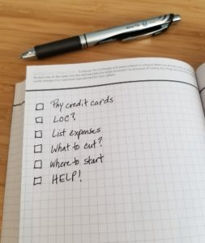

If a woman is trying to pay off debt, should she let the cleaning lady go? Is that a superfluous cost? What about expensive hockey team fees and equipment costs for her son?

Are you tempted to say yes in both cases? If so, consider this:

Years ago, two women, Gwen and Jean\*, approached me to help them get out of debt. When I took a close look at their respective financial details, I noted that both had tens of thousands of dollars of credit card debt. Both families were also spending a fortune on kids’ activities, which included super expensive hockey fees.

What would you have said to them if you had spotted this? Told them to ditch the hockey because it’s a huge, unnecessary expense?

When I first started working with families to help them get out of tough financial situations, I confess that I would have taken that approach. Surely hockey lessons are not essential, so they must go, right? Just retain the most important bits and chop the rest, with the freed-up cash going straight to debt repayment. Voila, solution in hand.

There is just one problem with a one-size-fits-all approach: We’re not all the same size.

## The usual approach

Much of the writing that I’ve seen on the topic of budgeting comes in this sort of flavour: Spend on this, but not on that. Cut here, eliminate this, and avoid that. Set aside money for essentials like A, B, and C; cut out the extras like X, Y, and Z.

Here’s the thing: How can someone else know what is essential or important to you without knowing the details of your life? *Or what you value?*

But wait, do those considerations matter if you’re knee-deep in debt? Don’t sacrifices have to be made for the greater good? Give up the expensive bits until you get out of debt and then add them back in when your cash flow is sufficient to cover them without relying on credit cards?

It’s not that simple.

For years, I helped people get out of debt by chopping out the big bits, regardless what they were. It worked, until I stopped holding their hand. Then my clients would revert to their old habits.

It turns out that two things are necessary to slay the debt monster: an understanding of why you got into debt in the first place, and knowledge of what you value.

## Money patterns and values

When you sort out your money patterns and you build goals around your values, then you can devise an approach to a cash flow shortage that will help you get out of debt and, most importantly, stay out of debt while taking into consideration your particular circumstances.

For example, is having a house cleaner an excessive frill? Not for the single mom for whom taking care of her young family’s well being is at the top of her list of values. She needs to free up her time to grow her income. Focusing on activities that will be of greater benefit in the long run makes sense, even if there is onerous debt.

If a woman is pressed for cash, which approach represents the highest, best use of her time: cleaning toilets or building her marketable skills? Scrubbing the floor or improving her business?

## Is hockey essential?

Back to Gwen and Jean. When I first spotted their expenses around hockey, I asked them the same question: Talk to me about your values. What matters most to you? Not surprisingly, the health of their family was at the top of the list, and that’s what they used to justify the hockey expenses.

When I asked Jean about the other activities that her son participates in, she rhymed off a long list, including competitive soccer. When I followed that up with a question about her son’s health, she beamed as she told me how fit he is – healthiest kid of the bunch! “Which sport does he like the most?” I asked. He loves them all!

I made the following recommendation to Jean: Sit down as a family and speak honestly about the fact that you are working to become financially healthy. Tell your kids that some activities, including hockey, will have to be curtailed, *for now*, as the family works together to eliminate credit card debt. They will still participate in sports that they love, just not all of them at this time.

Will the kids like it? Not one bit, but this is an important lesson for them about the importance of prudent money management. Sometimes, we need to make difficult choices for the greater, long-term good of the family. Once the family is back in the black, with savings in hand, they can make different choices based on their values. In the meantime, everyone needs to chip in for the benefit of the family.

The bottom line for Jean is that the elimination of hockey in no way threatened her son’s health and well-being, whereas paying those expenses certainly did have a negative effect on the family’s finances.

## The flip side

Gwen, however, was in a very different situation. When we discussed the costs associated with hockey, she explained that her son is mildly autistic, and hockey is the only activity to which he has responded positively. Since he started playing, he has made great strides forward in being able to interact socially with his peers. It also seems to give him greater confidence.

I said this to Gwen: “Hockey is clearly important for your son’s physical and mental health. We will find other things to eliminate from the budget.” It was hard work to eliminate thousands of dollars of expenses, but they did it without compromising their well-being.

Same activity, different needs.

A prescriptive approach to budgeting wouldn’t have addressed the nuances in the above cases. **Sorting out what to remove from a budget is difficult without understanding people’s values and motivations.**

## Top 5 values

If you’re trying to figure out how best to use your cash, or tackle debt, I suggest you start with your core values.

What really, really matters to you? If you were to write a list of the most important things to you, what would be on it? Would it be:

- Time with family
- Your and/or your family’s health
- Financial independence/strength/security
- Success at work
- Meaningful work
- Community service
- Education
- Travel
- Time with friends
- Philanthropy
- Practicing your faith
- Time in nature
- Your children’s success
- Being wealthy
- Something else?

**Write out your top five values, in order of importance, and use them as a guide when making financial decisions.**

Place expenses that aren’t congruent with your most important values, and aren’t absolutely essential for life, on a list of optional items.

When you’re facing a monthly cash deficit (i.e. you have credit card debt), consider eliminating the big items on the list of optional items. If you’re down to the wire, with no superfluous expenses, and all you are spending on are items related to your core values, perhaps you can find some ways to honour your values without spending any, or as much, money, starting with Value #5, then Value #4 and so on.

In another post, I’ll talk about the other way to eliminate debt, by growing your income, but the simplest place to start is with the money flowing out of your wallet or account.

## Yes you can

It *is* doable. Over the past ten years, I have helped many families eliminate thousands of dollars of debt using a simple, systematic approach. It also worked for me many years ago when [I found myself suddenly faced with $400,000 of debt, which I repaid in two years](https://yflmainprod.wpengine.com/book/).

You can do this, regardless of how much you owe.

Want some help? Join the wait list for my upcoming course [***Master Your Money: How to Create Money System to Live Debt-Free, Save Hundreds per Month, and Afford the Life You Want***.](https://yflmainprod.wpengine.com/diy-online-course/) There will be a DIY online version and a live online version, with coaching. Get on the list to be notified when the courses are released.

Questions? Reach out. I’d love to hear from you.

\*Not their real names

#### Share this post

## Your Foundation to Financial Freedom is coming soon.

Please complete the form to add your name to the wait list. We’ll let you know as soon as the course is released!

## No spam, ever. Unsubscribe any time.

## IMS ESSENTIAL

Please select a payment type: