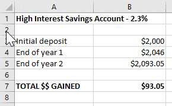
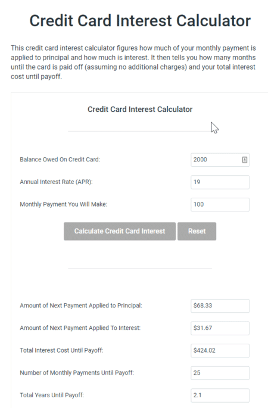

**Does an Emergency Fund serve you well or give you the illusion of security?**

It depends.

There seems to be a generally-accepted rule that having an Emergency Fund is wise and that the correct amount to hold is somewhere in the range of three to six months’ worth of expenses. Some advisors insist that a dollar figure, such as $5,000, is the way to go.

The bottom line is that an Emergency Fund of some kind is thought to be valuable. And by Emergency Fund, they mean a pot of easily-accessible cash to cover unexpected expenses such as the car breaking down, the furnace calling it quits, losing your job, or incurring health-related expenses.

**Pretty much any larger expense that might cause financial pain in any given month gets lumped into this category.**

## Let’s back up a bit

Is an Emergency Fund a good thing? Under what circumstances? Can you get by happily without one? And what constitutes an emergency?

Every time I’m faced with decisions regarding finances, I go back to a couple key questions. First, are the underlying assumptions behind a recommendation valid?

Second, what is the highest, best use of my cash given my values and priorities?

Let’s apply these questions to the notion of Emergency Funds.

## Is that really an emergency?

Let’s say you need to buy a new car because yours is on its last legs, and you come into my Excellent Car Dealership to chat about one of my offerings.

What would you say if I asserted that the beauty in front of you will never need repairs? Never going to face worn-out brake pads, or a snapped timing belt, or issues with the starter.

How about that?

Yeah, that’s what I thought you’d tell me. Pure fantasy, right?

Because cars break down. It’s what they do, eventually. They all need repairs to varying degrees. Someone I know got two lemons in a row: two new cars, two seized transmissions. Ugh!

The point is, mechanical things break down, typically at inconvenient times. So why, then, do we not expect it and plan for it when we buy things that break down?

Want to know what else breaks down?

Stoves, as in my stove on Christmas Eve when my then-boyfriend’s parents were over for a meal (we used my “baked” buns as hockey pucks afterwards – not kidding), or the furnace on one of the coldest days of the year (you can read about *that* story in **[my book](https://www.amazon.ca/Protect-Purse-Shared-Lessons-Women/dp/0995821801/ref=sr_1_1?ie=UTF8&qid=1532546549&sr=8-1&keywords=protect+your+purse)**).

These moments are annoying and frustrating as all get-out, and they might also be urgent. Nonetheless, these sorts of failures are to be expected. They are not emergencies of the “didn’t see that coming” variety.

Getting a nasty diagnosis, being hit by a bus, losing a job – those are true emergencies; the sorts of events that blindside you and can send you for a financial loop.

## So what? Isn’t it all just semantics?

The way we frame a situation drives our actions.

What if, when considering a purchase, we also factored in a monthly savings portion to cover the maintenance and repairs over time? How would that change our experience?

For example, when you buy a car, you could set aside $30 – $50 per month in a high interest savings account called **Planned Expenses Account**, for the eventual repairs.

Three years later, when you go to a mechanic for an oil change and they inform you that all your fluids needs to be flushed for a total cost of $1,200 (been there, experienced that), you won’t be pleased, but it won’t cause you financial stress either. The funds are waiting for you in the Planned Expenses account.

You’re prepared for this challenge.

## What if you can’t afford the savings portion?

Then you probably can’t afford the item.

I spent ten years watching people with consumer debt and the bare minimum for a deposit rush into home ownership. It didn’t end well.

They would have been better served dealing with their debt, then accruing savings before going down the path of ownership.

Back to the Planned Expenses account: **The amount you need can’t be prescribed, because it depends entirely on how many things you own that can break down.**

If you’re a renter, not a homeowner, then you don’t need to worry about the fact that the recent wind storm tore a heap of shingles off your roof. The landlord is the one who needed to increase their Planned Expenses account.

## What About Emergency Funds?

**Assuming that you have protective insurances in place (i.e. life and possibly also disability and critical illness), the question remains: How much should you set aside to cover your living expenses in the event that something unforeseen knocks you off kilter and packs a financial punch?**

**Do you really need an Emergency Fund for those moments?**

That depends.

My husband and I do not have a personal Emergency Fund. We keep sx months of operating funds in our corporate account for the “what if’s”.

On the personal side, we have access to a line of credit with a large credit limit. We don’t use it for anything other than emergencies. Thankfully, to date we have not faced a situation that we couldn’t handle with our existing monthly cash flow.

We also have a portfolio of investments that we could dip into, if push came to shove.

Our preference is to optimize for returns on our extra cash. We would rather invest our extra money to garner higher returns, than have those funds sitting in a so-called high interest savings account earning next to nothing and losing purchasing power.

This approach works for us because we have no consumer debt, no personal mortgage, and strong business income.

We’re comfortable operating this way; we don’t lose any sleep over the absence of an Emergency Fund.

In other circumstances, having an Emergency Fund would be a great idea.

Here is a chart that provides a values-based framework to determine when to create an Emergency Fund:

 

## Tackle debt first or create an Emergency Fund?

One of the objections to tackling corrosive consumer debt before starting an Emergency Fund is that it can be discouraging and stressful not to have any savings set aside. The people who raise this objection insist that it’s better to start putting an Emergency Fund in place while working on your debt. That way, you have funds to cover smaller emergencies when they arise and you don’t always have to use credit cards or lines of credit.

Others insist that this approach makes no mathematical sense. They say that if your goal is to get rid of debt and build an emergency fund as quickly as possible, then the best way to achieve that is by tackling debt that costs between 18% and 25%, instead of parking some of your funds in accounts that will pay you a pittance in interest.

After working with dozens of couples who were mired in a cycle of credit card debt for years, I would suggest that spending behaviours that fuel credit card balances are more discouraging than not having a few dollars saved.

However, we are emotional beings and if having some money set aside in a savings account provides greater value than paying off debt more quickly, then that’s the right choice for you.

In the end, your money has to serve you, not someone else’s idea of what “should” happen. Choose the approach that’s right for you.

## The illusion of security

Having just said that you need to make the right choice for you and your values, I do want to add a cautionary note based on what I’ve seen while working closely with clients. Sometimes, having money in a savings account lends a false sense of security while masking bigger problems, like overspending.

> **Taking an honest look at your spending patterns and finding ways to live on much less than you earn will yield far greater results than giving yourself the illusion of security by placing funds in a savings account while carrying credit card debt**.

If having the Emergency Fund lets you sleep better at night, that’s great. Just don’t let it deflect attention away from addressing corrosive debt.

## The math behind the two options

Let’s say you’ve just received a tax refund of $2,000. You have a choice to make: you can either pay off $2,000 of credit card debt or place the funds in a high interest savings account (HISA) to serve as an emergency fund. What would each choice yield? Let’s assume that the HISA pays 2.3%, which is the best rate you can find, and that the credit card interest rate is 19%. We further assume that you will make $100 monthly credit card payments. Here’s what the numbers would look like.

### An Emergency Fund vs Paying Down Credit Card Debt

In this scenario, you deposit the $2,000 in a HISA:

Interest costs on your $2,000 credit card debt using **[this calculator](https://financialmentor.com/calculator/credit-card-interest-calculator):**

What this demonstrates is that by choosing to create an Emergency Fund with the $2,000 instead of paying off the credit card debt, you will gain less than $100 in your savings account while paying more than four times that amount in interest costs over a two-year period.

If, after all this, you still argue that it’s better for you to build a small Emergency Fund while tackling your credit card debt, that’s fine. Some movement forward financially is better than no movement at all.

Again, your money should serve you and the things you value.

## Opportunity cost and peace of mind

Let’s say you’ve paid off your consumer debt and you’ve created a Planned Expenses Account. What do you do with the remaining cash flow?

Is it better to use a chunk of those funds to create an emergency fund in a high interest savings account, thereby sacrificing returns on your money (opportunity cost)?

Or invest the funds for a greater yield, knowing that you will either need to use borrowed funds or sell off assets in the event of an emergency?

The answer depends on your personality and your values.

If you have limited cash flow or you’re stressed out at the idea of not having a financial safety net, then having an Emergency Fund is the right step for you.

If, however, you’re in a solid place financially, you’re fine with the idea of using a Line of Credit to float you through a tough time, and you’d rather make your cash work for higher returns, then you don’t need an Emergency Fund.

Perhaps you have a foot in both worlds: you like high returns, but the sight of a healthy Emergency Fund makes you feel much better. If so, then a hybrid approach makes sense.

The Delphic maxim “Know Thyself” applies here.

Whatever you decide, set yourself up to minimize the financial impact of an emergency. You’ll have enough to deal with if/when life happens without having to stress about money as well.

## Get my weekly money tips and strategies, including my Focus on Finances 30-Day Video Series.

Don’t miss a thing! No spam, ever.

#### Share this post

## Your Foundation to Financial Freedom is coming soon.

Please complete the form to add your name to the wait list. We’ll let you know as soon as the course is released!

## No spam, ever. Unsubscribe any time.

## IMS ESSENTIAL

Please select a payment type: