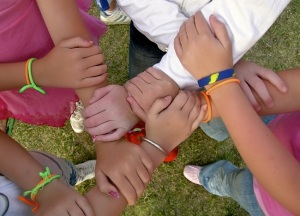
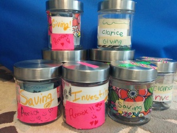

# should-we-ask-kids-to-donate-money

As so often happens, I had a thought-provoking conversation with my friend [Bona](https://yflmainprod.wpengine.com/2012/05/my-story-part-i/) about kids and allowances. Bona had just returned from a workshop with a parenting expert and after sharing some of the tips, which all sounded quite good to me, she issued a caveat.

– The instructor thinks that it’s a great idea to give kids an allowance so that they start learning how to work with money, but there’s one bit that I’m pretty sure you’re going to disagree with.

– Oh? What’s that?

– She doesn’t think that kids should donate money. Instead, she feels that it’s the parents’ responsibility. The kids should definitely be involved with the parents to make choices but the cash shouldn’t come from their pocket.

– Why not?

– I’m not sure, she just feels that it’s up to the parents to take care of giving back and that the kids will learn to do the same by watching their parents as they lead by example.

Bona was right, I disagree. I’ve spent several months thinking about this to ensure that mine wasn’t simply a knee-jerk reaction, but after mulling it over and trying to throw arguments back and forth, I still don’t get the expert’s stance.

This post isn’t really about allowances per se – that’s a whole other subject – but I will say this: **Allowances are a great way to help kids sort out how money works provided that there is some kind of system in place to get them thinking** beyond spending on candy, electronics and the latest offerings at Toys R Us. That’s all fun and it’s certainly part of the reward for earning money, but it will lead them to a world of pain if that’s the only “lesson” they take away from the exercise – get money, spend money.

The reason so many adults get into financial trouble is because they haven’t developed money skills around saving and growing the money they do make. In order to thrive financially, there needs to be a balance between spending, saving and growing your money.

Gail Vaz-Oxlade wrote a little (it really is wee) book called, “[Money-Smart Kids: Teach Your Children Financial Confidence and Control.](http://www.gailvazoxlade.com/books.html)” It’s a great book and there are a lot of good pointers about what to pay for (i.e. allowance) and what not to incentivize (i.e. good grades and household chores).

The system of four jars that she recommends – Saving, Sharing, Planned Spending and Mad Money – is one that I’ve implemented with my girls with a twist. Instead of having a “Mad Money” category my girls have an “Investing Jar” because I think it’s critical for all kids in general, and for girls in particular, to learn how to make their money work for them through judicious investing rather than just socking it away in accounts that yield little to no interest. In our case, the money that ends up in the Spending Jar gets separated into planned spending and “whatever I feel like doing” money.

In her book Vaz-Oxlade devotes entire chapters respectively to spending and saving but there is little said on the topic of sharing beyond the following:

“The rule of thumb for sharing is whatever you make it; in my house it was that you should put aside 5% of your income for those who are less fortunate, so if this is something that is important in your household, then in the Sharing Jar should go … whatever amount works in your family.”

Vaz-Oxlade clearly thinks kids should be sharing some of their money whereas the parenting expert thinks parents should be doing it and the kids will learn from them. Which is the best approach?

I’m with Vaz-Oxlade on this one for three key reasons:

1. We all have a responsibility to help those in need, and that includes children.
2. While we certainly do learn from observing our parents’ behaviour, it does not always translate directly into action and good habits.
3. Teaching kids the value of sharing what they have, if done well, can help to instill an abundance mentality.

## The short path from have to have-not

Most people would probably agree that we have a responsibility to help one another, but let’s just say you’re one of those tough-minded individuals who is a staunch believer in personal autonomy. Forget the hand-outs you might say, it’s up to people to make their own way in this world; you don’t owe anyone anything.

Leaving aside the obvious comments about kindness and generosity, consider that life hands out tough lessons quite indiscriminately. Sometimes, it’s not such a long path from being a “have” to a “have-not”. Illness, divorce, war, natural disaster – there is a daunting list of calamities that can strike anyone at any time. When you find yourself on the receiving end of such a disaster, you will be very grateful that most of the world operates within a belief system that values giving a helping hand whenever you can.

And seriously, who can see an image of a child in need and not be touched? Or read an article in the paper about a family that has lost everything in a fire and not feel moved to act? People all around us need a helping hand out of the misery they face. The sooner that children learn to share their good fortune, the better.

And if you think that children can’t have a significant impact on the world, I have two names for you: Malala Yousafzai and Craig Kielburger.

## 1 + 1 does not always equal 2

It would be wonderful if the “Lead by Example” approach were a guaranteed win but unfortunately it’s not. I can point to any number of examples of this:

- The parents who are early risers and the kids who can’t drag themselves out of bed before 9 am.
- The parents who keep a clean, orderly house and the kids whose personal space could double as a modern art piece.
- The parents who eat healthy, home-cooked meals and the kids who could live on fast food.

Just because mom and dad do the “right” thing doesn’t mean junior will necessarily follow in their footsteps.

Sharing one’s resources with others, just like spending and saving, is a habit. It is instilled through practice and an ongoing conversation about the importance of giving back. Children may well develop the habit of giving simply by watching their parents donate their time, money, abilities and other resources but it’s not a given.

If instead we get them donating early in life and we help them to understand that we have a shared responsibility to help each other, we increase the likelihood that they will develop the habit of giving long after the parents stop calling the shots. And as one reader noted, when you are not in a position to give money, you can always share other equally valuable resources such as your time, compassion and skills. We’re talking about allowance money in this post but there are many other ways to give beyond money.

**Parents, lead by example, for sure *and* have the kids follow suit to develop the habit.**

Here’s what I would have asked the parenting expert if I had attended her workshop: Why wouldn’t we ask our children to donate a percentage of their allowance money? What’s the down side? I can’t for the life of me see one whereas the upside is clear.

## Quashing the scarcity mentality

Another compelling reason to ask kids to donate a percentage of their allowance is this: it breeds an abundance mentality; I give *and* I receive. One doesn’t take away from the other.

As adults, so many of us struggle with a scarcity mentality – money doesn’t grow on trees, money is hard to come by, there’s only so much of it to go around, it goes out faster than it comes in. The list of limiting beliefs goes on an on. What if instead we had been taught as kids that money is simply a tool and that the universe is an abundant place where everyone can thrive? What then? How would that have changed our conversations around money? And our results?

There is an energy to money just as there is an energy to every single thing on the planet. Just because you give some of that energy away doesn’t mean you are depleted; quite the contrary.

In my work I have found that where there is reluctance to give there is an accompanying belief that resources are hard to come by. People see scarce resources in their lives and say, “See, there isn’t enough money.” Yes, money can seem hard to come by at times but just because that’s our experience doesn’t make it the rule. If we change our approach to, and our beliefs around, money we can change our results.

The biggest lesson for kids is that giving is an important part of the money cycle. Money in, money out, money in. It’s not money in, money out, money gone.

If, from the start, kids learn that giving is a net positive on all fronts, it might just set them up to have a more positive relationship with money. And that would be a game-changer.

Until next time, Survive, Thrive & Grow.

(Photo of “8 Hands” by Stephen Eastop)

#### Share this post

## Your Foundation to Financial Freedom is coming soon.

Please complete the form to add your name to the wait list. We’ll let you know as soon as the course is released!

## No spam, ever. Unsubscribe any time.

## IMS ESSENTIAL

Please select a payment type: