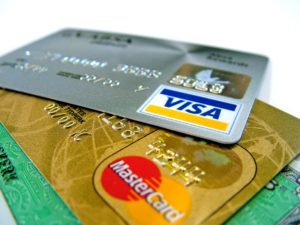

# tackling-debt-the-step-many-people-omit

Joe and Sally are a couple in their early thirties. They have university degrees and each have good, professional jobs. As a family, they have a strong, six-figure income and no dependants. Despite their income, they are awash in debt, much of it [corrosive: credit card and line of credit debt](https://yflmainprod.wpengine.com/2017/02/are-you-really-living-within-your-means/). When I first met them, they had low [credit scores](https://yflmainprod.wpengine.com/2017/03/ladies-whats-your-score/) and multiple payment delinquencies on their credit bureau reports. They were eager to turn their situation around, wipe out their debts, and buy their first house.

My business partner and I worked with them for three years to help them become mortgage-ready. Despite detailed spending and debt-repayment plans, they never managed to stay out of debt for very long. They would follow our plan and make great strides forward, then six months later, when we checked-in, they would be back in their same old patterns of debt. Thankfully, their credit improved and they saved enough money for a down payment through our forced savings plan, but when we last saw their financials, their debt levels were once again on the rise. Despite all their work, they were headed back to the same situation that made them reach out to us in the first place.

Does this sound familiar? Do you know someone who has done the same with dieting? Lose a bunch of weight, put a bunch more on, and then repeat in a maddening cycle?

During the ten years that I spent helping families recover from financial difficulties, I saw this pattern over and over again. We’d put a plan together and clients would set out determined to slay the Debt Dragon. They would succeed in doing so while we were guiding and encouraging them. The moment we turned away, though, the old patterns would creep back in. We’d talk about it, figure out where they got off track, and we’d get them going once again. Some would succeed in turning things around, but many would regress to their mean (i.e. their average behaviour) the moment they were back on their own.

Why?

## The soft but powerful side of money

The [science of influence](https://www.amazon.ca/Influence-Practice-Robert-B-Cialdini/dp/0205609996) and [behavioural change](http://charlesduhigg.com/books/the-power-of-habit/) tells us that in order for new behaviours to stick, we need to do a number of things: reward vital behaviours, make the wrong behaviour hard and the right behaviour easier, and change our environment to support our new goals, to name just a few. These are all important strategies, but even with these approaches, you may not succeed if you don’t tackle the reason you’re engaging in a behaviour in the first place. I call this the soft side of money as it relates to financial change. And boy is it ever powerful.

I frequently get requests to share my top strategies for getting rid of significant debt. Since I managed to repay $400,000 in two years, people want to know what strategies I used. Here’s what I’ve learned: The best strategies in the world won’t make a bit of difference in the end if you don’t figure out a) what your money patterns are and b) which emotion or belief is behind them.

Pretty much every time I share this with people who ask about strategies, there’s a look of dismay on their face. I get it. Strategies and tactics are tangible things. We can all understand reducing our largest expenditures, like cable for example, and funnelling the funds to our most expensive debt. Check. Got it. Did that. What’s next? We want action! But dealing with feelings, emotions, and financial patterns? Somehow that feels less legitimate, more touchy-feely, less effective, less like we’re doing something useful.

And nothing could be further from the truth.

## Isn’t that interesting?

If you have significant student debt, that’s probably not part of a pattern (unless you’re a perpetual student with no end-goal in sight). You borrowed money to get an education and now you need to pay it back. Simple: Apply strategies and tactics (I’ll tackle these in a future post). However, if you perpetually have credit card debt, or line of credit debt, or you’re constantly borrowing money from friends or family, there’s a pattern somewhere in there. It’s worth asking a few simple questions:

- Where does debt show up in my life? Do I keep spending on consumer stuff or essentials? Am I constantly buying clothes? Going out with friends?
- Does the issue revolve around insufficient income or overspending?
- When do I tend to spend money? Do I head out shopping when I’m sad? Do I use shopping to fill a void? Pass the time?
- Do I spend on myself to make myself feel good or better?
- Do I spend on others to make them like me? Appreciate me?

If you find yourself facing unproductive debt (i.e. debt that simply takes money out of your pocket versus debt for assets that grow your net worth), take some quiet time to ask yourself these questions. Persist until you uncover patterns that are not serving you well. Instead of beating yourself up, feeling shame, or experiencing guilt, take a non-judgmental approach by saying, “Isn’t that interesting? I wonder why I do that? I wonder what’s going on?”

## No judgment

This is so important that I’m going to repeat it: **Don’t judge yourself.** There is altogether too much shaming and blaming going on when it comes to money. Those negative emotions serve no one, least of all you. If you’ve got a bully nattering at you from your brain, kick it to the metaphorical curb and tell it to stay the hell out. The sooner you apply compassion to yourself, the sooner you can start to move forward. Leave the past exactly where it belongs – in the past.

Try approaching your challenges with genuine curiosity by saying something like, “Isn’t that interesting: I keep using my credit card for non-essential stuff even though I don’t like being in debt. I wonder what’s going on?” Perhaps, like one set of clients, you grew up in debt and that has become the norm for you and your family. Or perhaps, like others, you have no clue what to do with extra money, so you “keep” yourself in debt to avoid dealing with the next steps, which involve learning how to invest, something that may seem scary to you.

Regardless of the reason, identify your beliefs and then challenge or address them with compassion. If debt has been a part of your life forever, ask yourself, “Is this behaviour serving me well? If not, what would a new, healthier set of behaviours look like? Even though my family has always been in debt, does that have to be our reality from here forward? Has anyone else successfully gotten themselves out of debt and stayed in the black?” Find examples of people who have made positive changes and let them serve as proof that it’s doable. If you can’t come up with anyone who has overcome your difficulty, reach out to me. I will happily supply you with the examples you seek.

One last suggestion: **Give yourself time to figure this out.** The answers may take a while to come. That’s OK. Just keep at it without judgment and accept that the process may not be easy. Change happens when you accept where you’ve been while also being determined to move through a period of discomfort to create habits that serve you better.

## Cait’s example

Earlier this week, I saw a powerful example of this process in action. A friend invited me to hear Cait Flanders speak about her new book *[The Year of Less](https://caitflanders.com/the-year-of-less/).* Cait talked about how she paid off roughly $30,000 of debt in two years by imposing a shopping ban on herself. While it’s cool that she paid off her debt so quickly, the truly interesting part from my perspective is what apparently happened afterwards: She found herself slipping back into the old patterns that got her into debt in the first place. To her credit, she took the time to dig deep and figure out what was going on. From her telling, it was not an easy or comfortable process, but it was certainly worthwhile. She realized that she had turned to alcohol, shopping, and food to fill in some gaps in her life. By insisting on doing the uncomfortable internal work to get at the root cause, and by changing her habits, Cait has turned both her financial and personal life around. Her face was radiant as she talked about her new, uncluttered approach to life.

Don’t underestimate the power of money patterns and beliefs on your results. They’re not the action-packed visible part of tackling debt, but they are the key that underpins long-term success. Just picture the hidden portion of an iceberg and you’ll get the idea.

#### Share this post

## Your Foundation to Financial Freedom is coming soon.

Please complete the form to add your name to the wait list. We’ll let you know as soon as the course is released!

## No spam, ever. Unsubscribe any time.

## IMS ESSENTIAL

Please select a payment type: