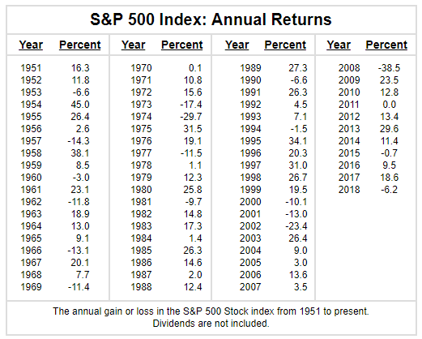

Welcome to my ongoing series on financial literacy. A short while ago, I published a [financial literacy quiz](https://yflmainprod.wpengine.com/2019/01/are-you-financially-literate/) in which I asked a series of questions. Today, we’re discussing the answers to questions 6 and 7 on the best usefor your money. Here are the questions:

**#6. You have just received a substantial refund from the Canada Revenue Agency.**

**Should you use the funds to pay down credit card debt, invest, or pay for your family vacation? Why?**

It seems fitting to tackle a question about tax refunds in tax season! For many of us, that means shelling out some cash to the government. But for those who, instead, end up getting some money back, what do you do with the money?

Tell me something: When you know you’re getting some cash back, do you spend a chunk of time plotting how you’re going to spend it? “Should I put it towards a family vacation this summer or buy myself the new cellphone I’ve been eyeing for a while? Or maybe I should use it to pay for the kids’ camps.”

Whatever it is, I suspect that spending the money is top of the list for a number of us. We’re human. Most of us look at cash coming in and think, “Bonus!! More money to spend!”; which is satisfying and, sadly, probably not in our best interests.

Let’s start by calling a spade a spade. A tax refund isn’t a bonus. It’s not new money, additional money or a raise. Nope, none of that. The government is giving you your money back due to an over-payment; hence the name.

**It’s a tax *refund*, not a tax *bonus*.**

As such, it behooves us to treat it as we would regular income. If you’ve paid off the essentials, what’s the next best thing to do with your dollars? Let’s consider a simple strategy to get the biggest bang out of your bucks.

## Step 1: Start with corrosive debt

If you have consumer debt, particularly **[corrosive credit card debt](https://yflmainprod.wpengine.com/2017/02/are-you-really-living-within-your-means/)** – and if it’s debt on a credit card, it is *always* corrosive to your wealth – that gets first dibs. Why? Because corrosive debt will suck the life out of your wealth. Think boa constrictor here. You can fight all you like, but it’s going to win the battle unless you slay the thing.

The idea is to pay off high interest debt first and get rid of it as quickly as is humanly possible.

Dumping tax return money onto your debt is like tossing water onto a fire you don’t want. It’s good, right? Yes, but here’s the thing: **It’s only good if you keep the debt off your books!** Another part of being human is to say, “Oh hey look, I have all this room on my credit card right now. I can totally afford to buy myself an (insert desired object here)!”

Alas, X = something you likely don’t need and definitely shouldn’t finance with debt.

Bottom line: The best return for your money is to use it to eliminate high interest debt. You will automatically save 19% to 28% in interest charges. It’s hard to beat those returns (legally, anyway)!

Start with credit cards, then tackle lines of credit and other loans.

No consumer debt? Yay you! It’s time to move on to the next step.

## Step 2: Build an emergency fund

Once you’ve slayed the debt monster, it’s time to put the extra cash toward an emergency fund. What is an **[emergency fund](https://yflmainprod.wpengine.com/2018/07/rethinking-emergency-funds/),** you ask? It’s a savings account, tucked away beyond easy grasp, where you accumulate cash to tide you over in case life happens – you lose your job and need time to find another one; someone in your family becomes ill and you need to take time off to help them; you become ill and you need to walk away from work for a bit. The money in your emergency fund will help to keep the roof over your head, food on the table, and the lights on while you regroup and recover.

There’s a strong argument to be made for contributing to your emergency fund every month with a view to building a reserve of three to six months’ worth of cash, even if you have debt. But we’re talking about a once-a-year influx of cash here. If you don’t have an emergency fund or the balance is a bit thinner than you’d like, pop your tax refund into it.

For bonus points, if you have unused contribution room in your Tax Free Savings Account, consider keeping your **[emergency fund](https://yflmainprod.wpengine.com/2018/07/rethinking-emergency-funds/)** in a High Interest Savings Savings Account inside a TFSA. The interest you make will thus be sheltered from tax. Once you gather up enough funds to hold higher yielding investments in your TFSA, you can transition the emergency funds to a high interest savings account outside the TFSA.

So now, you have no corrosive debt and you’ve stocked up your emergency fund. What now?

## Step 3: Invest or pay off your mortgage

Here’s where we get into a consideration of your values. **What’s more important to you: Feeling a sense of security as your nest egg grows or obtaining peace of mind by paying off [your mortgage](https://yflmainprod.wpengine.com/2015/02/why-you-should-stay-away-from-collateral-mortgages/)?**

If this were solely about arithmetic, then the decision would be easier: the investments have it, assuming that your expected rate of return after taxes beats your mortgage rate. (If you invest inside a TFSA, then taxes aren’t an issue as no further taxes will be paid on the funds.) Here’s what I mean by that:

- If your investments consist of **[GICs and similar fixed income products](https://yflmainprod.wpengine.com/2015/06/women-gics-are-they-a-good-fit-2/)** that currently yield somewhere around 2%-3%, and you’re paying 3.5% on your mortgage, you’re probably better off putting the money from the tax return towards your mortgage because of the higher cost, especially since monthly mortgage payments are made with after-tax dollars (at least in Canada; not so for our American neighbours).
- If, however, you have a portfolio of stocks and bonds which yields an average annual return somewhere north of 6%, then using the tax refund dollars to grow your investments would be the better bet from a mathematical perspective, especially if those investments are inside tax-sheltered structures like an RRSP, a TFSA or an RESP.

As much as we all love math (or, more accurately in this case, arithmetic), we are psychological beings, not computers.

We worry about our future.

Money stresses us out on occasion.

We’re affected by uncertainties in our lives.

The decision, therefore, boils down to what will make you the happiest.

**Money needs to serve you. Money is simply a tool to help you achieve your goals. If paying off the mortgage would make you sleep better at night for whatever reason, then that’s the right move for you.**

## Isn’t that interest-ing: line of credit vs investments

**#7. You have been working hard at work and your boss has finally recognized your efforts by giving you a bonus.**

**Should you pay down your line of credit, on which you pay 7% interest, or invest in an asset that has averaged an annual return of 7% over the past fifteen years? Why?**

I bet you know that there’s a trick in here. There is. This is where 7% ≠ 7%.

When you pay down a line of credit, you immediately save the interest costs on the repaid portion. You are therefore guaranteed to save whatever percentage of interest you’re paying.

Let’s assume you owe $10,000 on a line of credit with a 7% interest rate, and you pay monthly interest-only payments. Here’s what that would look like:

$10,000 x 7% interest = $700 in interest paid per year.

$700 (amount owed for the year) ÷ 12 (months) = $58.33 in interest charges per month.

When you use your tax refund to pay down the LOC, the outstanding balance drops down to $8,500 ($10,000 – $1,500). Your monthly payments would drop to $49.58, for an annual savings of $105, guaranteed.

If, however you buy an investment that has an average annual return of 7% over the past fifteen years, you know nothing for certain about what that will yield for you in the future. Maybe it will continue to perform well; maybe it won’t. The thing about investments – other than **[GICs](https://yflmainprod.wpengine.com/2015/06/women-gics-are-they-a-good-fit-2/)** – is that they do not come with guarantees.

Here’s a good example of that:

Over the last sixty-eight years, the S&P500 has averaged 8.6% according to the [chart above](https://www.forecast-chart.com/historical-sp-500.html). Sounds amazing, right? Maybe not so much if you entered the market in 1999 and then faced three back-to-back years of significant losses. By 2002, you might be forgiven for thinking that the market would never recover and that you’re better off socking your money under your mattress. (Except you know that ups and downs come with investing in the stock market. You know it’s a long(er)-term gig.)

That’s the issue with investments that have stronger expected returns: they come with greater risk. If you stick with low-cost investments, particularly diversified index funds that track indices like the S&P500, you’ll likely do well with them over the long run; but there’s no guarantee.

**In the scenario described in question #7, where you have a line of credit with a 7% interest rate, the math suggests that you’re better off tackling that debt before you invest. A bird in the hand, as they say, particularly a bird that costs 7% per year!**

One last comment about lines of credit where you have interest-only payments: They are a boon for lenders because your debt never goes down. **With interest-only payments, you have “forever debt”.** Every payment you make knocks off the interest, but doesn’t touch the principal balance. I’m pretty sure “forever debt” doesn’t show up on your list of values. Knock this debt to the curb by rounding up the payments as much as you can. If, as in the example above, you owe $58.33 every month, consider making $75 or $100 payments. Can you afford $150? So much the better. The more you pay off each month, the faster you win.

**Bottom line: Serve the “forever debt” in your life an eviction notice.**

How are you doing so far with **[the finlit quiz](https://yflmainprod.wpengine.com/2019/01/are-you-financially-literate/)**? Share your thoughts below and stay tuned for answers to the rest of the questions.

## Want to learn more? Join our online Women’s Money Group!

Earlier this year, we launched an online version of our popular in-person **[Women’s Money Group](https://yflmainprod.wpengine.com/womens-money-group/)**. If you’re looking for a community of support, a safe place to ask all your money questions, and research-based information to help you rock your finances, then join us. You can check out the first meeting for free! We meet via Zoom the first Wednesday of every month, from 7 pm to 9 pm EST. Check out **[our schedule here](https://yflmainprod.wpengine.com/womens-money-group/)**.

**Good News: Since we meet online, your location doesn’t matter**. If you have a computer with a working camera and microphone, as well as an internet connection, you’re good to go. Be the first person to join the group from your province and I’ll mail you a copy of my book for being #1!

By the way, if there’s a topic you want me to tackle, shoot me an email. Let’s chat.

#### Share this post

## Your Foundation to Financial Freedom is coming soon.

Please complete the form to add your name to the wait list. We’ll let you know as soon as the course is released!

## No spam, ever. Unsubscribe any time.

## IMS ESSENTIAL

Please select a payment type: