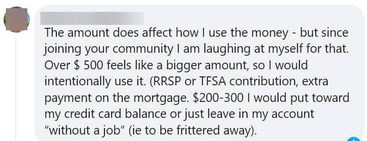

# the-best-use-for-your-tax-refund-dollars

If a **$22,000 tax refund landed in your bank account,** what would you do with it?

That opens up some seriously fun possibilities, right?

So how would you go about deciding how to use that money?

In a second, I’ll tell you what I’m actually doing with it (true $$ figure).

But first, don’t you just love tax season?

Probably about as much as a visit to the dentist. ⛏️

*Nobody* looks forward to either of these because they’re usually painful and *expensive.*

But occasionally, you get a pleasant surprise and discover that the government will send some of your dollars back in the form of a tax refund.

(There’s no such thing as a happy moment in a dental office. Sorry Dr. Courchesnes.)

Refunds typically trigger a happy dance and dreams of all the ways you could spend that money. 🛫🏖️👢

**Let me ask you this:**

**How do** ***you*** **normally decide what to do with your refund money?**

**Does the amount you get back make a difference in how you use it?**

Does the dollar amount change your thought process?

I asked that question – about the amount – in one of my online forums and here’s what one woman responded:

I get it. A bigger amount somehow feels more “real”. (Hello behavioral bias.)

Today, I want to talk about **the best use for your tax refund dollars** and whether or not the amount you get back should make a difference to your strategy.

And we’ll talk about that $22,000 refund. I’ll spill the beans on what my husband I are actually doing with that money – and why.

**If you take this approach, your finances will be in much better shape.** 💪

## The most common approach

For most people, refund money is spent before it even hits their bank account. 💸

The minute they find out how much they’re getting back, the race is on to decide where they’re flying or what they’re buying.

Sometimes the amount they get back doesn’t cover the full amount of the new purchase, so more of their existing dollars get used.

That might even trigger **more debt**.

And ironically, even with the extra $$$ coming in, they end up in worse shape.

The process of spending that money is fun and exciting because it feels like found money, and found money doesn’t count.

You can do whatever you want with it, right?

Well you *can* do whatever you want with it. You’re the boss of your money.

**But that kind of approach – treating it like an extra that doesn’t really count – is a huge mistake for your finances!**

Getting to financial freedom won’t happen if you spend automatically when unexpected money lands in your life.

Having a strong financial foundation requires that you make conscious spending choices BEFORE you touch the money.

Here’s how that works.

## Money Rules

One of the best ways to ensure your money serves your highest, best interests is to create money rules *ahead of time.*

No spur-of-the-moment impulses.

No stressing and second-guessing about what you should do.

In fact, you won’t spend much time thinking about the process at all when you get a refund – or an inheritance, bonus, or raise – because **you’ll already know where those dollars are headed**. ✨

You’ll have Money Rules in place that are tied to your values.

There’s no resentment either – unlike when your parents instituted rules during your teenage years (how is it we all had unreasonable parents??).

You get to make the rules. Don’t like them? Change them.

Here’s the step-by-step process:

1. Write out your values-based goals.
2. Determine which area is your highest priority. How much of the new money coming in gets dedicated to this priority? Use a % here.
3. Are there other priorities? What are they?
4. Decide how much to allocate to each of the other priorities, as a percentage.
5. Do whatever you want with the rest.

**Case Study**

One of my *Your Foundation to Financial Freedom* course students recently learned that she’s getting more than $2,000 back this year.

In the past, she’d just spend refund money on whatever she’d been depriving herself of throughout the year – weekends away, a funky jacket, AirPods.

She said that spending the money felt like a reward for working so hard.

But then in the course, she was hit with this **truth bomb:**

**All money is equal, whether it comes in the form of a salary, a refund, or a find on the street.**

There is no amount that’s more “real” than any other.

Every dollar can be used for any purpose.

And every choice comes with an opportunity cost: When you choose one path for the dollars, you’re giving up another path.

What else could you have done with that money? Would you have benefitted more from a different choice?

That’s where my **Conscious Spending Plan** comes in.

Instead of blindly making and spending money, you take a moment to choose the outcome you want, which informs your spending, saving, and investing choices.

You use your core values + your goals to create Money Rules that guide your behavior.

Back to my client: Having learned my Conscious Spending Plan approach to her money, she created a rule for “found money”:

- 80% goes to debt
- 10% goes to investing
- 10% is for fun

When the refund lands in her account, her credit card debt will get the lion’s share, her stock market portfolio will get 10% of the dollars, and she’ll do whatever she wants with the remaining 10%.

Now the only decision she has to make is how to spend her fun money.

The elegance of this approach is that the percentages for each priority are all mapped out. It doesn’t matter if her refund is $200 or $2,000; the distribution of dollars is the same. Paying off her debt gets 80% of the dollars in, and so on.

When her debt is paid off, she’ll create another rule for money coming in.

## Does the amount coming in matter?

Should the amount change your plans for the dollars?

No. The amount doesn’t matter.

It’s a fallacy to think that some dollars don’t count or that you \*should\* make different choices with larger amounts.

**All dollars are equal.**

Before you hop in with the obvious question – “Hey Doris, I just found 20 bucks on the street. Are you saying I need to put $16 to debt, $2 to investments and $2 for spending if I’m using your client’s breakdown?”

You can. Or you can choose to put the entire amount to your highest priority item, which in my client’s case is her debt.

Just don’t spend the money blindly or dump it into the black hole that is a checking account.

Use a rules-based approach.

Not because $20 is going to create a seismic shift in your world, but because you’re reinforcing a powerful habit.

## Now about that $22,000

Okay, let’s say that my $22K refund landed in your account. How would you use it?

I put that question to my community and here’s one of the responses I received:

> “I would break it down into the following:
> 
> 1\. Invest $11k to grow my money to beat inflation and build wealth
> 
> 2\. Emergency fund $5,500 to get it growing and be a great buffer for life’s what-ifs so that I can ride out storms and navigate them beautifully and thrive!
> 
> 3\. Maintenance fund $1,500 for replacing broken stuff.
> 
> 4\. Travel fund $2k for my values
> 
> 5\. Memberships $1,900 for financial education/values
> 
> 6\. Donations $100 because I would like to make small donations at certain times of the year (i.e., Canadian Armed Forces for Remembrance Day, etc.)
> 
> Thank you for the post to prompt discussion on this!!

These are great! The only suggestion I’d make is to convert the dollar amounts into a percentage, so that she doesn’t have to do any calculations in the future.

Here are **my Money Rules** **for unexpected $$ in**:

- 50% to building wealth (assets first)
- 50% to trips and items that will enhance the quality of our lives, with trips being the higher priority

In this case, I’ll make an $11,000 contribution to our tax-advantaged accounts to grow our stock market portfolio. 📈

I’ll then set aside $8,000 for an anniversary trip.🧳

The remaining $3,000 will be used to purchase an infrared sauna to help with recovery after workouts and Pickleball trainings. 🧖🏻‍♀️

When we learned of the refund, it took my husband and me a total of 20 minutes to discuss where we want to go for our trip (Croatia) and what we want to buy with the rest of the dollars.

Both the trip to Croatia and the sauna were on our “things we value and want” list, which meant that our discussion wasn’t about figuring out the distribution from scratch; it was more about selecting the two items to focus on.

With this breakdown, we’re honoring our core values of being financially free, maintaining vibrant health, and exploring the world.

Now, instead of spending valuable time trying to sort out what to do with the money, we’re digging into the research instead – when to go to Croatia, what to do when there, and which infrared sauna is the best for us.

It’s a much better use of our most valuable resource – our time.

## Over to you

I challenge you to **come up with a set of Money Rules** if you don’t already have them in place.

When money comes into your life outside of your regular income, how will you divvy up those dollars?

Figure it out, then hit the reply button and let me know. I want to hear from you!

Remember to keep your big-picture goals in mind. 🎯

Those dollars, even the 20 bucks you found on the street? They’ll help you get there faster.

Just be sure to give them the right job to do for you.

Much love,

Doris ❤️

PS Share this message with someone you love, then have her hop into my community so that she doesn’t miss a thing. She can join our growing, international group of women taking charge of their $$$ [**here**](https://pages.yourfinanciallaunchpad.com/moneytips).

PSS Did you know that I host a free Facebook group called the [Women’s Financial Freedom Club](https://www.facebook.com/groups/womensfinancialfreedomclub)? Come join in the conversation. The more we make talking about money normal and safe, the better off we’ll all be. Let’s get talking!

#### Share this post

## Your Foundation to Financial Freedom is coming soon.

Please complete the form to add your name to the wait list. We’ll let you know as soon as the course is released!

## No spam, ever. Unsubscribe any time.

## IMS ESSENTIAL

Please select a payment type: