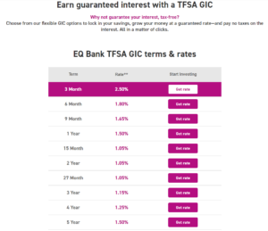

The options for your **[Emergency Fund](https://yourfinanciallaunchpad.com/rethinking-emergency-funds/)** just got a whole lot better.\*

Before I tell you why, let’s cast our mind back a bit.

Did you have the same reaction I did when **[EQ Bank](https://www.eqbank.ca/personal-banking/tfsas)** lowered the interest rate on their High Interest Savings Account (HISA) this past spring? It didn’t take long once the pandemic hit for the economy to take a pounding and interest rates to tumble. The “We’re lowering our rates” announcements started to drop into our inboxes one after the other.

For years, we’ve counted on EQ Bank to deliver 2.3% in its HISA. When **[Oaken](https://oaken.com/)** and others were lowering their rates, EQ Bank held firm.

Until it didn’t.

Even they couldn’t escape the impact of Covid-19.

## What to do with your savings?

Before 2020, EQ Bank’s HISA was a great place to park your savings dollars, whether they were part of your **[Emergency Fund](https://yourfinanciallaunchpad.com/rethinking-emergency-funds/)**, your Planned Spending fund, or your general savings.

Once the rate decreased from 2.3% to 1.5% (the current rate at the time of writing), this option became less attractive.

Some of my **[Women’s Money Group](https://yourfinanciallaunchpad.com/womens-money-group/)** members started to ask me what they should do with their Emergency Fund dollars? What better options were there?

My suggestion at the time was to hold steady in the HISA until something better comes along.

Canadians now have a much better option.

(By the way, if you’re not sure what an Emergency Fund is, I’ve written a blog post with all the details **[here](https://yourfinanciallaunchpad.com/rethinking-emergency-funds/)**. There’s even a decision tree.)

## EQ Bank’s TFSA

There it was, at last: an email from EQ Bank announcing their latest product – **a TFSA savings account with an interest rate of 2.3%!**

You might think that I’m pleased about the interest rate. That’s better, for sure.

**But what I’m more excited about is the fact that this product – a savings account with a 2.3% interest rate – is now available inside a Tax Free Savings Account (TFSA).**

## Why does that matter?

Inside a TFSA, your investments – in this case your savings dollars – grow tax-free. In turn, that means that more of your money is available for compounding.

Now, granted, at 2.3% you’re hardly going to make a fortune. That represents $23 for every $1,000 over the course of a year.

Still, if you can make 2.3% instead of 1.5%, that’s a win. ✔️

If you can make 2.3% tax-free, that’s a bigger win. ✅

Another bonus of using a TFSA Savings Account for your Emergency Fund dollars is that it provides accessibility. You can withdraw your funds at any time without being penalized.

The TFSA also gives you the option of topping up the amount you’ve withdrawn, but you have to be careful to do it in the next calendar year or later; you can’t re-deposit the amount withdrawn in the same calendar year as the withdrawal or it will count toward your contribution for that calendar year. If you’ve already maxed out your contribution room for that calendar year, it will put you over the top and attract CRA’s ire.

## When does it not make sense to do this?

Parking your savings dollars in a TFSA savings account makes sense only if you have contribution room that you would not otherwise use. In other words, if you’re not making good use of your TFSA for your investment portfolio, then use it as a strong savings account option.

If, on the other hand, you do have the dollars to max out your Tax-Free Savings Account contribution room, then you may not want to use it just for the savings account. Since all investments inside a TFSA grow tax-free, you might want to use this powerful structure for products that yield higher rates of interest or dividend income.

Food for thought. I’ll dive more deeply into this when I write a post on TFSA’s.

## Is it worth going to a GIC?

EQ Bank also announced that they’re offering GICs inside the TFSA. Here’s what they provided as a list of rates (effective in December 2020):

I honestly don’t get why anyone would be interested in a GIC inside the TFSA given the rates posted above. Here’s the scoop:

- The savings account will get you 2.3% in interest
- The best GIC offering will get you 2.5% – a mere 20 basis points above the savings account
- In order to get those 20 basis points, which will add up to peanuts even with a hefty deposit, you have to take the time to set up the GIC for a 3-month term. Then you have to do it again, assuming the rate hasn’t changed in the meantime.
- All of the rates beyond 3 months offer a lower interest rate than the plain Jane savings account option. Why would you take them?

For my books, the GIC is a hassle for no real payback. Plus, your funds are locked up during that time. If you’re using the savings account as an Emergency Fund, then you want the dollars to be accessible when you need them, not when the investment matures.

**The GIC option gets a solid PASS in my book.**

**The TFSA savings account though? That’s a WIN.**

## An important clarification

When I talk about using the TFSA “only” as a savings account in my investing course, I usually get questions along the lines of, “It’s called a Tax-Free SAVINGS account. Isn’t it by definition a savings account?”

And this is where I want to sleuth out the person who named the account and ask them, “What the hell were you thinking?”

**The TFSA is called a Savings Account, but really, it’s an Investment Account.**

Very simply, it’s a tax-sheltered structure that “protects” all investments on the inside from being taxed. Think of it as a big umbrella over your investments, protecting them from rain (aka tax).

**You can have a whole host of investments inside your TFSA including, but not limited to, GICs, index funds, bonds, and exchange-traded funds.**

Think of it as an account that can hold many things.

Unfortunately, many people assume that when they make a deposit into a TFSA, their money is invested. Not really, unless you think of bare-bones savings accounts with very low interest rates as investments. (Ah – no.)

Once the money is in your account, you need to decide how to invest it. In EQ Bank’s case, as soon as the money is invested in their TFSA Savings Account, it starts to earn 2.3%.

If you want to buy investments beyond GICs and their savings account, you’ll need to shop elsewhere. (I personally use Questrade.)

And there you have it – another good option for your Emergency Fund.

Any questions? Reach out.

If there’s a question you want me to tackle, shoot me an email and I’ll address it in an upcoming post.

\*In case you’re wondering, I did not receive any kind of payment from EQ Bank for this post. While I’m often approached to publish sponsored content, I refuse to do so. My opinions are my own.

## Want to receive my weekly money tips and strategies?

Don’t miss a thing! No spam, ever.

#### Share this post

## Your Foundation to Financial Freedom is coming soon.

Please complete the form to add your name to the wait list. We’ll let you know as soon as the course is released!

## No spam, ever. Unsubscribe any time.

## IMS ESSENTIAL

Please select a payment type: