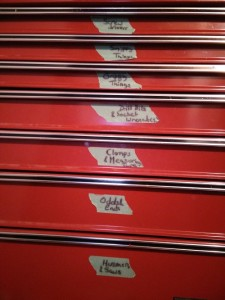

# the-genius-of-financial-simplicity

When Mark and I moved in together after buying our first house, it became apparent that we would need to purge. Do we keep his sofa or mine? (Both at first, but then I sold his to a neighbour during a garage sale. He discovered this when he was asked to help move it to her house, but that’s another story.)

There were many duplicate items except in two key areas: wine and tools.

Mark had a full size wine fridge that was packed with bottles whereas I’m pretty sure that I had nothing to contribute. I do love good wine but I had never been able to justify spending the money to acquire a collection. Mark had no such problem. The only purging that took place with respect to Mark’s wine fridge was the steady attack on its contents after we had moved in together.

The other key area where there was little overlap was tools. My [late husband Malcolm](https://yflmainprod.wpengine.com/2012/05/my-story-part-i/) was a gifted tool user, and buyer. There was nothing that he couldn’t create nor a sale that he could resist. As a result I had, and had learned to use, a vast collection of tools, powered and otherwise. Several years before, when Malcolm was too ill to work, his father Ron handed me a drill, showed me how to use it and put me to work installing floors and drywall. After several years of hanging out with Ron I could build or repair pretty much anything thanks to his tutelage.

Mark on the other hand is someone for whom the concept of manual labour involves a cork screw and a wine glass. We joke that his idea of household repairs often involves a phone call and a credit card. He certainly has repaired stuff around our house but he prefers not to, arguing that his time is better spent elsewhere. He’s more of an IT guy who prefers to play with electronic tools; technology is definitely his forte. (Ironic story: Mark had me howling with laughter when he started his first blog and called it “Notes from a tool user.” “You, a tool user?!” was my reply, which triggered even more laughter until Mark explained, slowly and patiently, that he meant electronic tools. Oh, well, yes OK then.)

When the movers unloaded his things, I discovered a small, unpainted, wooden box. I asked what it was. He replied, “It’s my tool box.” “That’s not a tool box, that’s a jewellery box!” Seriously, it contained a couple of screw drivers, a hammer and a few bits and pieces. After giving him a hard time about it, and introducing him to Messieurs Robertson and Phillips, to which he gave me his signature shrug, he set off to organize our tool room. The idea was that he would consolidate and organize everything into my large tool chest.

When I went downstairs to see how he was doing, I found green labels on the drawers. He had categorized them as follows:

- Screw drivers
- Snippy things
- Grippy things
- Drill bits & Socket wrenches
- Clamps & Measuring tapes
- Odds & ends
- Hammers & saws

Utterly brilliant. And hilarious.

Mark had taken a child-like approach to classifying a wide array of tools in a way that made perfect sense and could easily be understood by anyone. To this day I have fun asking myself, do I need a snippy thing for this job or a grippy thing? Even my daughters can figure out that pliers go in the grippy thing drawer whereas the wire cutters go with the snippy things.

I am reminded of the genius of Mark’s approach to tools every time I sit down with a couple who are in financial difficulty, trying to get a grip on too many expenses and too little income. Do they need a grippy tool or a snippy tool?

When trying to reorganize your financial life, you can make things terribly complex and thereby pretty much ensure that you will fail. Complicated spreadsheets? Some people like them (right Katie?) but most don’t. If your system makes your head hurt just thinking about it you won’t do it. You’ll track stuff for the first week, maybe, and then you’ll come up with reasons why you can’t/didn’t/won’t. And those reasons will make a lot of sense to you but the bottom line is that you’ll stay stuck in the same financial position.

For a couple of years now I have been teaching people how to master what I call the [four keys areas of money: Know, Make, Manage, Grow](https://yflmainprod.wpengine.com/2015/01/rebuilding-your-finances/). If we took the green tape label approach to each category, what would that look like? Maybe it would look something like this:

- What do you want and what have you accomplished? (Wants and Done)
- What do you earn? (Dollars in)
- What do you spend? (Oozing things)
- What do you invest? (Growing things)

There is a heap of tools to help you with each key area – books, blogs, free spreadsheets, expense trackers, calculators – so failure to progress cannot be blamed on a lack of resources. They’re out there. The trick is to find a simple system that you will stick to and keep implementing without making excuses.

If cash flow is your issue, track every dime spent for two months, then break the expenditures down into categories. Write them down on a piece of paper, use a spreadsheet or download an app, it  
really doesn’t matter as long as you do it in order to get a grip on where your money is going. Once you’ve broken down your expenditures, make (or download) a very simple budgeting tool and allocate essential costs first (i.e. rent/mortgage, food you make at home (NOT meals out), utilities, medical costs); then corrosive debt (e.g. credit card balances); then savings/investments; and finally discretionary spending. See if you can cut back on spending by trimming back big items – look for the big wins, not the nickel-and-dime stuff.

If investing is the problem – as in you’re intimidated by it and just don’t know where to start so you haven’t started at all – then read Tony Robbins’ book *Money, Master The Game* and start with simple, low-fee index funds. You can branch out as you learn more and become more comfortable.

If spending is at the root of your challenges, then you need to take some time to figure out what’s behind that. I recently had a client tell me that she doesn’t have money for a therapist to figure out why she spends compulsively, to which I responded that she doesn’t need a therapist, she needs a note book ($1), a pen and some quiet time. Make time to think, uninterrupted, and start asking yourself some basic questions: How long have I been like this? When do I spend? How am I feeling when I turn to spending? Are there any patterns? Did someone in my family do this too? Record everything in your note book and keep at it. Patterns will start to reveal themselves, particularly emotional patterns. Set your life goals, write them down and make different behavioral choices that support your goals. Attention and intention are powerful tools.

Wherever you can, automate the process. Automatically send incoming funds to bill-paying accounts and savings accounts. Automate the payments and then automate your investments. Bypass willpower and memory issues by having a machine take care of it automatically for you.

Whatever you do, remember the KISS principle: Keep It Super Simple. It works for tools, it works for finances and it also works for life.

Until next time, Survive, Thrive and Grow.

#### Share this post

## Your Foundation to Financial Freedom is coming soon.

Please complete the form to add your name to the wait list. We’ll let you know as soon as the course is released!

## No spam, ever. Unsubscribe any time.

## IMS ESSENTIAL

Please select a payment type: