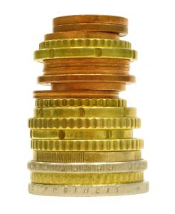

Just imagine how nice it would be if someone sent you a gift of $20,000. Wouldn’t that be great? Even better, what if they magically increased your salary by $10,000 every year for the rest of your life. Wouldn’t that make a huge difference?

Maybe. **It all depends on the money habits you had before the infusion of cash.**

## Six Years of Lessons

I don’t think anyone believes that money can solve all problems, but I bet most of us would assume that money problems can be solved by having more money. I used to think that, however six years in my business has taught me otherwise. It’s just not that simple.

Here’s a smattering of what I’ve seen:

- A couple racks up significant debt through “dumb credit card use” (their description) and overspending. They receive a 5-figure cash bonus from work and immediately use the bulk of that to pay off their debt. They feel that the bonus was just what was needed to get out of the hole and now they’re in a good place. One year later they have incurred even more debt than they originally had.
- A family goes through many challenging years dealing with their child’s illness including having to move to a new city and having one parent leave work to care for the convalescing child. They incur significant debt in the process. Happily, the child recovers, the second parent goes back to work and now their family income is very healthy. There’s just one problem: Their debt load is increasing despite having an income that has more than doubled.
- A man goes through a consumer proposal to deal with debt amassed by over-spending and a deteriorating marriage. Despite his six-figure income, he is not able to save any money. (His wife, soon to be ‘ex’, also earns a six-figure salary.) He is counting on the sale of his house to wipe out his debts so that he can begin saving again. The challenge: In more than a decade of earning a six-figure salary, he has no savings set aside.
- A couple goes through a series of job promotions and find themselves earning well into six-figures annually. In addition, one of them receives a large amount of cash from a settlement. Five years after the settlement and the promotions that more than doubled their family income, one of them has to declare bankruptcy and the other is scrambling to pay the bills, with many bills going unpaid for months.

(All of the examples above are composites of cases I’ve seen. The details have been changed to preserve anonymity.)

While the hundreds of cases that I’ve seen may not be representative of the population, they do nonetheless point to an interesting fact: *More money does not mean problem solved*. In fact, **what I’ve seen is that more money often leads to more spending**. It rarely leads to more saving and investing.

### Experience has taught me that there are two key factors that often make the difference between financial success and financial failure:

1. Accountability
2. Cash management with the ability to save

## Accountability

This one’s pretty straightforward. When you consider a particular result and you ask yourself who’s responsible for that result, the answer is telling. Is the problem “out there” (i.e. my ex, my family, the economy, my customers, the cable company, etc) or did you play a role in the situation that you’re in?

#### If you don’t hold yourself accountable for the results you’re not likely to make the changes necessary to get out of, and stay out of, financial trouble.

I’m not talking about beating yourself up and calling yourself a litany of bad names – not at all. But I am suggesting that if spending is an issue you may have a role to play.

Here’s the thing: If you have a habit of over-spending, the minute you get your hands on more cash you’re going to go right on spending your way into an even bigger hole. I’ve seen it time and time again. In fact, what I’ve seen is that the people who have the hardest time managing cash properly are the families with the strongest incomes. That’s not to say that lower income people don’t have cash management issues, but rather that I have definitely seen a pattern of cash flow problems with increasing incomes.

#### The more money there is to play with, the more we’re tempted to find ways to spend it unless we’ve developed good money management practices and a good savings muscle.

## Your Savings Muscle

This is probably the biggest indicator to me of whether someone is going to succeed financially or not: Are they able to save money? I’ve had people come to me for help buying a house and, like the many cases I’ve outlined above, they have good incomes and credit problems that could be solved within a couple of years. If they can show me that they were able to save money before the major event that affected their credit, then I know they will likely succeed.

If however they have never demonstrated that they know how to save money, then I know that they have no Savings Muscle which in turn means that they are spending beyond their capacity. Yes, they may be staying within their credit limits but without savings they will be derailed in a hurry when life happens and the car breaks down, the furnace gives out or they incur a medical expense they weren’t expecting.

**We need to figure this out if we’re going to thrive financially. Saving is not optional!**

How much should you save every month? That’s entirely up to you. I suggest that you start by [determining your goals](https://yflmainprod.wpengine.com/2014/07/step-1-for-your-money-plan-start-with-the-goal/), [creating a plan](https://yflmainprod.wpengine.com/2014/06/forget-about-budgeting-and-do-this-instead/) to get there and then start one step at a time. Save as much as you can to create a 6-month buffer for the “what if” situations and then move onto investing to make your money work for you.

It’s great if one of your goals is to make more money. Full speed ahead. Just don’t fall for the myth that having more money will mean you’re in a better place financially. You need a strong Savings Muscle for that.

Next week I’ll share some ways that we can by-pass our tendency to put off saving because it’s a) no fun and/or b) challenging. In the meantime, if you have a great way of saving money or a tip for people, please share.

Until next time, Survive, Thrive and Grow!

#### Share this post

## Your Foundation to Financial Freedom is coming soon.

Please complete the form to add your name to the wait list. We’ll let you know as soon as the course is released!

## No spam, ever. Unsubscribe any time.

## IMS ESSENTIAL

Please select a payment type: