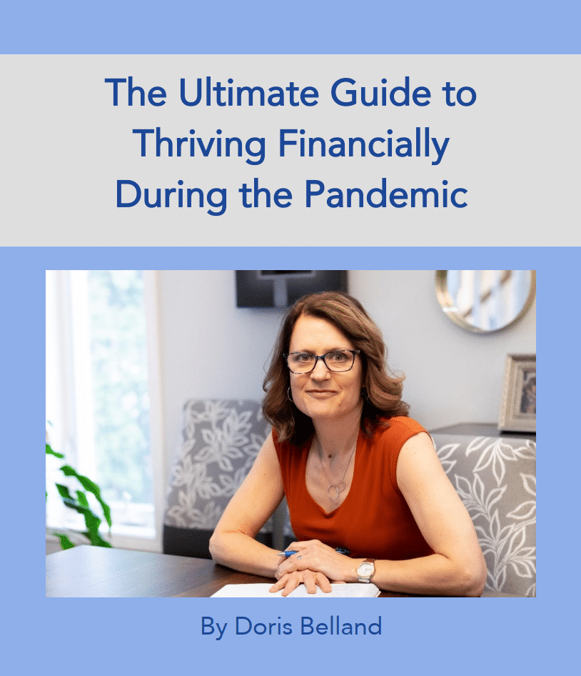

When the pandemic is over, people will fall into one of two camps: Those who took the time to pandemic-proof their finances and those who did not. 

The latter will face a difficult future.

Which camp will you be in?

## Three financial indicators

Here’s a question that will help to determine where you’ll land when the worldwide crisis is over and life has regained some of the normalcy we took for granted:

How much time have you taken to think critically and strategically about your finances?

What do I mean by that? I’m talking about asking hard questions with respect to three key financial categories:

- Your income
- Your Emergency Fund
- Your debt

Take a moment to jot down an answer to that question. Have you set aside “personal finances” time to consider the pandemic’s impact on your life and how you can mitigate it next time?

Have you done a review to assess your source(s) of income and come up with a plan to minimize your vulnerabilities?

Have you evaluated your Emergency Fund and considered whether it’s sufficient?

What about your debts? Did the pandemic cause a moment of sober second thought about, and an analysis of, your spending patterns?

#### If your answer is that you’re focused on getting through the pandemic, you will be every bit as vulnerable the next time something like this happens.

Or, if you haven’t addressed these areas because you’re fine as an essential service provider and your income is perfectly stable, you, too, may be vulnerable.

## Hoping isn’t a plan

Here are two contrasting responses to the pandemic. One of these women will thrive and the other will not.

##### Brenda\*

Brenda is a professional in the medical industry. When all businesses were shut down, she went from having a strong income to zero dollars coming in. Her expenses didn’t stop, though. She has rent and other overhead costs to pay despite the shutdown.

After feeling a sense of panic, her response was to immediately develop sources of income that do not depend on face-to-face contact.

She created online offerings despite knowing nothing about the technology involved. When I last spoke to her, she had managed to cover all of her expenses and show a small profit. She’s amazed by the response from her existing customers and she’s attracting new clients in the process.

What’s more, she did this in the space of three weeks while caring for her three young children who are now at home with her and her husband.

She is on track to do the same this month. Once the restrictions on businesses are lifted, she plans to continue to develop her online offerings as an additional source of income, which will serve the dual purpose of growing her bottom line immediately and providing an all-important Plan B if this happens again.

##### Amanda\*

Amanda has taken a different approach. She, too, is a professional, though in a different industry. She is an employee who currently has no income beyond the money coming in from government subsidies. She is taking this time to bake, clean her house, catch up with friends, and worry about the fact that she is taking on more debt to cover living costs.

When I asked Amanda what her plan was to bring in more money and stop the accumulation of debt, she said, “What can I do? I just have to wait it out. Hopefully this won’t last long. Once I get back to work, I’ll be OK.”

No, she won’t. It’s not the fact that she is taking on more debt that is at the root of the problem; it’s her acceptance of the situation as a passive by-stander while hoping a) that life gets back to normal soon; and b) that this won’t happen again.

Amanda’s reaction is a choice. We *all* have the power to choose our reaction to this crisis.

## History’s lessons

Remember 911?

Prior to September 11, 2001, taking a flight was a breeze. After four planes were hijacked, with three of them flown into targets in the US, killing nearly 3,000 people, flying was never the same again. Restrictions and additional security measures became the norm.

How about the economic meltdown of 2008?

After the subprime fiasco in the US and the economic shock waves felt the world over, real estate values took a pounding in many parts of the world. Some of those prices still haven’t rebounded to their pre-2008 values nearly eleven years later. I know this firsthand as I have properties in Edmonton, Alberta that are still worth less today than they were before October of 2008. (Thankfully, they yield good cash flow.)

It would be a mistake to assume that nothing like the pandemic will ever happen again or that it will be business as usual moving forward.

Expect the best and plan for the worst.

## Pandemic-proofing boils down to three things

To thrive financially regardless of what happens, including a pandemic, do the following:

#### #1 – Develop multiple income streams from diverse sources.

If one gets temporarily (or permanently) wiped out because of a world event, you have others to carry you through in the short term.

This does not mean burning the candle at both ends and killing yourself to juggle multiple jobs. It means finding ways to optimize your skills, time, and interests. Develop a side hustle doing something you love and find ways to make money online. The new, post-pandemic reality means that doing business online is no longer optional.

If your income is secure through the pandemic, that’s great, but it may not be immune when the next crisis hits. Developing additional sources of income is a winning strategy for everyone.

#### #2 – Build a strong Emergency Fund.

The pandemic has exposed people who had no savings in place.

If you’re depending exclusively on a government subsidy to survive, you are at high risk now and you will continue to be at risk moving forward. An Emergency Fund is an essential buffer to carry you through months of higher costs and/or interruptions to your income.

As soon as possible, set money aside to sustain you through life’s “what if” moments. They happen to everyone and come in forms we can’t even imagine.

#### #3 – Make eliminating corrosive debt a priority.

**[Corrosive debt](https://yflmainprod.wpengine.com/2017/02/are-you-really-living-within-your-means/)** is a phrase I coined when I first started working as a financial repair specialist years ago. Essentially, it’s any debt that costs you more than you can earn if you invest your money. These days, with many investments yielding negative returns, most debt falls into that category.

Before you focus on paying off your debt, ensure that you’re not adding to it. Analyze your spending and chop out anything that doesn’t contribute to your most important values and goals. It’s important to ensure your spending is *well below* your income. I explain why **[in this article](https://yflmainprod.wpengine.com/2018/10/why-living-within-your-means-isnt-enough/)**.

Corrosive debt harms your progress, adds to your stress, and makes you vulnerable when a crisis hits. It’s time to break up for good with consumer debt.

## The universe is talking to you

Gals, you have a big opportunity right now to learn some important lessons, make changes, and ensure you thrive in the future.

The universe is calling on you to reflect on your situation and to pivot in ways that will grow both your finances and your life.

Are you listening?

It’s time for us all to answer the call and take this opportunity to grow.

#### For more information on thriving during the pandemic, click here to access my FREE 83-Page Ultimate Guide.

\*Not their real names

Photo of hand by Ravi Roshan on Unsplash

#### Share this post

## Your Foundation to Financial Freedom is coming soon.

Please complete the form to add your name to the wait list. We’ll let you know as soon as the course is released!

## No spam, ever. Unsubscribe any time.

## IMS ESSENTIAL

Please select a payment type: