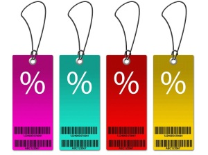

Shortly before Christmas many moons ago, [Malcolm](https://yflmainprod.wpengine.com/2012/05/my-story-part-i/) burst through our front door with a look of triumph on his face. In his hands he had a mitre saw.

– You won’t believe how much money I saved!

– Why do we need a mitre saw?

– The next time we do renovations it will come in handy. And I got it for a steal!

– But we’re not planning any renovations.

Malcolm couldn’t understand why I wasn’t excited. He had his hands on a Makita saw for a fantastic price and I was not thrilled about it. Actually, I was frustrated. At the time we were in a cash crunch so all I could see was the unnecessary expense. Later on the scene was repeated but this time he had a sawzall in his hands.

– But Doris, it was on *sale*. This thing can cut through concrete!

Last weekend, when I saw the Black Friday ads enticing people to part with their cash I couldn’t help but remember those exchanges.

It doesn’t matter how great an item is or how spectacular the price reduction, it’s still money out of your pocket. If the item is not needed, it’s an unnecessary expenditure.

Sales are often referred to as ways to save money. Really? Are you saving money? Because my idea of saving happens to be a verb not a noun, as in I have placed money in a savings vehicle (i.e. savings account, investment vehicle, etc) in a way that allows me to use those funds at a later date. Most of the material I see in public seems to refer to saving as being more like the noun – a reduction of money out.

While it’s true that paying less for something means that you have more money left over, you have not saved a blessed thing until you take the difference between the regular price and the sale price, and you park it somewhere for later use, ideally somewhere that will help that money to grow (though a savings jar that yields 0% interest is better than nothing).

What if every time you were tempted by a sale you immediately thought, “This is money going out of my pocket. Is that OK? Is this something I really need?” You might just spend a lot less money. Now, what if you always took the difference between the regular price of an item and the sale price and you invested it. What would that do to your *real* savings? What would your financial picture look like after one year if you took these two steps every time you were tempted by a sale?

That’s obviously not practical if we’re talking about buying something expensive like a car, but for most consumer items it might just make an interesting difference to your bottom line. Suddenly people who say they can’t manage to save anything would have a growing fund.

**Caveat**: I’ve said this a lot but it’s worth repeating – If your purchase means that you’re adding to your credit card debt, then it’s never worth it. Ever. Paying 20% interest for consumer goods is a great way to go broke regardless if the items are on sale. Just calculate the interest you’re paying and I can assure you the “savings” will evaporate in a heartbeat.

## Discount Coupons

What about discount coupons, aren’t those a good thing? That depends. If you happen to find some coupons for items you need and you haven’t spent a ton of time doing it, then terrific.

My beef comes from the notion of spending heaps of time chasing coupons and then more time driving around hell’s half acre to save a few dollars. Here’s my question: What is your time worth?

What if you spent the equivalent amount of time tapping into your extraordinary creativity to find ways to increase your top line, how would that change your life? If instead of spending a bunch of time chasing a total of $50 in savings (if you’re really lucky and not counting the gas you’ll spend to get the items), you worked on ways to get a raise or find a job with a better salary or benefits, or if you added to your skills to increase your marketable value, what difference would that make?

How much can you possibly save with coupons in a year? And how much could you gain if you spent the same amount of time figuring out ways to add more value to society and to get paid more for it? One set of actions benefits you on a one-off basis while the other can have a positive impact for years.

Just to be clear, I’m not saying that people shouldn’t use coupons. If you derive great joy from combing ads and finding discounts then great. And if it’s something from which you can benefit without a whole lot of effort, that’s good too.

For example, a girlfriend knew that I had a bunch of photos to frame so when a retailer had a huge framing sale, she passed on the coupons to me. Fantastic! Time spent on the project: 30 seconds. I mentioned it in passing while we were having coffee one day. She gets emails from the retailer in question and she forwarded one of them to me. So no great expenditure of time on her part either.

My point is about the highest, best use of your time. I suggest that you use your time and your gifts in such a way that you get the best possible return on your investment.

And beware of the lure of sales. An expense disguised in sheep’s clothing is still an expense.

Until next time, Survive, Thrive and Grow.

#### Share this post

## Your Foundation to Financial Freedom is coming soon.

Please complete the form to add your name to the wait list. We’ll let you know as soon as the course is released!

## No spam, ever. Unsubscribe any time.

## IMS ESSENTIAL

Please select a payment type: