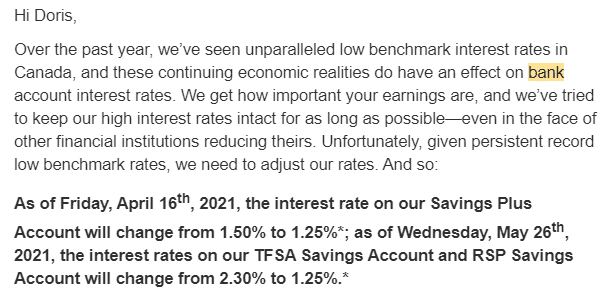
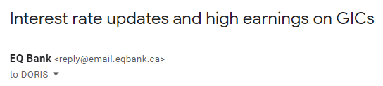

At 3:30 pm last Tuesday, my inbox blew up.

The same thing happened in the various financial forums I participate in.

“Did you hear about EQ Bank? They’re cutting the rates on the high interest savings account and their TFSA savings account – by a lot!”

Here’s part of the email from EQ Bank that started the verbal firestorm:

 

Not great news for sure.

You know it’s not going to end well when they start with this subject line:

 

Their “update” was the drop in rates and the “high earnings” are temporary.

“We’re going to chop the rates we’re paying you, but hey, we’re going to maintain higher rates for (very short term) GICs (for a very short period of time).”

That didn’t soften the blow for customers, especially the ones who had just opened accounts with EQ Bank after an aggressive marketing campaign with the offer of a TFSA Savings Account at 2.3%.

Somehow, they didn’t mention that this would be a teaser rate.

## Isn’t that interesting?

I get the initial reaction. It’s never fun to learn that your money will earn less effective pretty much immediately. But let’s take a second to take a step back and put this into perspective.

First, let’s deal with the stress of the news. One of the things I teach my **[Women’s Money Group](https://yourfinanciallaunchpad.com/womens-money-group/)** members is to ask two questions when they feel themselves getting emotional about an aspect of their finances: “Isn’t that interesting? I wonder what’s going on here?”

Or, “I wonder why I’m feeling this way?”

The idea isn’t to negate the emotion(s) you’re feeling; it’s to help tamp down the effect on your ability to think things through and to connect with whatever is driving the emotion.

Fear is a common driver, and it might be at play here for you, too. If rates are going down, your money will earn less and you’ll have to work harder to build a buffer or your nest egg and you’re already tired because of the pandemic and….

Do you see how that can spiral into an emotional roller-coaster? Take a second to take a deep breath and connect with whatever reaction you had. Write it down in your journal and let’s leave it there for now while we chat about what this development means for you and your money.

## What does this really mean?

Not much. Or maybe I should say that it shouldn’t mean a lot.

Two quick reasons why.

First, let’s say you have $1,000 in an EQ Bank Savings Plus Account and $1,000 in their TFSA Savings Account (more on this product in a second). What will the reduction mean for you in terms of dollars?

Here’s a bit of math to show the difference:

Savings Plus Account

$1,000 in Savings Plus Account @ 1.50% (former rate) for one year = $15.10 in interest

$1,000 in Savings Plus Account @ 1.25% (new rate) for one year = $12.57 in interest

**Difference: $2.53 per year per thousand dollars**

TFSA Savings Account

$1,000 in TFSA Savings Account @ 2.30% (former rate) for one year = $23.24 in interest

$1,000 in TFSA Savings Account @ 1.25% (new rate) for one year = $12.57

**Difference: $10.67 per year per thousand dollars.**

The amount of interest in all cases will actually be a few pennies higher because EQ Bank calculates the daily totals and pays interest monthly, whereas I used **[this calculator](https://www.getsmarteraboutmoney.ca/calculators/compound-interest-calculator/)** to get a quick figure using monthly compounding only. Still, the point is the same – the reduction doesn’t amount to a lot of dollars lost.

If you come back to me with the argument that you have a whole lot more than $1,000 in those accounts and the difference will add up to much more than a hill of beans, that will lead me to my second point on why this change shouldn’t mean a lot:

**What is all that money doing in a savings account? It’s losing value!**

## Temporary parking vs long-term storage

One of the things that came through loud and clear when I first started my research into women’s financial literacy more than a decade and a half ago, is that women love guaranteed interest rate products, like GICs and savings accounts.

They make us and our money feel safe.

They’re secure – there’s no (perceived) risk.

We know exactly how much we’re getting.

We’re not going to lose money.

One less thing to worry about in our crazy-busy lives where so many other things might feel insecure.

**Unfortunately, it’s these “safe” products that are playing a role in maintaining the significant wealth gap between men and women.**

**To be sure, there’s a lot more to it than that, but if you depend on financial products that offer low rates of return and, in some cases, don’t even offset the impact of inflation (i.e. the rising cost of goods), you’re hurting your future self.**

The very products that seem so safe end up carrying a serious risk after all – the risk of losing buying power for our money on top of minimal growth.

**The best way to approach a savings account – any savings account – is to think of it as a temporary parking spot for your dollars, not long-term storage. Your money is there for a short period of time, for a specific reason.**

If money is in a savings account, it’s there to provide short-term liquidity, or access to cash.

Every other dollar that isn’t needed in the short- to mid-term should be made to work harder for you through investments with expected yields well above the rate of inflation.

## Being strategic with your savings account

What are some of the “temporary parking spot” uses for your savings account?

Here’s a short list:

**1\. An Emergency Fund.** This is a fund to carry you through life’s true emergencies – the loss of a job, being unable to work because of an illness, etc. **Caveat:** Remember that money in a savings account is typically losing buying power every single year, not to mention loss due to the impact of taxation. I’ll discuss some strategies for these funds at the next Women’s Money Group meeting on April 27th. Reach out to me for details. Bottom line: Evaluate your Emergency Fund needs and keep only what you’d require to survive in this account. You don’t want to skimp on your safety net, but nor do you want to leave excess cash in an account that is losing value, either.

**2\. Planned spending.** This is for annual expenses you know you will incur: repairs for the car, house, appliances, and anything else that could break down. If you’ve owned anything mechanical or electronic, you already know that they break down at the most unexpected, and occasionally infuriating, moments. Planned spending can also include gifts and larger annual expenses that are due once a year.

**3\. Personal projects:** Saving for a trip, a new computer, a down payment, a wedding, etc.

If you know that you won’t be spending on a project for a while – for example, buying a house – then consider an alternative to a savings account for the funds.

Are you six months away from being ready to buy a house or two years away? The longer the time-frame, the more options you can explore for your money beyond a savings account, including potentially using investments inside a TFSA. (The latter assumes that this is the best use of your TFSA contribution room.)

## The thing about TFSAs

I have no idea who named this product, but let’s just say it wasn’t their finest accomplishment.

Women across Canada can be forgiven for thinking that their money is invested when they merely deposit it into a TFSA. That’s the investment, isn’t it? It’s a Tax-Free **Savings Account** after all. So that’s all you need to do with the money – leave it as is inside the TFSA because it’s a savings account, right?

Hard no.

A TFSA is in fact a **tax-sheltered investment account,** but you wouldn’t know it from the name. Why couldn’t the government have named it for what it is? 🤦

At least EQ Bank made it more transparent by offering a TFSA Savings Account. With this product, it’s clear that when you put your money inside their TFSA, it’s in the form of a savings account with a rate of 1.25% effective May 26th, 2021.

If you have unused contribution room in your TFSA and no possibility of making a higher use of that room – by investing in products that have higher expected returns – then it makes sense to use EQ Bank’s TFSA Savings account for your short-term savings. Currently, it’s still the best game in town as far as savings accounts go.

## Bottom line

While the rate drop announced by EQ Bank (and Oaken, among others) isn’t great news, it’s not the end of the world either if you view your savings account as a tiny part of your overall financial picture. That’s the role it should play – a small role.

**Focus on the dollars in your financial system, not the pennies. If you shift your energy from stressing about the loss of a percentage point from your savings account, to wondering how to make better use of your dollars overall, you will create much bigger wins for yourself in the end.**

If you only retain one thing from this article, let it be this:

**Inflation is eroding the value of the money in your savings account. Don’t let it sit there too long.**

If you want help understanding the savings account landscape and how to make the best use of all your dollars, then join me for the next Women’s Money Group (WMG) meeting. Here’s what I’ll cover:

- What affects interest rates and why they’re dropping
- The best offerings on the market at the moment for all products: savings accounts, GICs and TFSAs
- Whether it’s worth changing institutions to get better rates
- Strategies for your Emergency Fund dollars
- How to use GIC laddering for some of your savings
- Understanding the pros and cons of different compounding options
- What some choices cost you in terms of lost opportunities
- A Q&A to address your questions

You need a WMG membership to participate. You can get a **[monthly membership and join our community of women here.](https://yourfinanciallaunchpad.com/womens-money-group/)** Cancel at any time.

**[Reach out](https://yourfinanciallaunchpad.com/contact/)** if you have any questions.

### Get my Money Tips sent straight to your inbox. Join my community here.

### No spam – ever.

#### Share this post

## Your Foundation to Financial Freedom is coming soon.

Please complete the form to add your name to the wait list. We’ll let you know as soon as the course is released!

## No spam, ever. Unsubscribe any time.

## IMS ESSENTIAL

Please select a payment type: