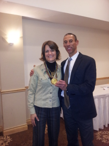

# what-i-learned-from-an-olympic-gold-medalist-about-pushing-through-failure

Can you think of a moment in your life when you worked very hard to achieve a goal and you failed? Or you tried to accomplish a task and you kept running up against one stumbling block after another?

Did you keep going or did you quit? How did you feel as you were working through the process? Did you ever figure out what didn’t work?

Sometimes it’s so maddeningly difficult to figure out why we can’t achieve success. What on earth is going on? Is it us? Is it just that we’re not meant to have what we desire or is there a way past the difficulties? Is there a point at which we should just throw in the towel and abandon the goal?

These are some of the questions that were answered for me a couple of nights ago when I had the pleasure of hearing Mark McKoy’s story in person and then speaking with him afterwards. That presentation and our subsequent chat provided me with a lot of revelations about what it takes to succeed and how to deal with ongoing frustrations.

Where were you during the summer of 1992? Mark was busy [winning a gold medal at the Barcelona Olympics](https://www.youtube.com/watch?v=dCoB_UhMOc4). Go ahead and watch his winning race. It’s a 2 minute, 43 second clip. Just listen to the newscasters talking about him. “The Perennial Also-Ran, Mr. 4th Place”. Not very flattering. Mark even joked that they placed him in Lane #4, which is true! There he is running next to his close friend and the guy expected to win the race, Colin Jackson. Can you imagine the pressure?!

When you hear his story, it gets even more remarkable. In high school, he wanted to be a sprinter. The problem was that the coach already had a heap of sprinters so Mark was given a choice: become the water boy for the sprint team or become a hurdler.

There was another catch: the school didn’t actually own hurdles. His training amounted to running around the track field pretending to jump over hurdles. You can imagine how well he did at his first track meet – dead last.

A normal kid might have given up at this point but not Mark. He found his own hurdles, found his own coach and ended up winning the Ontario championship a few months later.

His story goes on and on with incredible twists of ups and downs, with a heavy emphasis on the downs including an injury at the age of 26 that would have finished just about any other person. Throughout, one thing remained constant: Mark’s determination to succeed.

When he didn’t get the results that he wanted, he found his own coach. When he needed to move beyond what he had learned, he turned to the then-reigning world champion and asked for his advice, which he got by the way! As Mark says, successful people are often generous about helping out if you ask them and respect their time.

When he ended up being parked at 4th place over and over again in international competitions, including the Olympics, he moved to England to live and train with his friend Colin Jackson. Colin’s coach, Mark Arnold, just happened to be the world’s top hurdles coach.

There’s a great story from his first training session. Arnold asked Mark to run over the hurdles so that he could watch him. He noticed that Mark’s left leg wasn’t landing perfectly straight which meant that with every step he was losing an inch. Arnold pointed out that over the course of the race, Mark lost 39 inches because of that single misalignment. At the time Mark didn’t think that was such a big deal but here’s the kicker: when he won the gold medal at the Barcelona Olympics, he won by 39 inches!

When I spoke with Mark afterwards, I asked him if that was just a great embellishment to the story or if it was actually true that he won by 39 inches. He looked me straight in the eye and said, “It’s absolutely true, that was my margin of victory.”

Just think of that for a moment. One adjustment with a gain of one inch helped Mark achieve victory. One inch. How many details could we improve in our personal and professional lives that are the equivalent of that one inch? How much could we change for the better if we concentrated on the “one inches” in our lives?

Mark summarized the four key things that helped him move past all his failures to the point where he became an Olympic Champion:

## Passion

You’ve got to want it and want it badly. Any goal that you set can easily be ditched if you only kind-of-sort-of want it. Nothing short of pure passion and determination will help you get out of bed when you need to and nothing short of total commitment will help you deal with the difficulties that arise. Know your “why” and keep it front of mind all the time. You’ll get there.

If you have a goal to which you’re connected at a visceral level, you will not get discouraged. You might feel sorry for yourself for short periods of time but you will always stand up again after a fall to keep going.

## A Plan

How are you going to achieve your goals? What steps do you need to take to get there? You will never achieve them by accident, only by design. Figure out the things that you need to do and get first-class coaching to get there. Mark wanted to be the best so he insisted on learning from the best.

I loved what Mark told me during our personal chat after his speech: When someone claims to be the best at something, he wants them to prove it. His example was about financial planners. “Don’t tell me you’re great, prove it. Show me your record, pull out your stats, give me some numbers that I can verify.” In other words, talk is cheap. It’s easy to say you’re an expert; proving it, not so much. Ensure that the people you’re learning from know what they’re talking about. Success leaves tracks.

## Execute the Plan – no Excuses

This is where the rubber meets the road. You don’t need to be the most talented or brilliant person to succeed. According to Mark, you just need to be the one who works harder than everyone else without making excuses. Even when it’s inconvenient or you’re tired or you’re discouraged. Work your plan. Put a plan in place and stick to it.

That said, if you are not getting results, turn to a coach to help you understand what you need to adjust in order to get past the hurdles (no pun intended – let’s leave the real hurdles to Mark!).

Don’t give up on the goal, make adjustments instead to your execution to improve your outcomes. Perfect practice makes perfect. Remember the small adjustment that Mark made to the tracking of his left leg that yielded such big results? You might be a small adjustment away from a huge break through.

Mark emphasized the importance of preparation. When he won, he did so because he was prepared both physically and mentally. If he hadn’t executed his plan, he would not have stepped atop the podium in 1992. You must do the work to get the results – no excuses.

## Mindset – Focus on Winning

The people who cross the finish line first at the Olympics do not have losing on their mind; their thoughts are all about winning. That’s how they get through the doubt and the pressure to perform. They know they’re ready to succeed. they want to succeed and they go into it feeling like winners.

Mark told the story of Michael Johnson, a 4-time Olympic gold medalist in the 200m and 400m who wore very expensive gold shoes for all of his races. Afterwards, he’d toss them into the crowd. When a reporter asked what would happen if he lost, Michael replied, “I run to win. I don’t think about losing. I think about winning.”

If you think about losing, that’s what you’ll get. Keep your eyes on the ultimate goal, especially when the tough times hit. Understand that failure is a necessary part of success. Learn from it, don’t dwell on it.

Back to Mark’s medal. When he put it around my neck I got a close look at the piece of gold that represents years of toil and sacrifice. I thought of how often Mark could have chosen to quit and yet he didn’t.

I suspect we all have victories buried within. It’s time to connect with our passions and cross our own finish lines, one inch at a time.

#### Share this post

## Your Foundation to Financial Freedom is coming soon.

Please complete the form to add your name to the wait list. We’ll let you know as soon as the course is released!

## No spam, ever. Unsubscribe any time.

## IMS ESSENTIAL

Please select a payment type: