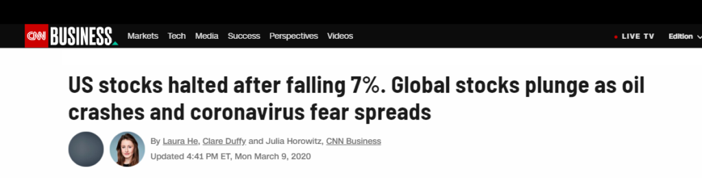
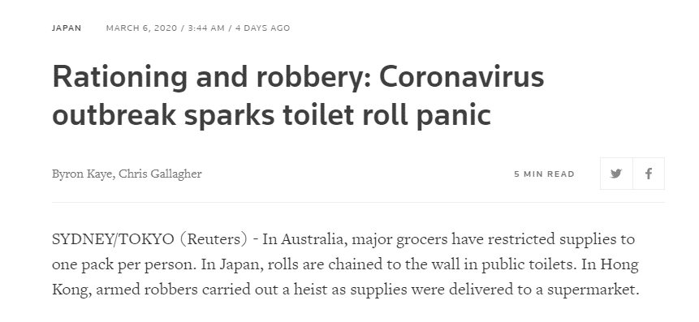
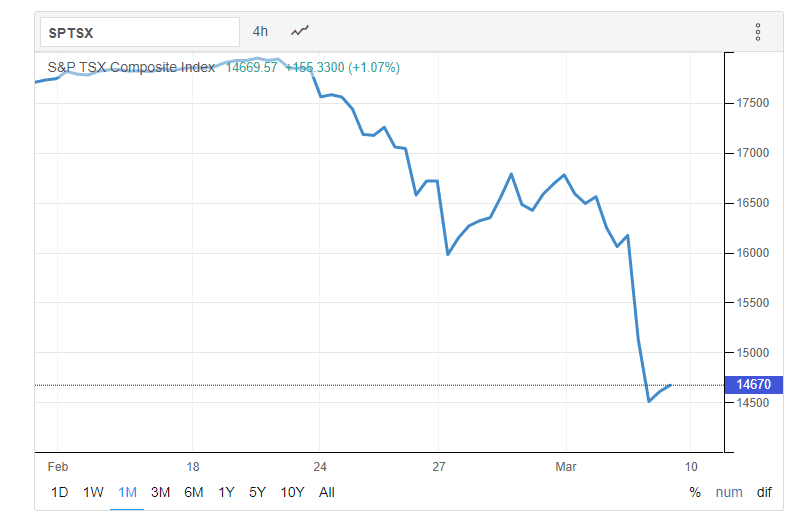
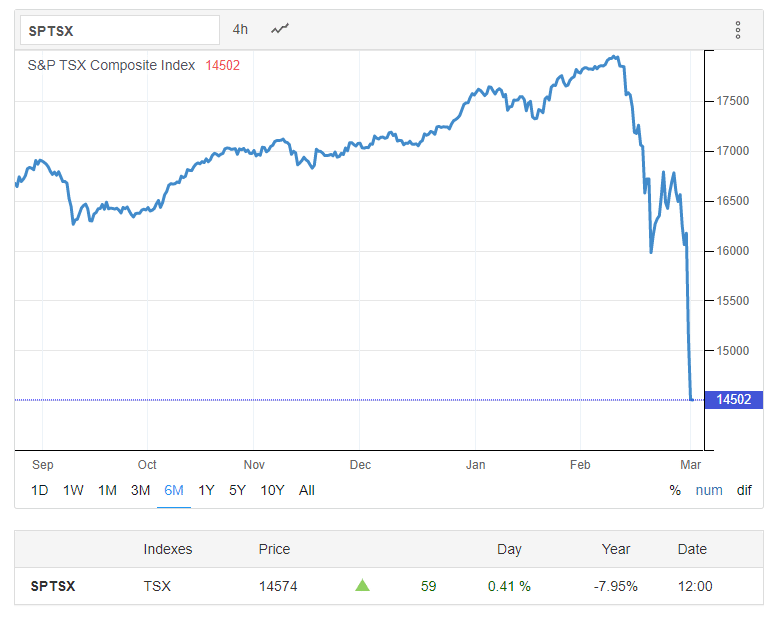
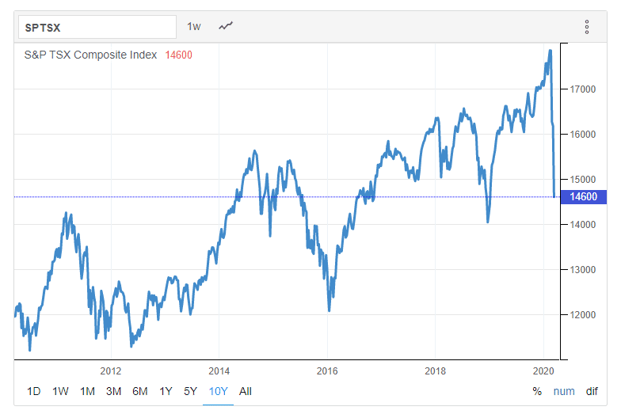
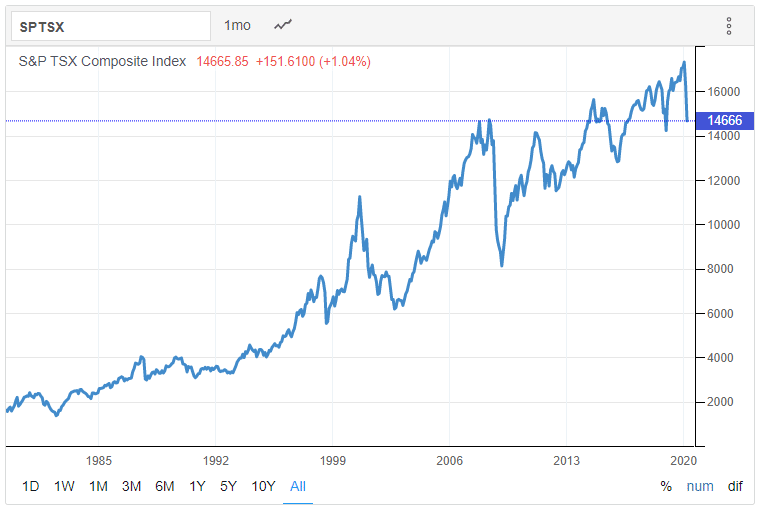

# what-to-do-during-financial-turbulence-and-stock-market-corrections

Are you looking around, amidst all the economic bad news these days, wondering what this will mean for your finances and your investments?

Are you worried?

Do you feel a sense of panic taking root?

Are you tempted to start selling some of your holdings?

Hunker down at home and stop spending on *anything?*

If so, you’re not alone. There is evidence of panic and fear everywhere you turn.

Check out this headline from CNN:

“Plunge.” “Crashes.” Perfect language to prey on our emotions.

It’s one of a dozen articles I could have selected. The point is that the messaging is the same: Covid19 is spreading, fear is growing, stocks are tanking, and people are emptying supermarket shelves as though Armageddon were around the corner.

Exhibit A from a [Reuters.com article](https://www.reuters.com/article/us-health-coronavirus-toiletpaper/rationing-and-robbery-coronavirus-outbreak-sparks-toilet-roll-panic-idUSKBN20T0YG)

Let’s let that sink in: *toilet roll panic*.

Today, I want to help you put this into perspective and give you a solid plan for dealing with all the uncertainty before selling your portfolio at a loss and turning to the black market to resupply your toilet paper.

Even if you don’t have any investments in the stock market, read on for real strategies you can implement to put your mind at ease.

#### Step 1: Understand that we’ve been here before and we will be here again

When we’re in the middle of a major international issue, with ensuing market corrections, it’s easy to forget that we’ve been through this before and we’ve recovered.

Volatility – that is, the swings up and down in values – is the norm for the stock market, not an exception.

Let’s consider the Canadian stock market to illustrate this.

Here’s a look at the last month for the Toronto Stock Market Index, or the S&P/TSX Composite Index, taken from [TradingEconomics.com](https://tradingeconomics.com/canada/stock-market):

You don’t have to be a genius with graphs to understand that the above is bad news for the Canadian stock market. It would be dangerous to toboggan off that nasty slope! No wonder we’re panicking, right?

Well, hold on. Let’s dial it back six months to see what the graph looks like:

Still not feeling very good. We were right to panic!

Except hold on again. One of the first rules of investing is that it’s a long game. It’s about building wealth over the long term, and six months does not count as “long term”.

How does the S&P/TSX Composite index fare when we look back over a decade? Here it is:

Much better.

The story becomes clearer when you roll back the clock even farther:

Now do you feel better?

The bottom line is that volatility isn’t fun, but it is the norm. On the whole, though, the trend line is headed up. **Your money will grow over the long term provided you don’t give in to panic and emotional decision-making.**

If you’re retiring tomorrow or you’re already drawing down your investments to fund your retirement, you may be facing some difficult choices, but again, this will pass.

Let’s keep breathing and understand that as unpleasant as it is right now, the markets and the world will bounce back.

##### The length of the average downturn

According to [Sean Williams in a Fool.com article,](https://www.fool.com/investing/2020/03/03/5-figures-that-put-the-stock-markets-worst-week-in.aspx) an official correction (i.e. downturn) happens once every 1.85 years and doesn’t typically last long:

> Interestingly, though stock market corrections are commonplace, [they generally don’t last very long](https://www.fool.com/investing/2018/04/11/how-long-do-stock-market-corrections-last.aspx). The[37 previous corrections](https://www.fool.com/investing/2019/04/25/the-stock-market-has-done-this-37-times-since-1950.aspx) in the S&P 500 since the beginning of 1950 have lasted an average of 192 calendar days, or a little over six months. This includes 23 corrections that have moved from peak to trough in 104 or fewer calendar days (about 3.5 months). The swiftness of these moves lower can best be explained by emotions, rather than reason, driving the market.

Here’s what he has to say about disease outbreaks in particular:

> According to data from Citi Research and **FactSet Research Systems**, the last five outbreaks — SARS, Avian influenza, MERS, Ebola, and Zika — all resulted in short-term declines of between 5.8% and 12.9% in the S&P 500, with the Zika scare lending to the steepest decline.
> 
> Additionally, these peak-to-trough declines happened considerably faster than the average correction since the beginning of 1950. The Ebola outbreak found its bottom in just 23 trading days (not to be confused with calendar days), while the Avian influenza in 2004 took the longest at 141 trading days. On average, disease outbreak corrections last 62.2 trading days, or just shy of three months.

#### Step 2 – Don’t do something you’ll regret later

Benjamin Tal, Deputy Chief Economist at CIBC Capital Markets, was interviewed on The Current, a [national radio program](https://www.cbc.ca/radio/thecurrent/the-current-for-march-10-2020-1.5492134), and he said this:

> I think that the first thing to do is not to panic. We’ve been through it before during SARS, in 2008 with the crisis…. This too shall pass. I think that panicking now, when it comes to selling your holdings in the stock market, would be a mistake.

In other words, don’t give in to panic. Understand that the only way to lock in a loss is to sell.

Hold on and when the markets recover, you’ll be glad that you stayed the course.

#### Step 3 – Remember that the market is on sale

It’s interesting that when we walk into a store and we find the contents on sale, we don’t refuse to buy, turn on our heels, and run away in a panic. That would be absurd. Instead, we congratulate ourselves on our good luck and pick up some bargains. Less money spent for the items we wanted – score!

When the stock market goes on sale, however, we just see the downside.

Someone once said that the trick to succeeding is to look at what the masses are doing and do the opposite. That’s true of stock market corrections. **When everybody is selling, it’s time to buy.**

Rob Carrick, a reporter for the Globe and Mail, published [this piece](https://www.theglobeandmail.com/investing/personal-finance/article-my-one-regret-about-past-stock-market-plunges-that-i-didnt-buy-more/?fbclid=IwAR0Mccsj4RiMtarMVcTgKAyPnF7fbNIGh_dd23WSiczOHVR1Jf1LUEGRngk) in which he shares his biggest regret about past stock market plunges. Spoiler alert: He wishes he had invested more money at the low points. Interestingly, he never wished he had panicked more.

#### Step 4 – Take charge of your money

Whenever there is financial turmoil, it is helpful to know exactly what’s going on with your finances. To do that, you need organizational systems to keep track of the following:

- Where you’re spending your money
- How much you’re spending relative to your income
- How much you’re saving
- How much you’re investing

You may not be able to control the markets or the spread of Covid19, but you can control your money. If you don’t have good, simple systems in place right now, start tonight with 15 minutes spent on printing up, then analyzing your credit card and bank statements.

You can use a simple spreadsheet or apps to help you track your spending. Once you have the information at hand, you can determine whether your spending is serving you well.

The more in control you are, the more you know exactly what’s going on with your money, the more peace of mind you have and the more quickly you can respond to financial developments or adjust your spending to line up with your values and goals.

Reach out if you need help with this.

#### Step 5 – Increase your savings rate

According to Benjamin Tal, most Canadians save far too little money. The same can be said of our neighbours to the south. The problem with this is that our low savings rates leave us vulnerable when there are major disruptions to the economy, just as we’re facing today.

Do yourself a favour – while you’re analyzing your finances in Step 4, pay close attention to your savings rate. The simple way to calculate that number is to take the total amount of money you put into savings or investment accounts last month, divide that by the total amount of money you took home and multiply by 100 to get a percentage. That’s your savings rate.

For example, let’s say someone called Jane put $200 into her savings account last month and she also invested $50 each in her RRSP and TFSA. Her total savings for the month would be $300. Since she takes home $4,500 per month, we would divide $300 by $4,500 to get 0.067. We’d multiply 0.067 by 100 to get a savings rate of 6.7%.

Jane’s goal next month might be to increase her savings rate to 7.7% and to continue with incremental increases on a monthly basis until she has built a strong financial cushion for herself.

That’s one strategy to grow your savings rate. Regardless of the strategy you employ, the more of a buffer you create in savings and investments, the more options you have at your disposal when something like Covid 19 comes around.

#### Step 5 – Turn off the noise

When you look at your phone, you see all the articles of doom waiting for you in your inbox.

You turn on the TV and the talking heads are at it, telling you how terrible the news is everywhere.

Instagram, Facebook, and Twitter? Their feeds are filled with people sharing articles about cancellations, closures, the latest stats, how badly the markets are doing.

No wonder our reptilian brains are on overdrive these days.

It’s worth remembering that the media needs to sell papers and stories. They don’t do that by reminding us to keep our head on straight. They use inflammatory language and click-bait headlines.

It’s also worth remembering that the single biggest factor that hurts investor returns is behavioral. Emotional decision-making is a killer of returns.

Ignore the papers, turn off the TV, and carry on with your plan.

Yes, this is a challenging moment for the world and for the markets. We have been here before and we will be here again in the future.

For now, remind yourself that investing is a long game.

Wash your hands, be prudent, remain calm, and keep breathing.

And if you feel an urge to do something rash, reach out to me. I’ll talk you off the ledge.

#### Share this post

## Your Foundation to Financial Freedom is coming soon.

Please complete the form to add your name to the wait list. We’ll let you know as soon as the course is released!

## No spam, ever. Unsubscribe any time.

## IMS ESSENTIAL

Please select a payment type: