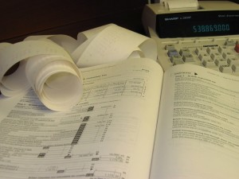

# what-to-do-if-you-cant-pay-your-income-tax-bill

Ahhh, tax time, everyone’s favorite time of year. April for most adults in Canada and the US means that it’s time to pay personal income tax. For most accountants, on the other hand, it means that they haven’t seen their families in a couple of months as they work to get all the returns completed by the deadline. Good times.

So you’ve managed to complete your taxes by the due date but there’s just one problem: you really don’t like the number on the final line showing how much you owe the government. Actually, it’s not just that you don’t like it, you also don’t happen to have that money available to pay off the debt in full. What should you do?

Well, according to one prominent financial advice site in the US, there’s some great news – you can put it on your credit card. Isn’t that awesome?

Advice like that makes me want to bang my head repeatedly on a brick wall. What are they thinking? You’re someone who can’t pay your tax bill and the smart idea is to grow your credit card debt? Because paying 20% interest is wise? That’s ridiculous. Sorry, did I just say that with my outside voice?

Just Say No to credit card debt. **What do you do when you find yourself in a big hole? Stop digging!** Credit card debt will just add to your hole. Even the government doesn’t charge 20% interest.

So what are your options if you’re faced with a bill that you can’t manage in full? Let’s start with what *not* to do: don’t ignore it. This is not the time to pull an ostrich routine because that would be the equivalent of poking a stick in the government’s eye and they won’t react well. They will not forget about your debt and they won’t go away. Instead, they will use the powerful tools at their disposal to go after you, and they’ll charge you a pile of interest and penalties in the process.

If you’re someone who plans not to file your taxes because you suspect you’re going to owe money, think again. Perm Persaud of [Ark Accounting and Tax](http://arkaccounting.com/) puts it this way, “I normally **recommend filing your taxes on time if you owe money so that you can avoid the penalties. It’s the penalties that will hurt the most and they add up very quickly** if you are behind in filings. If you then don’t pay what you owe on time, you will be hit with interest charges. CRA (Canada Revenue Agency) updates their interest charges each quarter and currently they charge 5% on overdue taxes.”

If you haven’t reported income in previous years, or you haven’t done your taxes, or you’ve claimed something improperly, CRA will give you a second chance through their [Voluntary Disclosures Program](http://www.cra-arc.gc.ca/voluntarydisclosures/). It allows you to come clean about past issues provided that you owe something to CRA and you tell them about it before they find out.

By the way, a quick aside to show the inequality of the relationship just in case you were wondering. If you owe money, the government currently charges you 5% on the overdue balance. However if they owe you money, they pay 1% interest if you’re a corporation or 3% if you’re not a “non-corporate taxpayer” (i.e. a regular human being). Apparently the bit about us all being created equal does not extend to the government.

So the first step is to file your taxes on time *especially* if you owe money. Once you’ve filed, you can then make arrangements with CRA (in Canada) to set up a payment plan. You can either call them first or wait until CRA contacts you and then negotiate an arrangement, but either way you do need to work with them to set up a plan.

When you’re speaking with the collections agent assigned to your file, you may need to provide some justification for a payment plan. They have the right to ask for evidence of your financial situation and as a result, you may need to make full financial disclosure to show that you are unable to pay. Telling them that it’s just not a good time for you at the moment probably won’t suffice.

Once you do have a payment agreement in place, stick to it, otherwise they can cancel the arrangement and begin legal proceedings to collect from you. Here’s the thing: once legal proceedings have begun, they won’t back down. Don’t think you can sweet talk your way out of it if you’ve failed to honor your agreement. You may be charming as anything with your friends but it won’t get you far with CRA. I speak from personal experience here. After my first husband died they decided to do an audit of my business. Friends who were helping me out during that difficult time explained that our business’s sales tax returns would be late because of the death. CRA were immoveable in their resolve. They were professional and polite but tight-lipped and humorless. They were there to do a job and they weren’t swayed by the fact that I was recently widowed. In my case they were satisfied by what they found and they left without any issue, but it demonstrated to me that their job is first and foremost to collect monies owed.

In the event that you’ve just experienced unexpected hardship, Perm Persaud points out that there are [taxpayer relief provisions](http://www.cra-arc.gc.ca/gncy/cmplntsdspts/txpyrrlf-eng.html). “If your situation is so dire that you weren’t able to meet your tax obligations as they came due, you can apply for a waiver of penalties and interest. Last year I had one client do this and he saved at least $25,000 in penalties and interest charges. As for negotiating with CRA, that is possible if you have a large tax debt and your income situation has changed such that insolvency or bankruptcy is looking like an option.”

The bottom line is don’t delay. File your taxes and set up a payment plan with CRA to ensure that you clear up the debt and stay on their good side. The last thing you want is to have them start legal proceedings to garnish your wages or obtain a judgment against you that will then show up on your credit bureau report, which in turn will harm your credit score for years.

Once you’ve addressed the debt it’s time to put a plan in place so that you do not find yourself in the same situation next year. Set up a savings account specifically for tax money and contribute to it every month. That way when next April rolls around, you may not be happy about the amount you have to pay, but at least it won’t be a stressful burden for you. If your reply is that you don’t have any money left for savings, then read [my article about financial planning](https://yflmainprod.wpengine.com/2014/06/forget-about-budgeting-and-do-this-instead/).

If you have a financial question that you’d like me to tackle, you can email me at doris@dorisbelland.com.

Until next time, Survive, Thrive and Grow.

#### Share this post

## Your Foundation to Financial Freedom is coming soon.

Please complete the form to add your name to the wait list. We’ll let you know as soon as the course is released!

## No spam, ever. Unsubscribe any time.

## IMS ESSENTIAL

Please select a payment type: