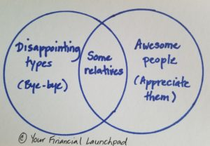

# when-your-support-system-fails-you

Have you ever had this happen to you: You get a great idea, one that excites you from your hair down to your toes. Perhaps it has to do with your career, or maybe you’re trying to improve an aspect of your health. Whatever it is, you are energized and gung-ho. Brimming with excitement, you share your big idea with your friends and family members, but the conversations don’t quite go as planned. In fact, it’s the very opposite of what you expected. Not only are some of them not enthusiastic, they tell you flat-out they think your idea is daft. What were you thinking? That is never going to work and only a fool would try that. Come on, get a grip; be realistic. Don’t be silly.

You are devastated. These are the people who are supposed to love you, support you, encourage you, not crush your spirit. If you can’t trust them with your ideas, goals, and dreams, who on earth can you trust? Why would they say or do that?

I’ve just seen this exact scenario play out with a teenager. This kid was excited about their upcoming birthday. Birthdays are about celebrating and partying, right? The kid put a lot of energy into coming up with an activity that everybody would enjoy, followed by some time to hang out together and eat cake. It would be a fabulous day. There was just one problem: When the kid mentioned their intention to the group of friends who would be invited, all but one mocked the idea. “Teenagers don’t have birthday parties. That’s lame!” said the chorus. Only one friend had the goodness of heart to embrace the idea and express enthusiasm. The party plans were cancelled and the teen was left in tears.

I know what it feels like to have the people you think of as your support system abandon or fail you in ways that leave you feeling deflated. Here are just a few of my own experiences:

- When I was working on my Master’s degree at McGill University, I was promoted to the PhD program. You can imagine my delight. I didn’t even know that was possible! When I called some key people, most were congratulatory. They couldn’t be happier for me. One person in my inner circle, however, wasn’t amused. “Really?” they said. “How many more years before you get a real job?”
- After Malcolm died, some of the people I thought I could count on for support all but vanished from my life. Some never said a word to me about my loss. Others avoided me to ensure they didn’t have to deal with the grieving widow.
- When I started to invest in real estate, something I continue to do to this day, one person clearly disapproved. They believed that I was risking a lot of money and indulging in foolishness. Never mind that I was taking courses and learning at the hands of experienced people. As a result, they never spoke to me about my work and were dismissive of my efforts, despite my success.

You get the idea. We all experience versions of the above, where people on whom we count for emotional support do and say the most regrettable things. And I’m not talking about moments where friends who genuinely love you express reservations about a choice you’ve made or are about to make. It’s essential to get critical feedback at moments, but that feedback needs to be delivered in a kind, thoughtful way. No one who genuinely cares about you ever says, “Your idea is lame!” That’s just mean. A true friend would not treat you that way.

### You have a choice

**When your support system fails you, you have to make a decision: Do you diminish your sense of self worth or do you view the issue for what it is – a sorting problem?**

Early on in my entrepreneurial career, I was lucky to have a great mentor, a woman by the name of Trish. Trish taught me a number of important lessons:

- Work harder on yourself than anything else. Success starts in your mind and in your beliefs.
- Don’t let naysayers stop you. If you are convinced that what you are doing is the right path for you, forge on.
- Ensure that your work and your values are in alignment.
- Finding customers is not a selling process, it’s a sorting process.

She’s also the one who gave me a brilliant line, which heads one of the chapters in my book: “Money isn’t everything, but it is right up there with oxygen.”

Of all her lessons, the last one is a real gem. It changed the way that I view a lot of interactions and helped me to get to a position of gratitude for the great people in my life. I realized that I had to let go of the ones who consistently dragged me down. I sorted them out of my inner circle – you can control that by choosing the people with whom you spend your time – and I retained those with whom there is mutual respect, appreciation, and joy.

I just want to be clear that this doesn’t mean you walk up to the person who let you down and say, “You’re a jerk. I no longer want you in my life.” As satisfying as that might be in some cases (come on, everybody has a relative who is *that* person), it doesn’t serve anyone well to counter bad behaviour with more of the same.

What I learned many years ago is that the healthiest approach is to distance yourself from the crabs in your life – anyone heard of the crabs in a bucket analogy? – and fully appreciate the lovely souls who do provide kindness, love, and support.

### Good people

Two years after Malcolm’s death, I decided that I was ready to consider dating once again. I was 34. If you think that playing the field sounds like a riot as a thirty-something, then you haven’t done it. It is p-a-i-n-f-u-l. After a number of insanely awkward dinner parties where friends tried to set me up with their “he’s such a great guy” single friend (you know who you are), I got to a point where I wondered if all the remaining 30-something single guys were morons. At one point, I actually thought there was a good chance I would spend the rest of my life solo.

I’m married with two children, so you know the story ends well, but it wasn’t entirely clear to me what would happen back then. When I let go of the challenges and went about my life, Mark crossed my path. It was all part of the sorting process. You meet people, they seem like a good fit, and then they do something that leaves you thinking they’re not the kind of person you thought they were. You try to talk to them about it, but that just reinforces your opinion.

Move on. You’ve just sorted them into the circle in your Venn Diagram of Life for people who drag you down.

You don’t pitch them on why you’re an awesome person and why they should treat you better. That’s selling. Instead, you remind yourself that you deserve to be surrounded by people who are kind, respectful, and supportive. And you move on.

Success in all aspects of life requires good people to nurture your spirit. Thankfully, the world is full of loving people who will enjoy your company, react with enthusiasm when you say you want to celebrate your birthday, high-five you when you tell them about your accomplishments, and provide support when the ground shifts under your feet. You just need to keep sorting.

Stand tall, walk with confidence, and believe in yourself. Don’t ever question your worth because of naysayers. Let them go.

#### Share this post

## Your Foundation to Financial Freedom is coming soon.

Please complete the form to add your name to the wait list. We’ll let you know as soon as the course is released!

## No spam, ever. Unsubscribe any time.

## IMS ESSENTIAL

Please select a payment type: