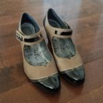
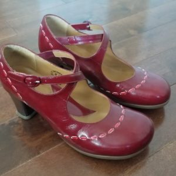

Have you ever done this: You sit down for a restaurant meal and the waiter hands you the menu, asking if you’d like something to drink. “Water would be great, thank you,” you respond. Then you look over the food offerings with one eye on the items and the other on the price. Your choice of what to order is not driven by what you’d really like to eat that evening. That would cost $42 – an outrageous price for a meal! Instead, you settle for something common, the chicken, with a much more reasonable price tag. When the waiter returns to take your order, you decline a beverage because they’re too expensive. Ditto for dessert. Publicly, you state that you’re full and don’t feel like drinking.

Perhaps your experience varied in the details, but the bottom line may be the same: Price drives what you order, not desire.

I used to do that all the time until roughly twenty years ago, when I began to study my financial patterns in earnest. Once I recognized the pattern, it triggered a “[Well isn’t that interesting](https://yflmainprod.wpengine.com/2018/03/tackling-debt-the-step-many-people-omit/)!” response. “I wonder why I do that?” I asked of myself. It took a bit of digging, but I finally figured out where the behaviour came from.

## The walls have ears

One night when I was young, my parents put the kids to bed and assumed, incorrectly, that they had privacy in the kitchen, where they discussed their finances. What they didn’t know is that I had gotten out of bed and sneaked down the hall to listen in on their conversation. I’d done that on occasion since I was a very young thing, presumably because I assumed, correctly, that what adults did after putting us to bed was WAY more interesting than sleeping.

That night, though, I heard them worrying about money, about not having enough to pay the bills. I’m sure to them the issue represented a challenging fragment of time which they knew they would get through, but to my young, naive mind, it sounded like the end of the world, a very real problem that could leave us destitute. Without saying a word, I went back to bed and began to worry.

## Cut that out

From then on, I curtailed my spending in my attempt to help them financially. On the infrequent occasions when we went out to dinner, I would have the least expensive item on the menu and I would not dream of having a beverage or a dessert. When they took me shopping for school clothes, I would choose the least expensive items. Without realizing it, this behaviour became entrenched, persisting past the point of memory.

Let me say, for the record, that we were just fine. There was always great food on the table, clothes in our closet, and money for the important stuff. I just didn’t know we’d be OK back then, and that feeling of scarcity seeped into my bones, unconsciously affecting my behaviour until I hauled it out into the light, challenged my assumptions, and made a conscious decision to change my behaviour. More on that in a second.

Earlier this week, I held a follow up webinar to the [Women’s Money Group](https://yflmainprod.wpengine.com/membership/) February meeting, in which the attendees and I discussed the progress they were making on their attempts to uncover money patterns in their life. It turns out that one of the women does the same thing I just mentioned when she goes into a restaurant: She buys the inexpensive stuff – no drinks or dessert, forget it! Others talked about having lots of inexpensive items around them that they bought just because they were cheap. It wasn’t because they loved the items and felt that they were an excellent choice; they bought them because they needed that particular thing and the price was their threshold. If money were no object, would they buy those items again? Probably not.

## Isn’t that interesting

As women, we do this all the time. We buy expensive sports gear for our kids, put them in a variety of cool camps for the summer, and enrol them in more extracurricular activities than you can shake a stick at. For the holidays, they get nice outfits and gifts, too.

Do we do that for ourselves? Or do we instead make do? Do we get all super practical when it comes to buying shoes for ourselves, for example? Yes, we would lovelovelove that fabulous pair over there, but there is no way we will pay $150 for a pair of shoes. That’s out of the question! Instead, we’ll buy four pairs for that amount, thank you very much.

Let me ask you this: Does your partner or spouse have any trouble at all spending on toys for himself? Sure, some men do, but much more frequent are the stories of guys having zero difficulty buying the most fabulous new (insert hottest tech gadget here). My own Dear Hubby nearly died an untimely death at my hands when he bought a kick ass camera and then told me “we” had agreed to buy it as an anniversary gift. Yes, I’m still married to him. (He now denies the story.)

What the hell is going on? Why do we happily spend on the rest of our family but we have such a hard time doing so for ourselves?

## Self worth

Last fall, I undertook a [research project](https://yflmainprod.wpengine.com/2017/09/tell-me-what-you-want-what-you-really-really-want-my-research-project-on-women-and-money/) in which I asked seventy-eight women from across Canada about their financial lives. One of the questions revolved around their confidence regarding their ability to make money. An interesting finding that came out of that research is that many women have low financial expectations. In other words, we are satisfied, or rather make do, with low levels of income. And when we do spend our money, we typically focus our generosity on others.

As I delved deeper into this area, one thing became clear: Many women have a tough time feeling worthy of wealth, of luxury. There’s a ton of judgment wrapped up in that, about how it’s selfish, wasteful, vain, and greedy to indulge, to want more.

## What if?

Back to my story. I went from being a kid who saved every penny and tried to cut back on expenses as much as possible, to a twenty-something dealing with the challenges of a sick spouse, to a thirty-two year old widow who found herself nearly [$400,000 in debt](https://yflmainprod.wpengine.com/book/). No wonder I had trouble spending on myself! When I realized what was going on, I began a process of retraining my expectations. If I wanted to become wealthy, I had to learn to be comfortable with money, with small luxuries, with spending on myself.

Here’s what I did: I took a few key areas of my life and I up-scaled them.

Whatever my budget for shoes was, I decided to buy fewer pairs and spend more on each individual pair.

Whatever my budget for clothes was, I bought fewer items but I spent more on each piece.

I went out to dinner more infrequently, but when I did so, I went to very good restaurants and ordered whatever the hell I wanted to.

I did not spend any more money than I had previously spent on any of those categories; I just distributed the money differently.

The first time I paid more than $100 for a pair of shoes – not boots, *shoes* – I spent twenty minutes pacing the store, having a silent conversation with myself. The clerk must have thought I was mad! It just felt so wrong, so stressful. Even though I had a plan and I knew the money was there for that item in that category, I still got sweaty palms pulling out my wallet. I reminded myself that there is no growth without discomfort.

Slowly, over time, as I bought better quality items and surrounded myself with articles that I lovelovelove instead of just like, I started to feel different. I began to believe that I was worth nice suits, high quality food, and killer shoes. As my feelings about myself shifted, so too did my expectations. Eventually, the results followed.

What if you tried that too? What if you took your clothes budget, for example, and bought half as many pieces but you cranked up the quality and spent the same total amount of money? Sure, get them on sale so you can buy more items within the total budget, but focus on quality. What might that do to your expectations?

## About frugality

Frugality seems to be the “in” thing right now. Everybody’s talking or writing about it. It’s hip to be frugal, to which I say great, as long as you are still focused on quality items that you love and you’re simply trying to find a way to get them at a better price.

Live with less? Absolutely. Deprive yourself? Not unless you’re trying to tackle major debts. Even then, I suggest you allow yourself moments of small luxuries, even if it’s just an occasional latte.

Don’t buy more, buy better. Focus on quality and know that you are worth every dime.

#### Share this post

## Your Foundation to Financial Freedom is coming soon.

Please complete the form to add your name to the wait list. We’ll let you know as soon as the course is released!

## No spam, ever. Unsubscribe any time.

## IMS ESSENTIAL

Please select a payment type: