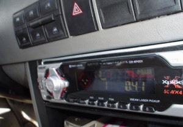

# why-a-money-give-away-contest-is-potentially-dangerous

Within two seconds of backing out of the driveway, my twelve year old asked, “Can you please turn on the radio?” The funny thing is that when no music is playing, my daughter usually clams up but as soon as the tunes start she pulls out her chatty Cathy routine. And so it was on this day the moment I turned on the radio to a local, Top 40 Hits music station. Within minutes she heard their ad about a money give-away and that got her all excited.

– That would be so cool! I want to win that contest!

– What’s the contest? I wasn’t paying attention.

– Apparently they’re going to pay all the bills for one year so that you can spend all of your money on fun stuff. Isn’t that great?

Fast forward one week and in comes my husband from running an errand.

– You won’t believe what I just heard on the radio. I’m pretty sure it would make you crazy. The ad went something like, “We’ll pay all your bills for one year. Imagine walking into any store and spending whatever you want without guilt!”

When I went to the station’s website to look into the details, sure enough, they were offering to pay all of the bills for a lucky winner for one year. Interestingly, here’s what the list of “bills” includes beyond the usual suspects of rent/mortgage, gas, groceries and so on:

- **Dining out once a week with $100 restaurant gift cards to various local establishments**
- **Movies for a year**
- **Cut and Colour every month from a local salon**
- **Mani/Pedi every other week from a local spa**
- **Personal Trainer for a year, once per week at any (local gym) location**
- **Burger meals for 2 twice a month from a local burger joint**

On the entire web page there is only a single mention of possibly using the money to pay bills, followed quickly by a suggestion that the money be used for going out for dinner or “whatever you want!”

Their on-air ads focus almost entirely on spending up a storm in any way that you choose for one year. Just imagine, goes the marketing, how much fun that would be! Just imagine, goes my thinking, just how problematic this could be.

I don’t even know where to start in pointing out the ways in which this could lead to trouble. To be clear, I think it’s fantastic that the station will pay all, or a good chunk, of someone’s core expenses for one year. That really is amazing, and if the lucky winner uses this windfall intelligently, it could potentially be a game-changer for them. But if instead they follow the enticing ads and spend, spend, spend, they will probably hit a major wall when it’s all over and miss out on a tremendous opportunity.

So in no particular order, here’s the beef I have with the way that this contest is presented:

## 1\. The focus on spending starts at the wrong end of a financial game plan

I have [written a great deal about how to apportion your income](https://yflmainprod.wpengine.com/2014/06/forget-about-budgeting-and-do-this-instead/) – in other words, what gets paid first and what matters most – and I can tell you that discretionary spending shows up dead last after the heavy weights – roof over your head, good food on the table, good medical care, paying down corrosive debt, saving and investing – are taken care of *first*. I’m pretty sure I’ve never said, “Set aside the cash for manis and pedis and then see what’s left over to pay off your credit card debt.”

If you are the lucky winner AND you have zero corrosive debt AND you have cash going out every single month to savings and investments, then you could potentially spend the rest. But that would still be a dumb idea, not to mention a huge opportunity lost from a big picture perspective.

## 2\. It reinforces bad financial habits

Check out the list of expenditures they will cover for one year. I’m not sure if they’re suggesting that this is a plausible or even sane list for anyone for one year, or if they’re instead gunning for an ideal annual scenario, but either way it should raise your eyebrows. A mani/pedi every other week? Seriously? Show me a single person who gets a mani or pedi every other week. And I hope like hell that if they do, their financial balance sheet looks rock solid. Throw in a colour and a cut every month – every month? That’s a chunk of change too. Now toss in going out for dinner once per week, burgers twice a month and a movie on occasion and that’s a pretty sizable chunk of cash to put out every single month.

After one year of doing this, what kind of habits will the winner have formed? If he or she isn’t careful, they could easily become quite accustomed to shelling out a pile of cash on discretionary spending each and every month. When the cash tap is turned off, how will they do going back to their regular routine with only their income? Just ask someone who has been downsized or had their income slashed how easy it is to adapt downwards when it comes to expenditures. Those belt-tightening habits are a lot harder to put in place when you’re used to spending lavishly.

## 3\. It ignores the not-so-small issue of existing debt

According to Statistics Canada, [as published in the media last month](http://www.cbc.ca/news/business/debt-income-1.3486811), the ratio of household debt to income rose to 165.4 per cent in the last year. To be fair, the bulk of that debt is mortgage debt, but it’s still debt and it still represents $1.65 of debt for every $1.00 of income. That’s a big gap! It’s not like our society is short on debt as a whole, so what if instead of focusing on spending, the ads went something like this, “What if you could take every dime that you earn this year and wipe out your debt? How awesome would that be? Or knock fifteen years off your mortgage and start paying yourself for a change!”

I won’t say focus on your retirement fund because I think people place too much emphasis on living in their older years to the exclusion of the present moment. How about setting up regular passive income right now so that you can travel with your kids to fabulous destinations while they’re still at home, and still be in great financial shape for the later years?

If, instead of focusing on buying more doodads, to borrow Robert Kiyosaki’s phrase, the ads instead suggested that you take the cash freed up by the winnings to make more money work for you forever, you would be leagues ahead and have much more fun over a much longer period of time. Why enjoy cash for just one year when you can set yourself up to enjoy it over decades?

The obvious rebuttal by the radio station could be that they’re not necessarily telling the winner to spend the freed-up cash, they’re saying that the winner can do whatever they feel like doing. Technically yes, except that the thrust of their ads revolves entirely on spending your way to Nirvana. Radio ads of this ilk are all about trying to get you to do things that you either can’t afford or that are not at all in your best interests. They’re pandering to the less attractive human tendencies tied in to immediate gratification.

Saving and investing may not make for exciting concepts for radio ads, but they’re hands-down the smarter thing to do and they will pay off much longer than will a year of wallet-blitzing. Just ask any lottery winner who’s blown through their cash in a year or two.

Let’s hope the contest winner makes better use of the cash than the ads’ suggestions. And for everyone else, don’t get sucked in by the easy lure of spending sprees. Saving and investing are a lot sexier than building debt.

Until next time, Survive, Thrive and Grow.

#### Share this post

## Your Foundation to Financial Freedom is coming soon.

Please complete the form to add your name to the wait list. We’ll let you know as soon as the course is released!

## No spam, ever. Unsubscribe any time.

## IMS ESSENTIAL

Please select a payment type: