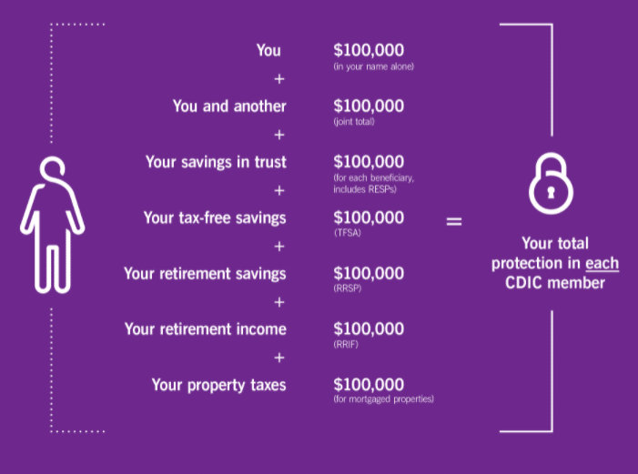
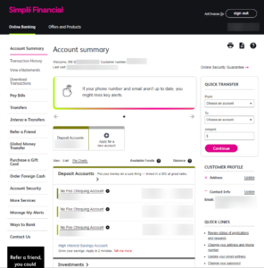
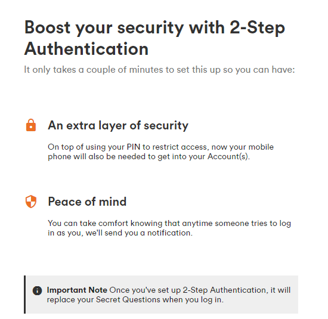
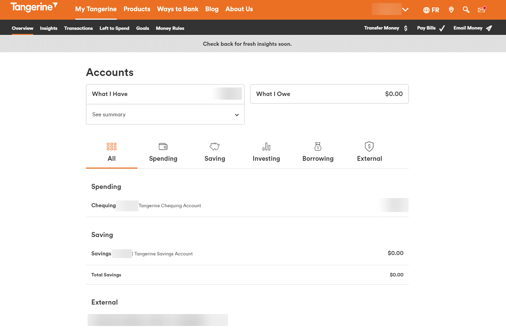

#### If you were to start over and pick all of your key financial accounts from scratch, which would you choose?

Forget about the fact that your family has *always* banked with RBC or that you chose TD because it has a branch just down the street from you.

Looking out at the financial institution landscape, which combo would you choose today?

I’m in that position right now, since my older daughter is about to turn 18, which means finally ditching her youth account and setting up what I call **the Big 3 Accounts: Checking, Savings, and Investing.**

A lot has changed in the banking industry in the last few years, so I did some digging. In this post, I share my findings in case you’re thinking that maybe it’s time for a change.

FYI: I’m not going to talk about investing accounts as that’s that’s a whole other conversation.

Instead, I’ll focus on checking and savings accounts.

Let’s dig in.

## CHECKING ACCOUNTS

## Where to start?

One of the things I teach in my values-based money management system is that you shouldn’t pay for a checking account. There are many great, free options available. Why give more cash to traditional banks for no greater service?  
  
The banks are already making billions in profits every year. They certainly want your $6 to $20 per month, but they don’t need it.

They bank on the fact (pun intended) that many people feel more comfortable with brick-and-mortar institutions that have been around forever. It’s all about the comfort of the known and people’s resistance to change.

Inertia is a powerful behavioral motivator. So is fear of change.

That wasn’t an issue for me in my selection process, because the only thing that matters is whether or not a financial institution is a member of CDIC – the [Canada Insurance Deposit Corporation](https://www.cdic.ca/). This is where the real protection comes from in the event that the institution goes bankrupt.

Here is a chart taken from the [CDIC website](https://www.cdic.ca/your-coverage/protecting-your-deposit/) regarding what is covered:

 

All of the institutions I will consider in this post are members of CDIC.  
  
If you’re looking into one I haven’t mentioned, head over to the CDIC website and use the search function to see if it’s on the list.

Note that if you choose a credit union, the deposit insurance will come from a provincial regulatory body. Be sure to look into the details before proceeding to verify the coverage you get.

## Who’s on my list?

**When you make one of the criteria “must be a no-fee checking account”, that immediately eliminates the Big 5 Banks in Canada: RBC, TD, CIBC, BMO, and Scotiabank.  
  
**They all charge fees, unless they have a student-specific deal going on, like Scotiabank. I address that below (it’s still an unattractive option).

That leaves online financial companies.

I whittled down my list further by ditching any institution that charges for e-transfers. There’s no good reason to pay for those, either, given the great options at hand.

Here are the candidates that made my short list:

- Simplii Financial
- Tangerine
- EQ Bank
- Koho – Regular account, not the Premium (remember my rule – no monthly fees of any kind)
- Scotiabank Student Banking Advantage Plan – I’m only considering this one because this research is for my daughter at university

## What to look for?

Here are the factors I considered:

1. Free **e-transfers**, as mentioned above.
2. Free **online bill payments**. There has to be a way to automate payments. Automation is an important part of the values-based money management system I teach.
3. Can open **multiple accounts**. In my system, there is a main chequing account and a Guilt-Free Spending account. If you’re in a partnership where individual funds are kept separate, but there is a joint account for shared expenses, you’ll need three accounts.
4. Access to **ATMs** for withdrawals.
5. Free **checks**. Just when I think cheques are no longer important, I find a use for one, especially a void cheque. It’s not a deal-breaker, but it’s handy, although online providers who don’t offer checks usually provide a link where you can generate a void check if needed.
6. **Mobile deposit**. I can’t remember the last time I went to a bank to deposit a cheque. Direct deposit is a beautiful thing, but there are times when you end up with a cheque in your hands. With mobile deposit, you grab your phone and make the deposit in a minute instead of having to drive to a bank.
7. **Overdraft protection**. Cashflow and planning mistakes do happen, so having overdraft protection is helpful as it saves on fees.
8. **Interest rate**. Let’s face it, a checking account is not where you want to park a lot of dollars, but it’s worth knowing just how little you’re making on the money in your account.
9. **Visa debit card**. This is a cool new product that is brilliant for students or people who are working on establishing good spending habits. More on this below.
10. **Budgeting tools**. It’s a bonus if your account provides tracking and planning tools.
11. **Automatic savings tools**. This is right out of the behavioral economics handbook: make saving money easy by automating the process. A definite plus.
12. **Cashback on spending**. If you can get some dollars back from your spending, why not? Especially if you cannot (yet) qualify for a cashback credit card.
13. **Mobile wallet** options. It’s handy to use your phone as your wallet (and also behaviorally dangerous). Still, with the right protective processes in place, this is a handy option.
14. **CDIC member**. Discussed above. Critical.

## How the candidates stack up

I created a spreadsheet of the options I considered and how they stack up on the factors noted above.

 

You’ll notice that two columns are highlighted. At the risk of wrecking the ending, those are the ultimate winners I selected for my daughter.

Here’s my analysis.

### Simplii Financial

I wanted to like this option.

I’ve had an account with Simplii (formerly PC Financial) for twenty years. In that time, I have not paid a penny in account fees or for checks, even back in the day when all payments were made by check.

This account has served me well over the years, but it hasn’t aged well. **Simplii is having its lunch handed to it by other innovators in the field**, who are offering powerful planning and analysis tools.

What I like about Simplii, though, is its simple dashboard where you can easily see and click on any action you want to take. Here’s a view from my account:

Regardless of what I want to do, every possible action is available from the vertical menu bar on the left. It’s not attractive, but it is functional.

I’ve also used the quick transfer function on the right countless times as I have multiple accounts for rental properties. I can log in and move money around in less than a minute.

Super simple.

Also, as a division of CIBC, it has a large network of ATMs available across the country.

Nonetheless, it’s not a compelling option for my daughter. There are simply (sorry, couldn’t resist) much better options available to her.

**Will I move my accounts?**

Yes and no.

I’ll open additional accounts at EQ Bank for the excess cash (explanation below), but I’ll keep these Simplii accounts for the predictable monthly transactions (e.g. property taxes, management fees, etc). I also want to hold on to the free e-transfers and free cheques available with these accounts.

**Bottom line: this is a NO for my daughter.**

### Tangerine

In July of last year, [I wrote a post](https://yourfinanciallaunchpad.com/why-i-stopped-using-tangerine-products-and-prefer-the-simplii-pc-mastercard-combo/) on why I was sticking with Simplii Financial and the PC Mastercard instead of using the Tangerine Account + Tangerine Mastercard combo.

I had a number of issues with Tangerine. Chief among them was their lack of security and high PITA factor during log-in.

What a difference a year has made.

Since my post, Tangerine has added 2-factor authentication as an option to their log-in process. You can still choose to use their 4- to 6-digit PIN with the “security questions” (aka security theater) option, but this option offers inadequate protection for anything online, let alone your banking.

Or, you can now choose this:

 

You already know from what I said above that I’m going to recommend the Tangerine checking account to my daughter, but it comes with **this caveat: you must use it with 2-step (otherwise known as 2-factor) authentication in order to be protected.**

What this means is that every time you log in (unless you tell it to skip this step, which you won’t, right?), you will have to input a code that has been sent to your phone via text message.

This new set-up now works well with password managers, unlike their previous system – which used to drive me crazy!

As I was doing this research, logging into Tangerine took seconds with 1Password (the password manager I use), including the 2-step authentication. That’s a refreshing and welcome change.

#### There are two other features that make Tangerine a compelling candidate: their money management tools and the Visa debit card.

**Money Management Tools**

These tracking and planning tools are a value-add. Here’s a quick overview of Tangerine’s tools:

1. Set savings goals (though I don’t recommend leaving your savings in Tangerine because even the savings accounts offer next to no interest).
2. Set money rules. This is powerful stuff. It means that you can decide to move surplus cash to savings so that it’s not just sitting around. Or top up your purchases to the nearest dollar (or whatever amount you choose), then have that extra money go straight to your savings account. The irony, though, is that their savings account only pays 0.10% at the moment. It’s never been great. Here’s what I suggest instead: Use the money rule to move excess cash to the Tangerine savings account, then move that cash to EQ Bank, where you’ll earn 1.25% (at the moment).
3. Automatic savings. You can decide that you want a % of your dollars to go straight to savings as they come in. That fits beautifully with my money management system, where you fund your savings and investments first before spending.

**Visa debit card**

This is such a cool product. I first saw this with Koho, but Tangerine has now jumped into the game.

This is a card that offers some of the benefits of a Visa card, without the risks associated with traditional credit cards.

It is 100% a debit card, meaning that you can’t spend more than you have in your account. However, because it’s issued by Visa, it can be used anywhere you would use a Visa card, including for online purchases.

This is a significant benefit for my teen who does not yet have a credit card and who is just building her money management muscles. She can’t get into any trouble with this card, since there is no credit component attached to it.

I’m still going to help her get her first credit card asap, but this is a terrific card to have in her tool chest right out of the gate.

Another thing Tangerine has improved is its dashboard. That was a sticking point for me when I wrote a compare and contrast article between Simplii and Tangerine. Here’s what it looks like today:

 

All the main actions are now visible from the home page, including sending e-transfers.

One last thing about Tangerine: it’s owned by Scotiabank, which means that you have access to a large network of ATMs across the country for withdrawals and the occasional deposit. I realize that the use of cash is becoming a thing of the past. Still, having access to your cash for emergencies is handy.

**Bottom line: this is my recommendation for a checking account for my daughter.**

### EQ Bank

The EQ Bank Savings Plus Account is a popular choice for savings because it is always at or near the top of the interest charts.

Saven Financial and Oaken Financial all typically offer good interest rates, but EQ Bank gets my vote for its consistency and broader offerings.

In the last few years, they’ve upped their game and started to offer more functionality. They now offer free e-transfers and bill payments, which is great.

You can do a lot of your banking through them for the portions you can complete online.

**\*\* In 2023, they added a prepaid Mastercard to their line up, which is a plus. However, the big downside is that they don’t offer access to ATMs to withdraw or deposit cash. Since they also don’t offer mobile wallet options, this means that they are not yet an all-around, all-purpose option.**

**Even if you use them as a place for savings, you still need a “regular” checking account.**

**Bottom line: this is a great option as a savings account, but not an everyday money management account.**

### KOHO

Koho is a financial technology company that has partnered with Peoples Trust Company to offer a compelling product.

Their debit card is actually a Visa debit card, with all the convenience I outlined above.

**They also offer 0.5% cashback on purchases, which is a first in the world of chequing accounts.**

Cashback offerings are usually reserved for credit cards, so this is a cool development.

They offer 1.2% interest, but only if you set up a Direct Deposit to the account. This has no value for students and for self-employed people who don’t receive their salaries via a Direct Deposit. So it’s an attractive option, but only to a limited crowd which, unfortunately, doesn’t include my daughter – or me!

Since this is a fintech company, it’s no surprise that they offer some tracking and planning tools, like automated savings, round ups, and insights on your spending.

I tried KOHO for many months to test its functionality and I found it to be a bit of a pain when it comes to e-transfers.

You can receive them, but you have to use a special email address generated by your account. I had to copy and paste my KOHO e-address to my contacts in order to receive payments. That got old really fast.

**Bottom line: my daughter can do better on all fronts with other accounts. She can get more savings from EQ Bank, more functionality and better options from Tangerine for a chequing account, and she can get cashback from the Tangerine credit card. This is a NO for her.**

### Scotiabank Student Banking ADVANTAGE Plan

The only reason I included this one on the list is because I’m doing research for my daughter, who is a student.

There is nothing attractive about this option:

- It’s only free while she is a student.
- There is no Visa debit card option
- There are no automated savings tools
- The interest rate is very low

**Bottom line: This is a definite NO for my daughter.**

## SAVINGS ACCOUNTS

This is going to be a short discussion: I’m sticking with EQ Bank.

**All of the Big Banks offer terrible rates.**

It’s true that at the moment, no one is offering stellar rates, but at least with EQ Bank you’re getting more than 100 times the amount of interest that the brick-and-mortar institutions are offering.

Even most online banks have unimpressive offerings when it comes to savings accounts, with Simplii and Tangerine clocking in at 0.10% at the moment.

As mentioned earlier, KOHO is offering 1.2%, but only if you set up a Direct Deposit. Still, if you wanted an all-in-one option and you have monthly direct deposits, KOHO might be a decent option for you, assuming you don’t ever need cheques and you’re OK with limited ATM access.

There are a number of credit unions across the country that are offering slightly higher rates for savings accounts, but beware of fees for transactions with these accounts.

[Saven Financial](https://www.savenfinancial.ca/en/on-Home), a division of FirstOntario Credit Union, is currently offering 10 basis points more than EQ Bank, so they’re a strong option worth considering if you just want a savings account.

One of my clients likes the fact that deposits in Saven are insured up to $250,000. My counter argument to that is that **if you have that much money sitting in a High Interest Savings Account, you’re losing a lot of buying power due to inflation.**

You would be much better served investing those funds in higher yielding investments.

For my daughter, though, I like the fact that she can park all of her excess dollars in EQ Bank and pay some bills from there, for free, if needed. EQ Bank also has a TFSA (Tax Free Savings Account) option, so my daughter can put her Emergency Fund money inside a TFSA to start.

The reason I say “to start” is because I will also recommend that my daughter open up an investment account with a discount brokerage and invest in a TFSA there. That will give her a much broader range of options to build wealth.

**Bottom line: EQ Bank is the winner for the savings account.**

## BEST ALL AROUND OPTION

From what I’ve seen, the best option for my daughter is to do the following:

1. Set up **checking account at Tangerine**. Use their money management tools to set up Round Ups and automated savings. A couple times a month, transfer the savings to EQ Bank. Only keep money for monthly expenses in the account.
2. Open a second checking account for Guilt-Free Spending.
3. Set up a **savings account at EQ Bank** and use this for any dollars beyond monthly expenses.
4. Open a TFSA at EQ Bank for an Emergency Fund and planned spending.

In addition to this, I will help my daughter apply for Tangerine’s Mastercard, where she’ll earn 2% cashback on 3 categories by automating the deposit of cashback dollars to her savings account. As a student, this is the best option for her.

So that’s it! I hope this helps.

Remember that my analysis of the accounts above is for my needs.

You may decide that a different combo of checking and savings accounts is right for you. That’s cool. Your financial system has to serve you, however that shakes out.

I’d love to hear from you: Which accounts are you using and why? Shoot me a comment below.

**Want a proven process to help you make savvy financial decisions that are in your highest, best interests *every time*?**

Grab your copy of my [FREE Cheat Sheet](https://yourfinanciallaunchpad.com/4-questions-cheat-sheet/).

In it, you’ll discover the four key questions to ask yourself, in order, to gain **total clarity** on the right financial decisions for you.

This **process works** for all decisions, big and small.

Make indecision, second-guessing, and analysis-paralysis a thing of the past.

#### Share this post

## Your Foundation to Financial Freedom is coming soon.

Please complete the form to add your name to the wait list. We’ll let you know as soon as the course is released!

## No spam, ever. Unsubscribe any time.

## IMS ESSENTIAL

Please select a payment type: