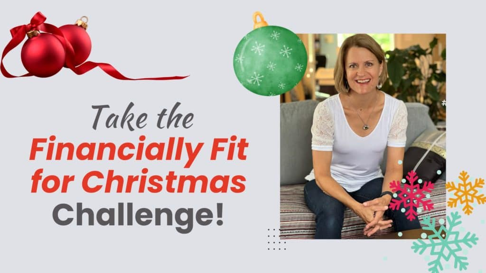

## Let's Give You More Reasons to Celebrate on New Year's Eve 🎉

When you join the Financially Fit for Christmas Challenge, you’ll receive daily, easy-to-implement strategies for the next ten days to help you make great use of your dollars and have a fun, memorable Christmas – for all the right reasons!

**Avoid** **the financial traps of the holiday season and** **breeze through Black Friday without bruising your credit card or your bank account.**

#### No dreading your credit card statements in January!

#### And no looking back with regret, wishing you “hadn’t done that.”

## In this Challenge, you’ll discover:

- - - The top myths about sales and what to avoid.
		- Why so many people get in financial trouble during the Christmas season (but not you!).
		- How to set up your finances so that you stay on track despite aaaaaaaalllll the juicy temptations of the season.
		- How to ensure that overspending – and the resulting traumatic credit card bills in January – are a thing of the past.
		- What to do about the pressure to conform, especially when it comes to family.
		- The clear, doable action steps to follow.

#### Your financial approach to the holidays will be transformed in just 10 days.

And it’s FREE!

## How it works:

Once you fill in the form below, you’ll receive a welcome email giving you an overview of the 10-Day Challenge.

The following day, the Day 1 Challenge will be delivered to your inbox.

You can either read the Challenge instructions in the email or listen to the audio version for that day.

You get to pick the way you prefer to learn.

**You can start any day you like. The Challenge is ready to go when you are!**

If you’re reading this page, it’s means the Challenge is still available. 😉

> Until you make the unconscious conscious, it will direct your life and you will call it fate.

If you’ve ever struggled to get a grip on spending at Christmas …

… Or if the holidays typically mean more debt and more financial stress for you;

… Or if you just wish the whole thing weren’t so darn hard on your bank account …

**Then hop into the 10-Day Financially Fit for Christmas Challenge and let’s do things differently this year.**

Because Christmas shouldn’t be about financial stress.

And it certainly shouldn’t knock you off track with your financial goals.

Let’s help you to create a **Conscious Spending Plan** for the holidays so that you start the new year in great (or better) financial shape.

### Fill in the form below and let's get going!

If you choose not to join me for the Challenge, that’s cool.

I just have one question for you: What’s your plan for your money between now and the new year?

Without a plan, you probably won’t be delighted with the results.

And if you’re hoping that it will all just work out, remember this:

### Hope isn’t a plan.

**Making savvy decisions with your money requires a plan and a process. You’ll get both in the challenge.**

I look forward to seeing you on the inside and to celebrating your success with you on December 31st!

## Your Foundation to Financial Freedom is coming soon.

Please complete the form to add your name to the wait list. We’ll let you know as soon as the course is released!

## No spam, ever. Unsubscribe any time.

## IMS ESSENTIAL

Please select a payment type: