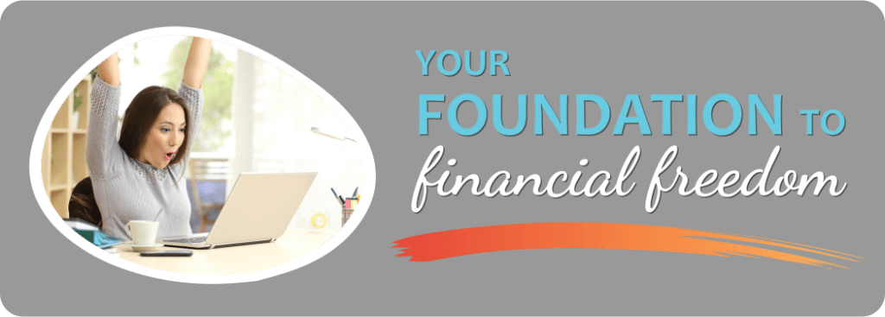
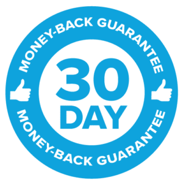

## Welcome to the Foundation to Financial Freedom Course!

## A Program to Help You Take Control of Your Finances,Strengthen Your Relationship with Money, and Grow Your Wealth

## Get More Joy and Peace of Mind from Your Dollars Without Nickle-and-Diming Yourself in a Restrictive Budget

##### When you use a proven system based on your core values…

##### … and you develop an empowering money mindset, saving money and achieving financial independence become doable.

##### In 9 weeks, you can transform your finances with this evidence-based, step-by-step system that is fully customized to your needs, values, and goals.

## If you're here, I know this much about you: You want your finances to be better and easier.

When you entered adulthood, you were told to get an education, get a good job, follow a budget and you’d be in great financial shape.

**What happened to the “great financial shape” part?**

Your finances aren’t as *easy*, or as *secure,* as you thought they would be by now.

Some days you think, “At my age, I should be father ahead. Why am I not?”

#### It’s not for a lack of trying.

Maybe you did the whole budgeting thing to get a handle on your spending.

You downloaded Mint, tracked expenses, created categories and imposed spending limits.

Three months in, the whole “micro-managing” and “obsessing-over-nickels” approach caused you so much stress and shame when you couldn’t stick to your spending targets that you said, “!@\*?#🤬” while deleting the app.

Or maybe you’re the kind of super organized person who started budgeting when you were fifteen after getting your first job.

You know where every dime goes and you can list your budget off the top of your head.

Despite all that controlling and being careful, you’re still *nowhere near* your financial goals.

You think, “I don’t get it. I’m doing the work. When do I get to enjoy the fruits of my sacrifices?”

## The frustrating reality is this:

## Tracking your money is NOT the same as managing your money. And until you make the switch, you won't create the life you want.

## The problem isn't you

- You went to school for years. In that time, you learned:
- Calculus, grammar, the historical events behind D-Day, the parts of a cell, and the skills to do your work.
- But you were never really taught how to make, manage and grow your money.
- Your parents didn't teach you about money either - for a million understandable reasons that typically revolve around fear, discomfort, and shame.
- For most people, money is still a taboo subject.
- Your parents would rather talk to you about sex than money - and we all know how *that* talk turned out.

## You need a better approach for your finances

One that serves your unique situation, values and dreams.

One that’s doable by someone juggling 14 balls (that would be you).

And one that works *right now –* without making money management feel like a punishment!

You don’t want to wait another ten years – or more – to be able to *finally* let your shoulders relax and enjoy life,  
without having to think about money ALL the time.

#### This is your chance to do just that without the restrictive, one-size-fits-all approach of traditional budgeting.

Introducing

 

**A comprehensive, step-by-step course to help you take charge of your finances, strengthen your relationship with money, build your confidence, grow your savings account, and create great options for your future.**

You’ll learn how to eliminate debt, build a financial safety net, and make more money so you can experience the peace of mind and the joy that come from knowing your future is secure.

## Before we get into all the course details,let's make sure you're a good fit. If you are...

- **A salaried professional** ...  
	who earns well but can't seem to save money consistently despite repeated attempts. You want that feeling of having a growing savings account, but you don't know how to make it happen.
- **A single mom** ...  
	who feels the weight of being the Plan A *and* the Plan B for the kids because there is no other backup. It's so hard to juggle everything on your own and right now, your finances are an additional stressor. You want to know how to create a safety net that will protect you while providing enough money to help your family enjoy some of the good things in life.
- **A solopreneur** ...  
	who is so busy trying to bring money in the door that you don't have time to figure out how to make all the moving parts of your finances work together. You want to know how to manage your money when you can't predict your month-to-month income. It's overwhelming.
- **Newly divorced** ...  
	and you're having to deal with your finances alone - ALL of it - for the first time. You desperately want to feel in control and confident, but right now you're overwhelmed and uncertain about what to do first.
- **Someone who has debt** ...  
	and you're worried about the future. You've tried to pay it off, but somehow it just always pops back up again. You wonder if being debt-free is even possible for you.

## You're in the right place!

### The Foundation to Financial Freedom Course will give you the step-by-step plan, tools, inspiration and support you need to create a system where money serves your highest, best interests and leaves you free to enjoy your life.

## By the end of the course you will have:

### 1\. Put a stop to unhealthy money patterns and self-sabotage

and started writing your own **Money Story** based on what matters to you. Your mind will be your ally when it comes to achieving your financial goals.

### 3\. Created a financial decision-making framework

based on your **core values** and your life goals. You'll use your values as your North Star to make the best use of your money.

### 5\. Put together a sustainable debt elimination plan with a "Debt-Free Me" date

and you'll know **what to pay off first**, including how much to pay every month. You'll also have the right mix of credit cards for you.

### 2\. Implemented a proven money tracking system and created a weekly Money Ritual

so that you can keep an eye on the key numbers that lead to financial freedom. You'll know what you spend, where, and why.

### 4\. Created a Conscious Spending Plan and Grown Your Savings

and you'll have all your essential accounts in place. Each part of your finances will be **optimized** through automation and regular review practices.

### 6\. Learned strategies to grow your income

using money-saving scripts, negotiation strategies, and a **blueprint** to build a side gig if you choose.

### 1\. Put a stop to unhealthy money patterns and self-sabotage

and started writing your own **Money Story** based on what matters to you. Your mind will be your ally when it comes to achieving your financial goals.

### 2\. Implemented a proven money tracking system and created a weekly Money Ritual

so that you can keep an eye on the **key numbers** that lead to financial freedom. You'll know what you spend, where, and why.

### 3\. Created a financial decision-making framework

based on your **core values** and your life goals. You'll use your values as your North Star to make the best use of your money.

### 4\. Created a Conscious Spending Plan and Grown Your Savings

and you'll have all your essential accounts in place. Each part of your finances will be **optimized** through automation and regular review practices.

### 5\. Put together a sustainable debt elimination plan with a "Debt-Free Me" date

and you'll know **what to pay off first**, including how much to pay every month. You'll also have the right mix of credit cards for you.

### 6\. Learned strategies to grow your income

using money-saving scripts, negotiation strategies, and a **blueprint** to build a side gig if you choose.

## The Foundation to Financial Freedom course changes lives. Get on the Waitlist to be the first to hear about it when it's open.

## Students’ success storiesThis could be you

## What’s inside the course

### Module 1

Rewrite your money story

- Discover the link between **money and emotions**, and how to handle negative beliefs that harm your progress.
- Uncover the hidden stories from your past and present that sabotage your goals.
- Learn powerful strategies to release those "old stories" about money and write your own, empowering money story.
- Learn what research has to say about rewiring your brain and improving the mindset component.

### Module 2

Know your numbers

- Discover the **4 key numbers** to track and how to calculate them.
- Learn simple tools and processes to track the flow of your money.
- Create a regular, sustainable **Money Ritual** to keep you on track.
- Understand your spending patterns.

### Module 3

Identify your values and goals

- Clarify your top values in order of importance, and learn how to use them as a **framework** for making all financial decisions.
- Create big picture goals that are congruent with your values and create a plan to achieve them one step at a time.
- Identify gaps between what you say matters to you and how you behave. You'll learn a strategy to ensure your values and behavior are in alignment.
- Apply the **Values Test** to your spending to free up more money for your savings.

### Module 4

Your money system

- Understand how your money flows in and out of your life.
- Choose the key accounts you'll need for your system.
- Learn the different types of savings accounts and how much money to hold in each.
- Create a **Conscious Spending Plan** to ensure the highest, best use of your dollars.
- Start building your Emergency Fund if you don't already have one.
- Put a plan in place for Planned Spending.

### Module 5

Become debt-free

- Identify your **debt story** and rewrite harmful scripts that may be affecting your behavior.
- Learn how **simple and compound interest** work, and how to use them to your advantage.
- Learn how credit cards work, which ones are best for you, and how to avoid harming your finances with these powerful tools.
- Create a **debt-elimination plan** and identify your Debt-Free Me date.
- Identify when to focus on debt elimination and when to focus on growing your savings.

### Module 6

Make more money

- Discover your **unconscious income ceiling** and how to eliminate those limitations.
- Learn effective **negotiation strategies** to help you pay less for purchases and earn more.
- When and how to ask for more money, whether in the form of a salary increase or an increase in your business rates.
- How to earn money on the side doing something you love.

### Module 7

Maintain your system

- Learn strategies to avoid overwhelm.
- Discover how to deal with setbacks and challenges.
- Learn how to create a **Success Team** of supporters who will help you through the good times and the bad.
- Create an **accountability system** to ensure continual progress.

## Want the best possible results?

### Get a FULL YEAR of coaching, support, and guidance.

After fifteen years of working with clients, there’s no arguing with the results: People who get coaching get deeper, faster results.

Choose from one of our two coaching packages.

## Premium Package

With the Premium Package, you have access to live, **bi-weekly coaching sessions for a full year**.

Think of this as Drop-In Office Hours. Attend as many sessions (or as few) as you like.

If you aren’t available for a scheduled session but you have a question, I’ve got you covered. All the sessions are recorded.

When a financial question pops up over the next year, you simply reach out to me during the group coaching sessions and say:

“Hey Doris, what’s the best way to handle this? What are my options and how do I choose?”

Or:

“Doris, I’m stuck. I just can’t seem to get moving. Can you help me through this?”

You can transform your finances much more quickly when you have someone in your corner, in real time, who’s been there, gotten the results, and coached thousands of other women to do the same.

## Platinum Package

#### Want a more personalized approach?

Then hop into the Platinum Package and get the **VIP Concierge Experience** with:

- private coaching sessions in addition to the group coaching sessions.
- on-call access to me via a messaging app for Q&A and coaching – *every day of the work week!*
- a review of your finances and **customized Action Plan** for the year ahead.

Over the next year, we’ll work closely together to help you overcome any money challenges you face and get on track with your financial goals.

This is also a great option if you want to take your finances to the next level.

We can move as quickly or as slowly as you need in this **Done *With* You** package.

I will hold your hand every step of the way for an entire year.

## But the best part about the CoachingPackages is the community.

Just imagine what it would feel like to tackle your finances *within a community of support…*

… a group of women who *get* you because they’re doing the same kind of work on *their* finances.

Women who will cheer you on, support you through the hard times, and provide a safe space for you to talk about any part of your finances you like without shame, blame, or judgment.

It’s powerful!

##### Our community of women will keep you coming back every two weeks for twelve months to share, laugh, learn, and encourage each other.

## Meet Your Guide

#### Hi, I’m Doris!

I’m a financial literacy educator who has helped thousands of women take control of their money and create great options for themselves.

In my early thirties, I was widowed and left with $400,000 of debt, which I paid off in two years. I’ve since built a multi-seven-figure net worth and a thriving business – using my skills as a trained researcher and an evidence-based approach.

Here’s what I know to be true:

It doesn’t matter who you are, what you know, or what your current situation is. Financial freedom is possible with the right system, ongoing support, and a safe, no shame, no blame, no judgment environment in which to learn.

#### This is that safe space for you.

In this course, I created the system and the plan that I wish I’d had years ago when I stared down a mountain of debt.

At the time, it felt like I had few options for my future.

This course would have changed my life.

I created it so that *you* can achieve financial security, peace of mind, and freedom in a tiny fraction of the time it took me to figure it out and make it happen.

Life is short. Don’t waste another minute settling for less than you want. You can do this.

**Hop into the course and let’s get you to financial freedom as soon as possible!**

## Why women only?

**Because the reality is that the financial conversation changes when men are present.**

I know this from my experience running women-only courses and co-ed courses.

I also know this from my experience running a Women’s Money Group.

Women who were otherwise vocal and expressive in a women-only setting clammed up when men were in the room. It didn’t even take a male stranger to make them feel less comfortable speaking about money. The men in question were their partners, sons, nephews, and friends!

That’s why I design my courses with women in mind and I offer my **coaching packages for women only**.

#### In my coaching community, you’ll get a safe space to talk about money

#### and my signature No Shame, No Blame, No Judgment approach.

 

## You'll be backed by my 30-Day Satisfaction Guaranteed or Your Money Back Guarantee

**If you’re thinking, “This sounds great, but I’m still not 100% sure it’s for me” you can try the course risk-free with my 30-Day Money-Back Guarantee.**

The best part is that it’s a No Hoops to Jump Through guarantee:

- I won’t ask for copies of your worksheet.
- I won’t ask for justification of any kind.

Either you like it and you keep going, or you don’t and you get a full refund.

It’s that simple.

I know what it’s like to be interested in taking a course, but you wonder, “Will this meet my expectations? What if I don’t like it?”

I *know* that my students get great results when they do the lessons and implement what they’ve learned, but I get that you don’t know that yet.

I want you to feel confident about taking this step and to be fully satisfied with your purchase.

So if you’re on the fence, or if other trainings have left you disappointed…

Then **I want to give you the opportunity to dive into the material and experience the feeling of empowerment and excitement** that comes taking control of your money – *risk-free*.

That’s why I’m offering a **30-Day** **Money Back Guarantee:**

Check out the video lessons and the tools that I provide. If you don’t find the course useful by the end of 30 days, send me an email and I will happily refund your full payment within 30 Days of the course start date. No hard feelings!

I’m SO confident that if you implement what you learn inside *Foundation to Financial Freedom (FTF)*, you’ll transform your money and your life.

**You have nothing to lose and a bright, secure future to gain.**

## You deserve to have a life you love without financial stress and overwhelm.

You also deserve a money management system that serves you, and not the other way around.

It doesn’t have to be hard and painful.

I say this as someone whose life was upended in her early thirties by loss, crippling debt, and no easy path to income.

**It took me years of endless research, burning the candle at both ends, deprivation, experimentation, and false starts to finally crack the money code.**

**Today, I’m financially free and I know how to help you get here in a tiny fraction of the time it took me.**

There is a world of abundance just waiting for you. I can show you the path to that world.

Hop into the course and let’s get you there as quickly as possible.

I can’t wait to meet you and cheer you on inside of the *Foundation to Financial Freedom* course!

All my best,

Doris

## Your Foundation to Financial Freedom is coming soon.

Please complete the form to add your name to the wait list. We’ll let you know as soon as the course is released!

## No spam, ever. Unsubscribe any time.

## IMS ESSENTIAL

Please select a payment type: