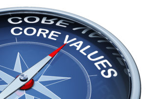

## Identify Your Core Values Course

### Are you looking for an easy, effective way to make decisions about the best use for your money and your time?

### This is it!

When you tie your decisions and your money management system to your core values, everything changes.

You get more satisfaction from your money.

You accomplish your goals more quickly.

And you ensure that you never find yourself way off course ten years down the road, wondering what on earth happened.

It all starts with identifying your core values.

In this five-lesson mini course, you will be guided to identify your top 5 to 10 core values, in order of importance. All other decisions flow from these.

Your values will provide you with a personalized framework that meets your needs and gives your money the right job to do. The course will guide you step-by-step through the process to help you avoid confusion and speed up your results.

When you invest in the course, you will have immediate access to all the lessons. You can proceed at your own pace through the video lessons with worksheets.

Back up, pause, watch as often as you like – you’re in control and you have lifetime access.

Grab a spot, roll up your sleeves, and let’s get down to identifying your core values!

Your finances will thank you.

## Your Foundation to Financial Freedom is coming soon.

Please complete the form to add your name to the wait list. We’ll let you know as soon as the course is released!

## No spam, ever. Unsubscribe any time.

## IMS ESSENTIAL

Please select a payment type: