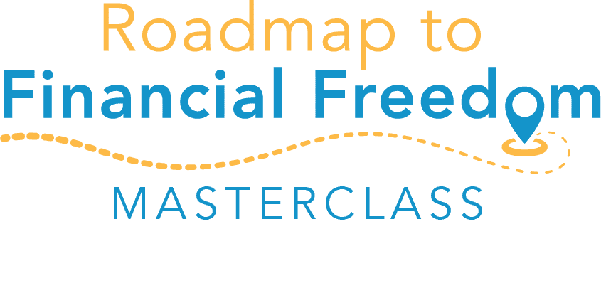

#### If you’ve ever tried to figure out how to deal with a financial challenge or make any kind of positive change where your money is concerned, you know how confusing and overwhelming it can be.

- *What are you supposed to do first?*
- *What’s most important?*
- **What actually works?  
	**

Maybe there’s some debt you want to clean up, but at your age, you also worry that you should have more money set aside for retirement, so which takes priority?

**You can drive yourself crazy going in circles trying to figure it out by yourself.**

**And waste a ton of time reading 183 books on budgeting.**

**Or, you could sign up for my free [Roadmap to Financial Freedom Masterclass.](#enroll)**

It’s pre-recorded, which means you can watch it on your schedule.

#### In the Masterclass, I’ll walk you through my proven, step-by-step process to get you from where you are today to financial freedom.

- No more guesswork.
- No more wasted time.
- No more overwhelm.

I’ll show you what matters, where so many people go off the financial rails,what you need to pay attention to, and what factors to consider when you have competing options for your dollars.

You’ll have **a clear, doable system to follow**.

In addition, you’ll get access to the PDF version of my roadmap.

(Yes, it’s an actual step-by-step roadmap.)

### For the past fifteen years, I’ve helped people deal with all kinds of financial situations – including six-figure debt, bankruptcy, and difficulty saving money.

### I’ve helped them transform their finances because I know what works, and what doesn’t, based on experience and research.

### I’ve helped thousands of women get on the path to financial freedom. I can help you, too.

## Sign up below for access to the Masterclass

You can start watching it as soon as you get the link!

"**It feels so empowering to have sight on the dark, dusty corners of my finances and to have hope that the future can look different.**  
  
The work is just beginning, but I’m grateful to have come across Doris and her system! The focus on core values was such an important exercise and journey for me not only in my financial life, but across all categories!"

\- Lisa K.

## What exactly is financial freedom?

- It’s the freedom to live life on your terms and take back control of your time. Do what you want, with who you want, when you want.
- It’s about having the power of choice regardless of what life throws your way.
- It’s about the peace of mind that comes from knowing you’re in a good place financially.
- It’s the feeling where your shoulders relax for the first time in ages, and you breathe a sigh of relief because the pressure is off.

## Don’t miss this chance to learn how to get your finances on track to create the life you want.

### Click on the link below to access my Roadmap to Financial Freedom Masterclass.

"Doris helped me walk through my situation and focus on the true issues. With her help and her system, **my financial situation feels under control and not something I repel from with dread.**  
  
Her motto of no shame, no blame, no judgement is such an important concept. I’m grateful to Doris for knowing how important **a safe place to share everything** really is to women like me."

\- Lynn Q.

"Doris is an amazing coach! Her “no blame, no shame” philosophy helped put me at ease to face my finances. I finally uncovered and released some key subconscious beliefs that had been holding me back for years.  
  
**I now feel more confident about my earning power and how to manage my money.** And, discovering my Core Values is now changing the way I spend. I highly recommend her offerings."

\- Ann O.

## Your Foundation to Financial Freedom is coming soon.

Please complete the form to add your name to the wait list. We’ll let you know as soon as the course is released!

## No spam, ever. Unsubscribe any time.

## IMS ESSENTIAL

Please select a payment type: